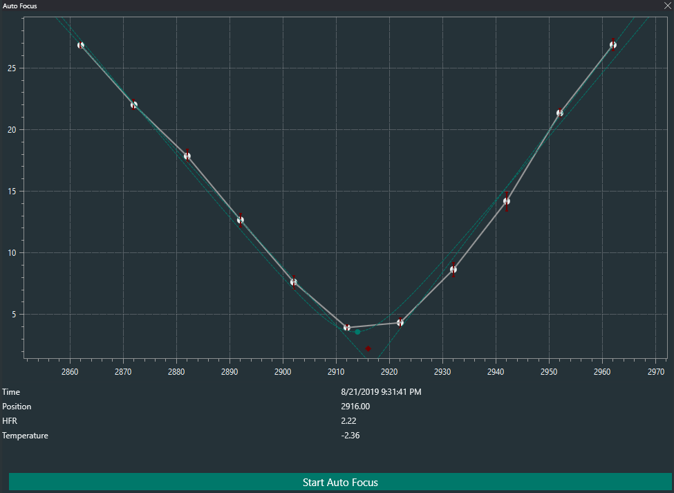
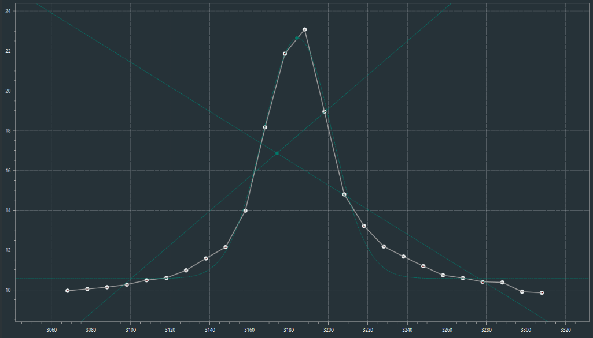
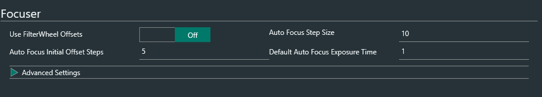
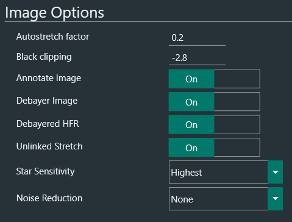
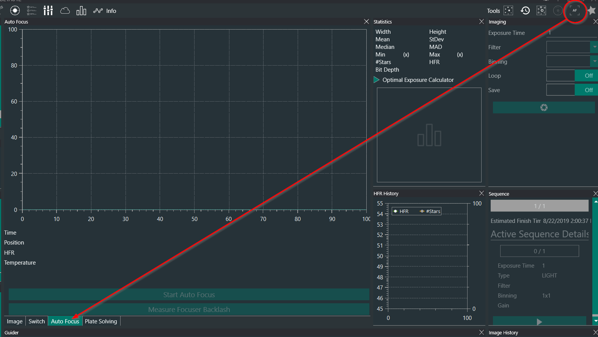
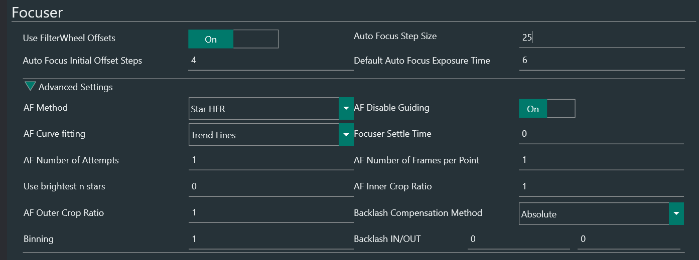
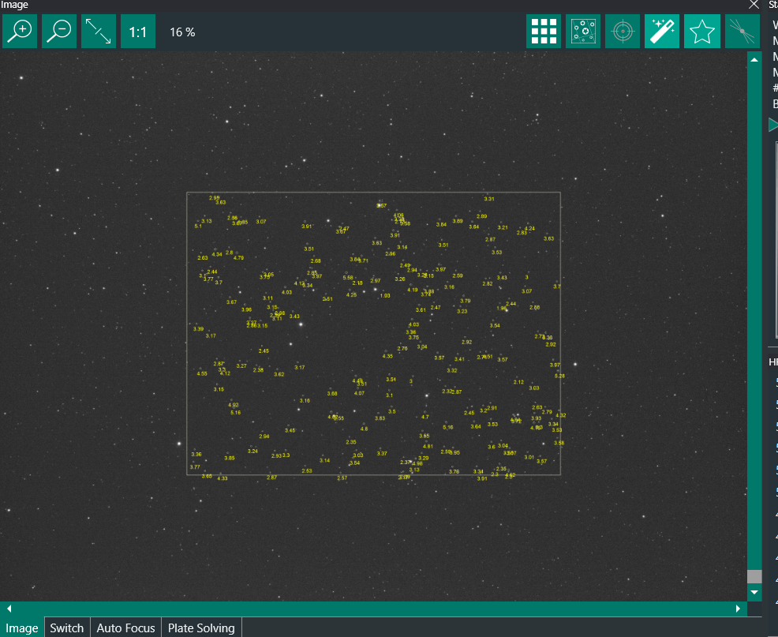
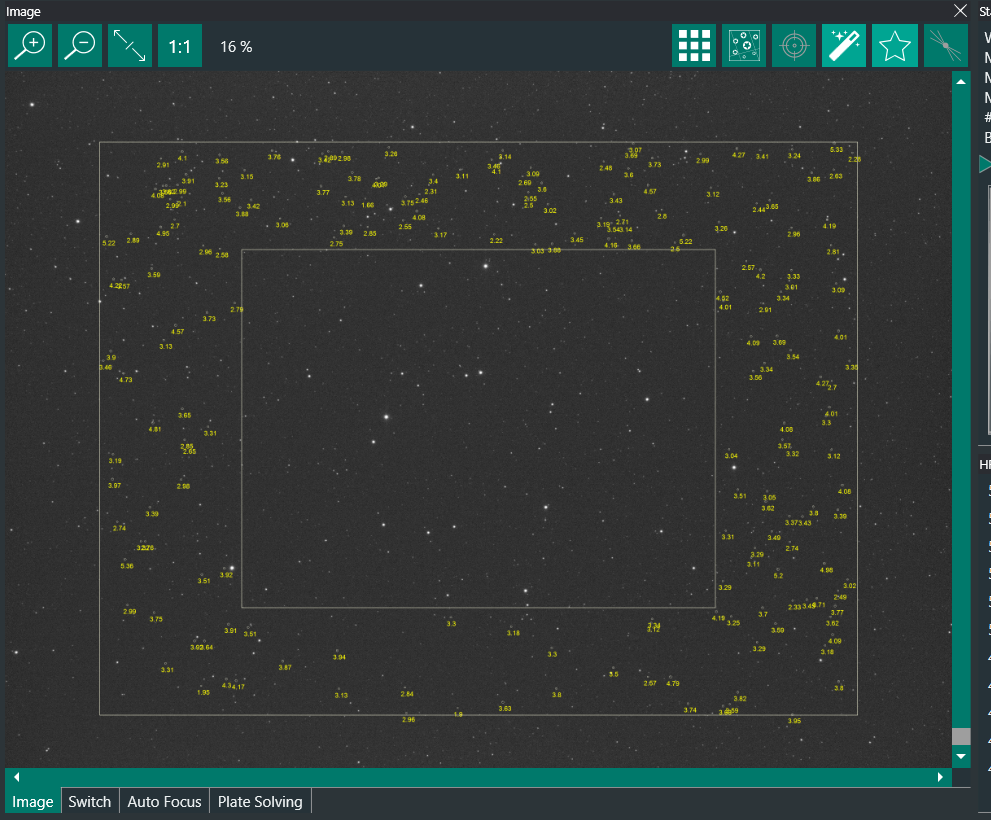
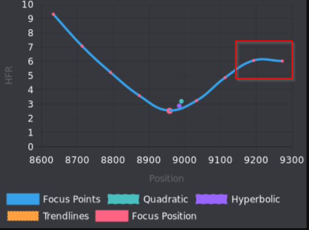
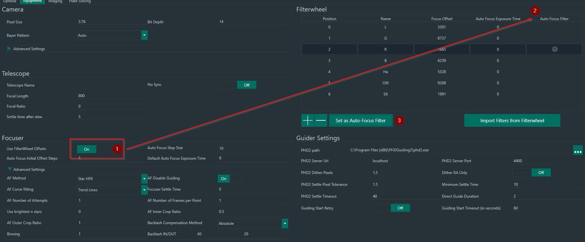

# 自动对焦

## 概述

精确对焦是天体摄影中至关重要的环节。对焦不佳会导致图像偏软、信噪比降低。因此，拍摄者通常会在拍摄前使用鱼骨板等精确工具进行对焦。
然而，大多数光学组件在整个夜晚都会因温度变化或其他原因而出现焦点漂移。此外，随着单色传感器配合窄带或宽带滤镜的普及，由于滤镜会引入微小的焦点偏移，拍摄者需要在滤镜之间重新对焦。
因此，需要能够在序列开始时以及整个夜晚期间运行的自动化对焦流程。

## 要求

要在 N.I.N.A. 中使用自动对焦，必须通过设备选项卡连接以下设备：

* 一台支持绝对定位的 ASCOM 兼容自动调焦器，并已正确设置以确保回差最小、打滑最少。
* 一台使用与该自动调焦器相同成像链的相机。

## N.I.N.A. 自动对焦

N.I.N.A. 的独特之处在于它提供了多种对焦方式，可以对星场、明亮目标（如月球或行星）或地面物体进行自动对焦。这通过两种方法来衡量图像的离焦程度。

### 星点 HFR

使用此方法时，N.I.N.A. 会先大幅移出对焦位置，拍摄一张曝光图像，检测图像中的星点，计算星点的半通量半径（HFR），并取整个画幅的平均 HFR。然后，将调焦器移动一个预定义量（即自动对焦步长），N.I.N.A. 重复此过程，直到获得一条可用的对焦曲线，并通过不同类型的拟合（趋势线、双曲线或抛物线）找到最小值（最佳对焦点）。得到的曲线如下例所示。

上方的每个对焦点代表了相应对焦位置上的 HFR。此外，每个点上的红色条表示每个对焦点的潜在误差——风和其他因素可能导致此误差较大。用于寻找最佳对焦的线条和曲线拟合会利用这些误差，更多地考虑误差较小的点，而较少考虑误差较大的点。因此，该流程对噪声和风等因素具有较强的鲁棒性。

然而需要注意的是，星点 HFR 测量必须在视场中检测到星点才能正常工作——因此，在曝光时间较短且远离对焦位置的情况下（离焦星点往往非常大），该流程会面临挑战。因此，自动对焦曝光时间是自动对焦流程中的一个重要参数。

同样重要的是，如果 N.I.N.A. 步长过大（在上例中我们可以看到它等于 10 个调焦器步数），曲线可能过于粗糙而无法分析。因此，N.I.N.A. 步长需要谨慎选择。

### 对比度检测

第二种方法是通过检测图像中的对比度来进行对焦，其原理类似于智能手机或无反相机进行自动对焦的方式。调焦器按自动对焦步长移动，按自动对焦曝光时间拍摄图像，并通过不同技术测量对比度。得到的曲线接近高斯曲线，曲线的最高点即为对比度最高、因此对焦最佳的点。示例如下。

如图所示，N.I.N.A. 将高斯曲线拟合到对焦点上，以找到曲线的最高点——即最佳对比度点。由于此方法不依赖星点检测，因此可以使用非常短的曝光时间，且计算时间极少——这使得它非常适合快速对焦。但请注意，曲线峰值可能相当窄，很容易完全错过——因此，自动对焦步长需要比星点 HFR 方法更窄。还建议在最佳对焦附近获取更多数据点。
由于此方法使用对比度检测，因此它也适用于月球、太阳系天体或地面物体。然而，与星点 HFR 方法相比，它对不利条件的敏感度可能更高，且目前仍处于实验阶段。

请注意，以上两种方法都假定在开始时对焦已大致接近最佳位置——请确保在启动对焦流程之前，星点的大小已经足够小。

## 基本设置

自动对焦的主要设置位于选项 -> 设备 -> 调焦器区域。

正如上文所述，成功自动对焦的两个主要参数在此处：

* 默认自动对焦曝光时间（秒）
* 自动对焦步长（调焦器步数）

还有一些额外参数可供设置：

* 自动对焦初始偏移步数（以 N.I.N.A. 自动对焦步长为单位，而非调焦器步数）
* 使用滤镜轮偏移（不直接影响自动对焦）

:::note
如果连接了滤镜轮并且在选项 -> 设备视图的滤镜轮区域中设置了自动对焦曝光时间，则不会使用默认自动对焦曝光时间。取而代之的是根据当时的滤镜使用按滤镜设定的曝光时间。对于同时拍摄宽带和窄带（如 HaRGB）的拍摄者来说，这可能非常方便。有关如何设置此功能的更多详情，请参见[设备选项部分](../tabs/options/equipment.md#滤镜轮配置)。
:::

## 自动对焦算法

自动对焦逻辑如下：

1. 对于星点 HFR，N.I.N.A. 在当前调焦器位置拍摄一张曝光，并计算星点 HFR。这将成为"需要超越的基准"，最终对焦结果将与该基准对比，以确保实现了更好的对焦。
2. 将调焦器向外移动（移动到比当前值更高的调焦器位置），移动量为*自动对焦初始偏移步数*乘以*自动对焦步长*。在上述示例中，调焦器将向右移动 5 * 10 = 50 个调焦器步数。
3. 开始将调焦器向内移动（移动到更低的调焦器位置值），每次移动一个*自动对焦步长*（例如上述示例中的 10 个调焦器步数），在每个位置测量对比度或 HFR。
4. 继续向内移动，直到找到最小值（HFR）或最大值（对比度）点，并且在该最小值或最大值两侧各有至少*自动对焦初始偏移步数*（本例中为 5）个数据点。如果 N.I.N.A. 发现最小值/最大值右侧没有足够的对焦点，它会移回最右侧的点，然后再次前进，每次一个*自动对焦步长*，直到右侧也有足够的数据点。
5. 对数据点进行拟合（趋势线、抛物线、双曲线或高斯曲线），找到最佳对焦位置，并将调焦器移动到该位置。
6. 对于星点 HFR，会拍摄一张最终验证曝光，计算 HFR，并与第 1 步中获取的基准进行比较。如果最终 HFR 比初始 HFR 差 15% 或更多，自动对焦流程将被判定为失败，调焦器将返回其初始对焦位置，或者尝试再次运行自动对焦。

## 确定理想参数

如上所述，自动对焦算法中使用三个重要参数。现在是时候正确设置它们了——以下是一些经验法则。

### 自动对焦初始偏移步数
对于星点 HFR，默认值 4 通常效果良好。对于对比度测量，值 6 更为合适。

### 自动对焦步长
要确定正确的自动对焦步长，用户可以从最佳对焦位置略微向外偏焦开始。然后将调焦器向外移动，比如说 10 步。如果肉眼能观察到明显差异，且星点直径增加了大约 20-30%，那么这可能是一个不错的步长。
另一种方法如下：从良好的对焦位置开始（例如使用鱼骨板对焦），用户可以逐步向内（或向外）移动调焦器，直到 N.I.N.A. 无法在图像中检测到星点 HFR。总增量代表最大初始偏移量。为安全起见，用户可以取最大初始偏移量的 80%，除以*自动对焦初始偏移步数*（默认值 = 4）。得到的值即为一个良好的自动对焦步长。在此过程中，必须开启[星点 HFR](../tabs/imaging.md) 检测和[标注图像](../tabs/options/imaging.md)功能。
> 示例：假设良好的对焦起始位置为 4000 步，我们将调焦器向外移动，每次 10 步，每次增量后拍摄新曝光以检查测量的 HFR。假设经过 12 次移动（120 个调焦器步数）后，N.I.N.A. 只能检测到零颗或极少数几颗非常模糊的星点。那么 120 步的值即为最大增量。将其缩放 80%（约为 100），除以初始偏移量（4），得到*自动对焦步长*为 25。

除此之外，用户应不断尝试，直到找到能够以适当幅度移动对焦的步长。

上述步长（以调焦器步数为单位）对于星点 HFR 测量是正确的。对于基于 Sobel 或 Laplace 方法的对比度测量，这同样应该有效。对于基于统计学的对比度测量，可能需要将步长除以 2 或 3 再使用（正如我们在前一个示例中看到的，这种情况下峰值相当窄）。

### 默认自动对焦曝光时间
在选项 -> 拍摄 -> 图像选项下，将"标注图像"参数设置为开启。

对于你感兴趣的滤镜，在接近最佳对焦的位置，对星点丰富的区域拍摄一张曝光。星点 HFR 的理想曝光时间应当是：几乎使最亮的星点饱和，但大多数星点保持在饱和阈值以下。星点应清晰可见且易于识别。现在在拍摄选项卡的图像窗格中启用星点图标（HFR 测量）——N.I.N.A. 将高亮显示检测到的星点。如果检测到很多星点，这个曝光时间很可能就是合适的。

然后，将调焦器移出对焦位置，移动量为*自动对焦初始偏移步数*乘以*自动对焦步长*。使用相同的曝光时间拍摄一帧，检查是否有些离焦形状仍然较亮，且有明显的边界。再次使用星点图标，让 N.I.N.A. 高亮显示检测到的星点——是否有些最亮的星点被正确检测到了？如果是，说明曝光时间是合适的。

如果以上两点都满足，你就找到了星点 HFR 的正确默认自动对焦曝光时间。请注意，这可能会因你的拍摄自动拉伸设置而变化。如果发现在远离对焦的位置检测星点有困难，可能需要增加曝光时间，并可能降低自动拉伸因子。

请注意，对于对比度检测方法，通常使用比星点 HFR 更短的曝光时间也是安全的。

### 使用滤镜轮偏移

即使齐焦滤镜也可能因滤镜本身或光学系统对不同波长的光的处理方式而引起微小的焦点变化。因此，可以设置每个滤镜相对于其他滤镜的偏移量（以调焦器步数为单位）。如果使用了滤镜轮，并且已按滤镜正确定义了偏移量，则此设置应开启。否则，应保持关闭。此设置不直接影响自动对焦，除非设置了自动对焦滤镜。定义滤镜偏移量的详细说明请参见[设备选项部分](../tabs/options/equipment.md#滤镜轮配置)。

## 重要注意事项

以上基本参数应能提供良好的自动对焦效果。然而，星点 HFR 测量和对比度检测计算还受其他设置的影响，这些设置位于选项 -> 拍摄 -> 图像选项下。

### 自动拉伸因子与黑色裁剪

这些设置用于自动拉伸图像，使目标特征肉眼可见。拉伸因子决定图像亮度（值越高越亮），黑色裁剪决定是否将部分背景裁剪为黑色以增加对比度。

自动对焦使用的某些程序也会使用拉伸后的图像（例如边缘检测），因此受此设置的影响。这包括：

* 星点 HFR 流程：基于拉伸后的图像检测星点。
* 对比度检测流程（Sobel 和 Laplace 测量方法）：在拉伸后的图像上测量对比度。

在光污染条件下，如果遇到问题，可以尝试将拉伸比率降低到 0.1 之类的值，将裁剪降低到 -2 之类的值。不过这取决于每个观测者的实际条件，每位用户需要利用上述技术找出自己的最佳设置。

### Debayer 图像、Debayered HFR 与非联动拉伸

这些参数的推荐值（也是默认值）为开启。

Debayer 设置适用于 OSC（一次性彩色）相机，对单色相机无影响。启用后，传感器数据（此时为单色）将被 Debayer 处理为彩色图像，并以此显示在 N.I.N.A. 中。此外，如果非联动拉伸设置为开启，拉伸图像时每个色彩通道将根据其自身的统计数据分别拉伸。这有助于获得对比度更高的图像，因此建议保持开启，除非拍摄的电脑非常慢。

正如上文所述，许多自动对焦测量方法依赖于拉伸后的图像，正确设置此参数将有助于自动对焦。一般来说，最好保持这些设置开启。

类似地，Debayered HFR 选项在开启时提供了更好的 HFR 计算方式。如果关闭，Bayer 格式的传感器数据将用于星点 HFR 计算，这可能导致微小的对焦误差。

### 星点灵敏度

星点灵敏度参数在星点检测过程中生效，因此会影响星点 HFR 自动对焦方法。更激进的设置通常会检测到更多星点，但同时也会对噪声更敏感，这可能导致漏检星点。将标注星点设置为开启后，用户可以看到此设置在合焦和离焦情况下的效果。通常，Normal 或 High 的值会提供良好的结果。

由于使此参数更激进会增加对噪声的敏感度，因此可以与下文描述的降噪参数有效配合使用。

### 降噪

此参数决定在星点检测之前，或某些对比度检测方法（Sobel 和 Laplace）之前，对图像应用多强的降噪处理。它仅对以下自动对焦方法有效：

* 星点 HFR 流程
* 对比度检测流程（Sobel 和 Laplace 测量方法）

可选值如下：

* None：星点检测或对比度测量前不应用额外的降噪处理。
* Median：在星点或对比度检测前，对全尺寸图像应用 3x3 中值滤波。这对消除热像素（可能被误认为星点）极其有效，但会略微增加处理时间。
* Normal：在星点或对比度检测前，对图像应用高斯平滑。这对减少热噪声有效。处理时间影响最小，但仍然可察觉。
* High：对图像应用更强的���斯平滑。
* Highest：对图像应用更强的的高斯平滑。

降噪与星点灵敏度设置配合使用时可能非常有效——但哪组值最理想取决于每位用户的设备。Star Sensitivity Normal 或 High 配合 Noise Reduction Normal 的结果已被证明效果良好。

## 启动自动对焦

现在自动对焦流程的基本设置已经完成，是时候启动一次自动对焦了。当然，在此之前，望远镜应已指向夜空并处于跟踪状态。有多种方式可以启动自动对焦：

* 从拍摄选项卡手动启动自动对焦。为确保自动对焦窗口可用，需要先点击右上角的 AF 按钮。这将在拍摄窗格中创建一个选项卡。

如果相机和调焦器均已正确连接，"启动自动对焦"按钮将可用，点击它将启动自动对焦流程，如[介绍部分](#nina-自动对焦)所述。

* 作为拍摄序列的一部分启动自动对焦（在开始时、拍摄一定帧数后、用户定义的时间后、HFR 恶化后等）。这可以从序列选项卡配置，详细说明请参见相关[序列部分](../tabs/sequencer.md)。

## 高级选项

在调焦器选项下，有一系列会影响自动对焦的高级选项。可用的选项因使用的对焦方法而异。更多详情请参见[选项->设备](../tabs/options/equipment.md)。

### 自动对焦方法

用于自动对焦的方法。可选择星点 HFR 或对比度检测，两者均已在本文档中描述。默认为星点 HFR。

### 自动对焦时禁用导星

决定自动对焦时是否应禁用导星。对于使用 OAG（离轴导星器）或皮带调焦器的用户，将此选项设为开启可能更好。否则，可以设为关闭。

### 自动对焦曲线拟合

此选项仅在选择了星点 HFR 自动对焦方法时可用（对比度检测始终使用高斯曲线）。它决定应将哪种方法用于将对焦点拟合到平滑曲线上。

* 趋势线：这是默认选项，使用误差加权的趋势线来拟合对焦的左右两侧。趋势线的交点即为最佳对焦点。
* 抛物线：将对焦点进行误差加权的抛物线拟合，其最小值确定最佳对焦点。这对于自动对焦步长和偏移步数使其保持在 CFZ（临界对焦区）附近的用户最为适用，这样通常不会触及对焦曲线的渐近线。
* 双曲线：将对焦点进行误差加权的双曲线拟合，其最小值确定最佳对焦点。这适用于大多数用户，其对应的对焦曲线类似于双曲线，每侧各有清晰的渐近线。
* 抛物线 + 趋势线 或 双曲线 + 趋势线：将同时使用趋势线和抛物线或双曲线拟合对焦点。最佳对焦点是趋势线交点与双曲线或抛物线最小值的平均值。

:::note
:::
哪种拟合方法效果最好取决于用户及其具体条件。特别是在视宁度较差的条件下，抛物线拟合可能非常合适，而双曲线拟合（或双曲线 + 趋势线）对大多数用户效果最好。

### 调焦器稳定时间

调焦器移动后、下一次曝光前等待的时间（秒）。这对于可能导致成像链振动的调焦系统（如某些皮带调焦器）可能很有用。对于大多数用户，可以保持为 0。

### 自动对焦尝试次数

如果对焦运行被判定为不成功（在星点 HFR 方法中可能发生，该方法会比较最终的星点 HFR 和初始的星点 HFR），并且还有剩余的自动对焦尝试次数，则会尝试一次新的对焦运行。当所有尝试次数用尽后，自动对焦流程将宣告失败，返回到原始调焦器位置，拍摄继续进行。对于大多数用户，值 1（单次尝试，失败不重试）或 2（失败时重试一次）是合适的。

### 每对焦点帧数

对于需要极其精确对焦的用户（例如视宁度良好、成像分辨率高的用户），获取非常精确的对焦点从而得到精确的对焦曲线拟合是必要的。为此，自动对焦流程可以在每个调焦器位置拍摄多张曝光（根据此参数），并平均它们的星点 HFR 或对比度测量值——这会产生更平滑、更精确的对焦曲线，代价是花费更多的自动对焦时间。对于大多数用户，值 1 效果良好。

### 使用最亮的 n 颗星

此设置仅适用于星点 HFR 对焦方法，它将检测视场中最亮的 n 颗星，并在整个自动对焦序列中仅使用这些星点。由于星点位置在不稳定的成像链或受镜面偏移影响的成像链中可能会变化，因此这应仅用于非常稳定的成像设备。对于大多数用户，值 0（即使用视场中所有检测到的星点）效果最好。

### 自动对焦内裁剪比例与外裁剪比例

这些设置（0.2 到 1 之间的数值）用于为自动对焦方法定义感兴趣区域（ROI）。对于星点 HFR，其工作原理如下：

* 如果两个比例都设置为 1，则不进行任何裁剪，使用整个画幅进行自动对焦。
* 如果内裁剪比例设置为小于 1 的值（如 0.5），外裁剪比例设置为 1，则将使用中央 ROI（感兴趣区域——本例中对应全幅尺寸的 50%）进行星点检测。如果相机能够对该特定 ROI 进行子采样，它就会这样做。否则，将拍摄全幅，但仅使用 ROI 内的星点。如果"标注图像"设置为开启，该设置的效果将清晰可见，如下截图所示。

* 如果内裁剪比例和外裁剪比例都设置为小于 1 的值（注意外裁剪比例值不能小于内裁剪比例），则在内矩形和外矩形之间形成一个"环形"——这将成为自动对焦的 ROI。这对于某些在视场 2/3 处对焦最佳的光学系统（如某些 Takahashi 折射镜）很有效。结果如下（inner = 0.5，outer = 0.8）。

请注意，可以将内裁剪比例设置为某个值，而外裁剪比例设置为 0.99 这样的值，以仅使用中心以外的区域。这对于居中且非常密集的球状星团可能有用，不过 N.I.N.A. 的星点检测程序通常不会因此遇到太大问题。

请注意，对于对比度检测方法，仅内裁剪比例可用。此外，对于基于统计学的对比度检测方法，仅当相机能够对所需的 ROI 进行子采样时才有效。

### 回差

大多数调焦器都存在某种程度的回差，即在反转方向时会有一定的"打滑"量。该回差可以在软件中精确测量并进行补偿。对于大多数调焦器，向内回差（调焦器从向外切换回向内方向时）和向外回差（调焦器从向内切换回向外方向时）是相同的。

#### 识别回差

自动对焦的关键在于确保在对焦运行期间消除所有回差。否则，最终的对焦位置将永远无法正确到达。因此需要识别回差。
一个简单的查看方法是观察自动对焦图表本身。回差在起始位置的右侧会很明显，并在图表中呈现为一条水平线。

在上例中，回差量至少为 100 步。让我们解释一下为什么右侧会以这种方式显示回差。
上述示例的初始调焦器位置大约在 9000 步。为了开始自动对焦流程，调焦器将向外移动到 9300 位置。进行第一次测量。然后调焦器需要移动到 9200 位置。在这里，方向从向外变为向内。每次发生方向变化时，都需要补偿回差。由于上述示例没有进行补偿，调焦器以为它移动到了 9200 位置，但由于回差，调焦管的物理移动为零。因此，下一个测量点将具有与之前相同的 HFR 值，导致出现一条水平线，直到回差被克服。最后，当调焦器向内移动到最后一个对焦点 8600 位置时，它需要再次改变方向以移动到计算出的对焦点。这里回差再次未被补偿，对焦位置将被错过，导致最终结果不佳。

#### 补偿回差

N.I.N.A. 提供两种回差补偿方法：

* 绝对模式：
  当调焦器改变方向时，将向调焦器移动添加一个绝对值。
  向内回差：当调焦器从向外移动变为向内移动时，将添加向内回差值。
  向外回差：当调焦器从向内移动变为向外移动时，将添加向外回差值。
* 过冲模式：
  此方法通过大幅越过目标位置，然后将调焦器移回最初请求的位置来补偿回差。
  由于这种补偿方式，调焦器的最后移动将始终朝着同一方向（始终向内或始终向外）。

> 绝对模式适用于回差相对较小的调焦器，需要更精确地测量回差量，而过冲模式容错性更好，对大多数调焦器都可以安全使用。

**向内/向外回差**
* 调焦器在向内（位置减小）和向外（位置增大）方向上的回差，以调焦器步数表示。

> 选择过冲模式时，向内回差和向外回差只需设置**一个**值！设置向内时，该值将应用于每次向内移动，因此最终移动将始终向外。对于向外回差，则反过来。

### 像素合并

自动对焦有时在合并后的图像上工作效率更高。这是 1 到 4 之间的数字，分别代表 1x1、2x2、3x3 和 4x4 合并。这将尝试将相机图像合并到该特定值。对于大多数用户，值 1 是合适的。

## 自动对焦滤镜

另一个影响自动对焦流程的参数是自动对焦滤镜。可以如[设备选项部分](../tabs/options/equipment.md)所述设置一个自动对焦滤镜。如果设置了自动对焦滤镜，并且*使用滤镜轮偏移*设置设为开启，自动对焦流程将使用自动对焦滤镜而非滤镜轮中当前设置的滤镜，并确保在切换到自动对焦滤镜以及切回拍摄滤镜时应用调焦器偏移量。这对于窄带拍摄者尤其有用，因为窄带滤镜可能需要较长的自动对焦曝光时间，例如 10 到 30 秒。

## 自动对焦日志

对于每次已成功执行的自动对焦，都会创建一个 JSON 日志文件，其中包含关于该次自动对焦运行的详细信息。你可以在其中找到所使用的滤镜、所有测量的步骤以及其他用于评估过往自动对焦运行的有用信息。此外，通过与他人分享此文件，这些日志可以极大地帮助分析自动对焦可能存在的问题。

这些日志存储在 `%LOCALAPPDATA%\NINA\Autofocus\` 中。
