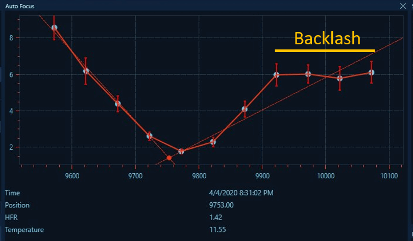
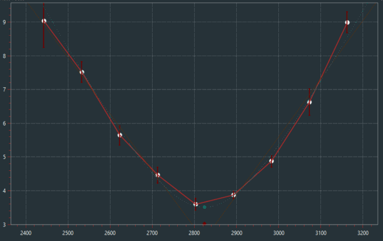
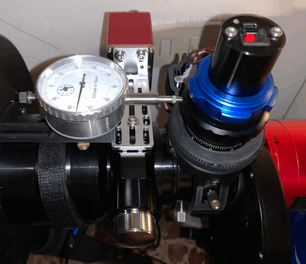

## 概述

调焦器在反转方向时可能会出现回差（backlash），也就是在改变方向时，调焦器实际开始物理移动之前"滑过的"调焦器步数。

回差在自动对焦曲线上的典型效应如下图所示。在曲线的第一部分（从右到左），HFR 保持一致，这是因为调焦管在调焦器仅补偿回差期间没有移动。本例中的曲线显示大约 150 步的回差。

一条良好的自动对焦曲线不应显示任何回差迹象，应类似于下图：

有多种方法可以测量调焦器回差，其中大多数都涉及对调焦管移动的机械测量。
例如，通过使用百分表测量调焦管的移动，改变调焦器移动方向，并测量调焦管再次移动之前需要多少步，由此确定回差值。

如果调焦管带有刻度标记，也可以用与上述相同的方法使用。
另一种方法是运行一次标准的自动对焦流程，并如上例所示确定回差步数。

N.I.N.A. 提供两种[回差补偿方法](autofocus.md)：__绝对模式__ 和 __过冲模式__。

使用 __绝对模式__ 回差补偿时，N.I.N.A. 会在调焦器改变方向时增加一个固定的步数（如[调焦器高级选项](autofocus.md)中所指定）。这需要良好的回差测量，并且对回差相对于*自动对焦步长*较小的调焦器最为有效。

使用 __过冲模式__ 时，N.I.N.A. 通过大幅越过目标位置，然后将调焦器移回最初请求的位置来补偿回差。这种方法比绝对模式容错性更强，推荐用于回差较大的调焦器或回差测量不太精确的情况。
对于 __过冲模式__，一旦用户确定了粗略的回差值，可以再增加 50%，然后输入为向内或向外补偿值。由于此方法容错性很高，也可以通过试错法——逐步使用更大的补偿值，直到自动对焦流程正常运行为止，且自动对焦曲线中不显示回差迹象。

:::tip
过冲模式对 SCT 用户非常有用，可以避免反射镜位移。事实上，当将回差补偿设置为 _IN_（向内）时，调焦器的最后一次移动将始终向外。
:::
