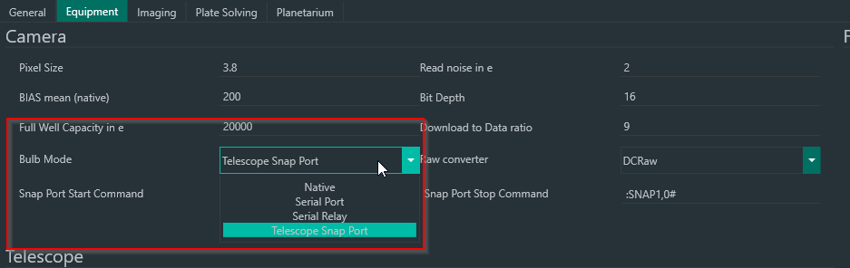
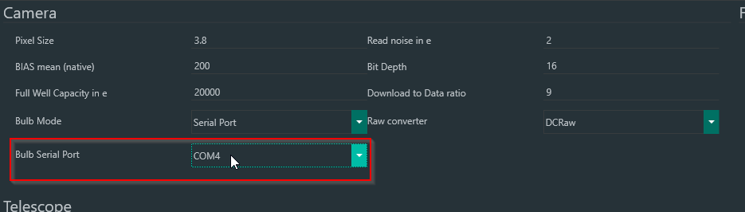
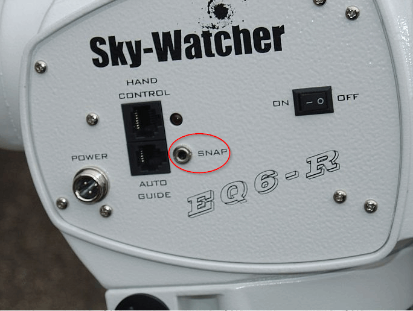
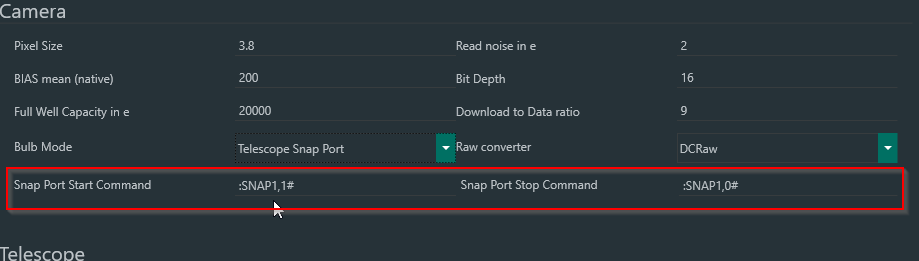

If you have a Nikon DSLR that does not allow bulb exposure time over USB this is a solution for you. 
Instead of native USB mode you can use a self made RS232 shutter cable or use the mounts snap port for shutter (if available).
You can test whether you need or don't need an external shutter cable by trying taking an exposure of more than 30s.
This will trigger bulb mode on a Nikon DSLR. If your camera won't take a picture you need to look at this section.

!!! tip
    Prerequisite for any method of this functionality is that your DSLR has a shutter port!

You can find the necessary settings in the Camera settings.

If your mount has a snap port it is advised to test out the mount for bulb shutter functionality before using the RS232 method for bulb shutter.

## RS232 for Bulb Shutter

One way to trigger the shutter mechanism of your DSLR is utilizing a self-made RS232 to bulb shutter cable. 
There are already some pre-made cables to be bought online for this issue or you can DIY.

!!! tip
    DSUSB cables are not supported since they don't expose a COM Port!

You can find some tutorials on how to build a DIY shutter cable here:

[Nikon MC-DC2](https://www.cloudynights.com/topic/457536-usb-corded-shutter-control-for-nikon/)  

Once you have built a RS232-Shutter cable you need to connect it to the PC, install drivers for your RS232 adapter and check which COM port is used for it.
In N.I.N.A. you need to change the "Bulb Mode" setting to "Serial Port" and change the COM port to the port your RS232 cable is using.

After that you can try and snap an image with an exposure time of longer than 30s. 
If it works you are done and can now expose for any time that you wish.

Should you face issues with the RS232-Shutter exposure in N.I.N.A. feel free to contact us on our [Discord](http://discord.gg/fwpmHU4).

## Mount for Bulb Shutter

In case your mount is having a snap port and there is some way to trigger it using command strings you can use that to trigger the bulb shutter mechanism.
To enable using the snap port you need to change the "Bulb Mode" setting to "Telescope Snap Port".

!!! notice
    Currently confirmed and tested mounts for Mount Bulb Shutter are the SkyWatcher NEQ6-R and AZ-EQ-6-GT using EQMOD V200q, and a SkyWatcher Star Adventurer GTI using GSS.

First you need to connect a shutter cable from the snap port of your mount to your DSLR. 
For that you will likely need a 3.5mm jack to your camera's specific shutter port cable.
Once everything is physically connected you need to connect the camera and mount to N.I.N.A.. 
If your mount has two SNAP ports you can use either. Both will work depending on the next setting.
The next step is to set up the command string to communicate with the snap port.

The default settings might already work for you, so feel free to try and take a snap shot that is longer than 30s in N.I.N.A..
If the shutter is triggered, you are done and can take longer exposures than 30s now.

### EQMOD
By default, the Snap Port start and stop commands are specified using EQMOD standard explained [here](http://eq-mod.sourceforge.net/docs/EQASCOM_compliancy.pdf)

|                 | On\Start  | Off\Stop  |
| :-------------- | :------:  | :------:  |
| **Snap port 1** | :SNAP1,1# | :SNAP1,0# |
| **Snap port 2** | :SNAP2,1# | :SNAP2,0# |

### Green Swamp Server (GSS)
For GSS, you can find the Snap port commands [here](https://greenswamp.org/?docs=gs-server-overview/snap-tab)

|                 | On\Start | Off\Stop |
| :-------------- | :------: | :------: |
| **Snap port 1** | :O11     | :O10     |
| **Snap port 2** | :O21     | :O20     |

Should your bulb exposure still not trigger please contact us on our [Discord](http://discord.gg/fwpmHU4).