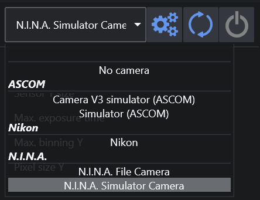
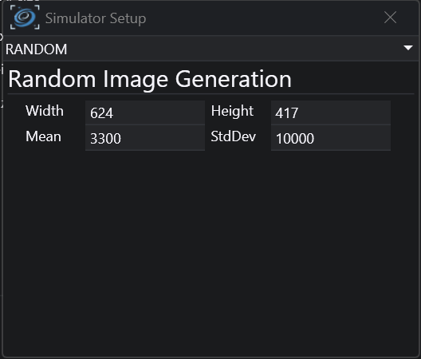
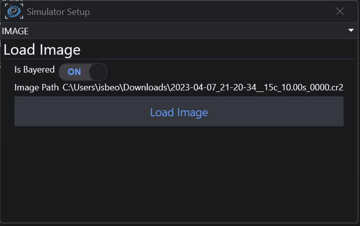
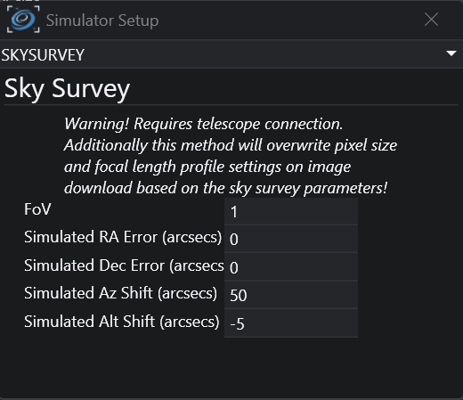
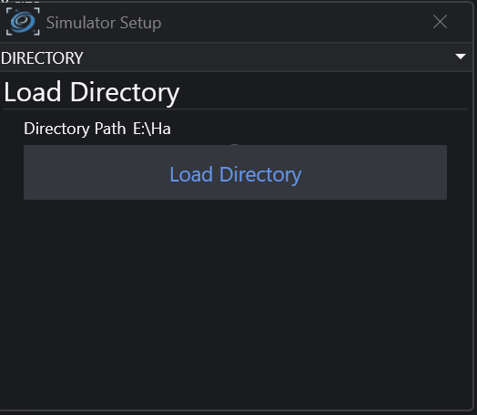

N.I.N.A. offers a built in camera simulator which enables some basic debug utilities to simulate a camera.  
It will act like an actual camera, but has the ability to generate images from different sources.  
To use the simulator, you can connect to it like you would typically connect to a real camera.

## Simulator Setup

Use the gears icon to open the setup screen for the simulator. On the top you can select between different ways to generate an image.

### Source: Random

  
Using this source the simulator will generate an image of the given size with random values for the pixels based on the specified mean and standard deviation.

### Source: Image

  
This source will use an existing image as the output. Simply click on the "Load Image" button and it will preload the image into memory. Later when taking an exposure this image will be shown.

### Source: SkySurvey

  
A telescope connection is required when using this source. It will download an image from an online sky survey (similar to the framing tab) based on the current telescope coordinates.

### Source: Directory
  
Similar to the Source: Image this will load images from a directory instead of one static image. Click on "Load Directory" and specify a target directory. Then it will iterate through all images in a directory and start from the beginning again.
With this source you can easily replicate an imaging run.

## Simulator Usage

The simulator will not automatically populate areas like the imaging tab or others, as it really is a simulation of a camera.
To display an image of the simulator, you need to take an exposure like you would with a real camera.

    