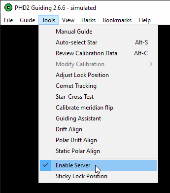
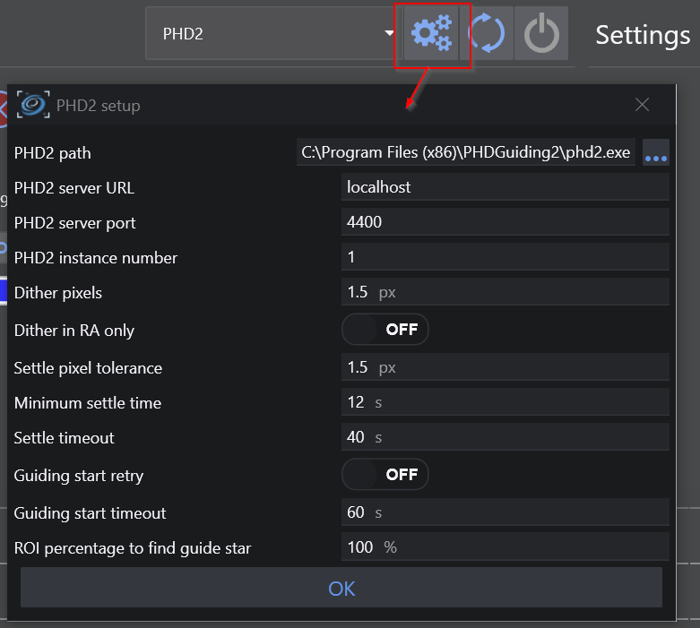
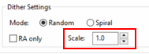
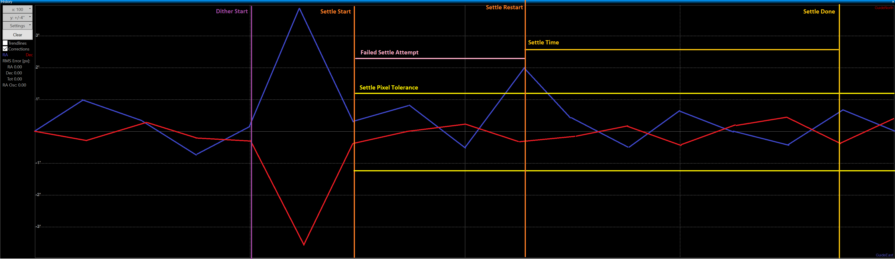
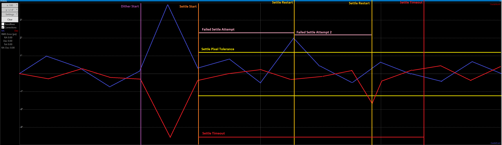
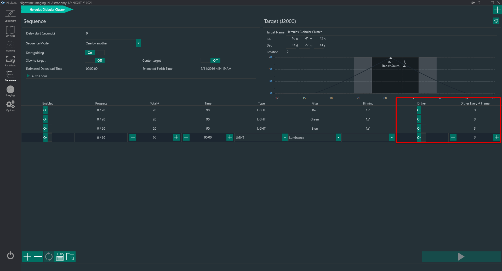

## 概述

抖动是现代图像采集流程中的重要环节。CMOS 和 CCD 传感器会受到各种类型的电子噪声影响，如固定模式噪声，以及热像素和坏像素等缺陷。来自天体的光子落在传感器上，但如果光子落在坏像素或热像素上，这些数据就实质上丢失了。抖动的操作是在连续曝光之间向赤道仪发出指令，使其进行非常微小的移动——在像素尺度上改变光子落在传感器上的位置。这意味着上一张曝光中光子落在坏像素或热像素上的位置，在下一张曝光中同一光源的光子可以落在不同的位置。大多数天文叠加和图像后处理应用都能轻松处理图像对齐问题。
单张亮场的位置各不相同，这将使采用离群值剔除方法（如 sigma-clipping）的图像叠加算法能够更有效地剔除固定模式噪声以及热像素和坏像素。这是因为热像素和坏像素在相机传感器上的位置始终不变，而抖动会使它们在每次抖动移动后出现在每帧的不同位置。

由于抖动是一项必须与导星协调的操作（请记住，赤道仪被有意移动了几个像素，而导星会本能地试图抵消这种移动），因此抖动操作由导星应用程序本身来管理。过程很简单。N.I.N.A. 暂停拍摄，命令导星应用程序执行抖动操作。导星应用程序执行抖动，然后通知 N.I.N.A. 操作完成。导星的任何必要调整由导星应用程序自动处理。N.I.N.A. 然后恢复正常的曝光指令。通常，一次抖动操作最多需要几十秒即可完成。

## N.I.N.A. 中的抖动

N.I.N.A. 提供了三种不同的抖动方式：

1. 通过 PHD2、MGEN2 或 MetaGuide 进行标准抖动
2. 使用 N.I.N.A. 的内置赤道仪抖动功能

所需的抖动方式取决于**设备 > 导星器**选项卡中连接的设备。

### 标准抖动

这是大多数用户的典型场景。用户拥有一台主相机、一台导星相机以及一款受支持的导星应用程序。在序列中配置的间隔时间点，N.I.N.A. 将暂停主相机的操作并触发抖动操作。抖动操作完成后，拍摄即恢复。

### 内置抖动

在某些情况下，不需要或没有导星设备，但你仍希望进行抖动。当你拥有带编码器的高端赤道仪，或者使用小型便携设备时，就可能出现这种情况。N.I.N.A. 可以通过其**赤道仪抖动**功能直接执行抖动，该功能会手动将望远镜移动非常小的距离。

## 要求

N.I.N.A. 支持通过与 PHD2 的直接通信来进行抖动，并且可以方便地将其作为序列的一部分进行设置。在序列中进行抖动需要满足一些前提条件：

* 需要连接赤道仪
* 需要有一款受支持的导星应用程序正在运行、正在主动导星，并与 N.I.N.A. 保持通信：
    * PHD2
    * MGEN2
    * MetaGuide
* 设备设置中与[导星相关的设置](guiding.md)需要正确配置
* 如果需要进行抖动，应在序列中启用

## PHD2 设置

为了让 N.I.N.A. 能够与 PHD2 通信并命令其执行抖动等操作、接收导星遥测数据，必须启用 PHD2 的内部服务器。要启用 PHD2 的内部服务器，请前往 PHD2 的**工具**菜单，确保**启用服务器**已选中。

## N.I.N.A. 设置

### PHD2 设置

与导星和抖动相关的设置可在**设备 > 导星器**选项卡中点击 ⚙️ 齿轮按钮找到。默认值适用于大多数情况。如果 PHD2 安装在非标准位置，则需要指定 `phd2.exe` 的完整路径。这样 N.I.N.A. 就可以在设备连接过程中自动启动 PHD2。

以下是最重要的两个抖动相关设置的解释：

* **PHD2 抖动像素**：抖动操作将移动的导星相机像素量。此值应考虑到导星成像比例和主相机成像比例（单位为角秒/像素）。要选择合适的值，你需要考虑两次曝光之间因抖动移动导致的主相机像素位移量。显然，在某个焦距和像素尺寸下的 2 个像素所覆盖的天空面积，与具有不同焦距和像素尺寸的其他设备是不同的。
通常建议抖动的主相机像素位移量为主相机的约 10 个像素。

:::tip
假设导星相机的像素尺寸为 3.8µm，导星镜焦距为 260mm，导星比例约为 3 角秒/像素。主成像光路由像素尺寸 3.8µm 的相机和焦距 520mm 的望远镜组成，成像比例约为 1.5 角秒/像素。导星相机移动 5 个像素，相当于 15 角秒或主相机移动 10 个像素。这种情况下，PHD2 抖动像素设置为 5 像素是合适的。
:::

:::note
PHD2 抖动像素值将由 PHD2 按 PHD2 的"高级设置>抖动设置"下的"比例"值相乘。此值将与 N.I.N.A. 中设置的抖动像素值相乘，以确定最终的像素位移量。建议将其保持为 1，仅通过 N.I.N.A. 中的抖动像素值进行调整。

:::

* **仅 RA 抖动**：这将使抖动仅在赤经（RA）轴上发生，而赤纬（Dec）轴继续导星。

:::note
此选项仅在以下情况下勾选：
- 你的赤道仪不支持 Dec 导星（如星野赤道仪）
- 赤道仪存在较大的赤纬回差
- 你仅在一个方向上对 Dec 进行导星
:::

:::tip
导星相机的像素比例可使用在线工具计算。输入导星光路的焦距和导星相机传感器的像素尺寸，你就能知道每个像素覆盖多少角秒的天空（角秒/像素）。[CCD 分辨率计算器](//astronomy.tools/calculators/ccd)就是这样一个工具。
:::

* **抖动稳定像素容差和稳定时间**：这些是定义抖动移动成功完成的重要参数。当 PHD2 发起抖动时，会向赤道仪发出 RA/Dec 方向的随机移动指令，随机移动的最大量由**PHD2 抖动像素**定义。赤道仪随后恢复其跟踪操作，但根据齿轮的机械稳定性，可能需要几秒钟才能恢复到正常导星状态。这段时间代表了稳定时间，N.I.N.A. 允许你定义一个**最短稳定时间**，在此期间赤道仪必须保持在像素容差范围内。如果赤道仪在此时间段内移出此容差，最短稳定时间计时器将重新开始计时。
抖动稳定成功完成的标志是：抖动移动后的导星维持在**PHD2 稳定像素容差**（以导星相机像素表示）所定义的容差范围内。一旦稳定完成，N.I.N.A. 即可继续并开始新的拍摄。
如果在**PHD2 稳定超时**定义的时间段后仍未实现稳定，稳定将被宣告失败，N.I.N.A. 将开始新的拍摄。
**PHD2 抖动像素**取决于你的赤道仪导星能力和导星比例，应通过查看 PHD2 日志来确定。分析 PHD2 日志的一个优秀工具是 PHD2 Log Viewer，可从[此处](http://adgsoftware.com/phd2utils/)下载。

** 一次失败稳定尝试后成功抖动的示例 **

** 因超时导致稳定失败的示例 **

### 序列中的设置

无论使用哪种抖动方法，在运行序列过程中启动抖动都很简单。抖动操作可以为序列中的每个步骤激活，并在每个步骤中每隔*第 N* 帧启动一次。也就是说，如果序列中的某个步骤指定拍摄 20 张曝光，同时每隔一张曝光执行一次抖动操作，则先拍摄两张正常曝光，执行一次抖动操作，然后拍摄接下来的两张曝光，以此类推。N.I.N.A. 自行与 PHD2 协调管理这些操作，整个过程完全无需人手干预。

抖动操作在前一张图像从相机下载时进行。如果你的相机下载速度较慢，抖动操作可能会在相机准备好进行下一次曝光之前就已完成。
