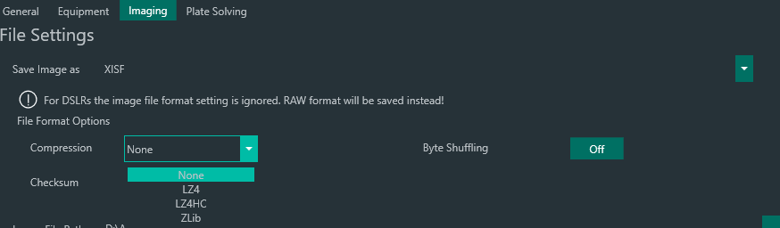

# XISF

Extensible Image Serialization Format (XISF) is an image file format created by PixInsight. It is a free format open to contributions of anyone interested. For more detailed information about the format itself refer to [pixinsight.com/xisf](https://pixinsight.com/xisf/).

N.I.N.A. is capable of saving images in XISF format. The XISF format offers a variety of header meta information and N.I.N.A. will populate all available information into this header. A detailed list of all available Headers and their conditions is described below.
Many applications can make use of these headers (e.g. PixInsight during processing).

## Standard XISF Headers

- Version: 1.0
- CreationTime: Time when the file is created
- CreatorApplication: N.I.N.A. - Nighttime Imaging 'N' Astronomy

## [Observation Namespace](http://pixinsight.com/doc/docs/XISF-1.0-spec/XISF-1.0-spec.html#__XISF_Core_Elements_:_Image_Core_Element_:_Astronomical_Image_Properties_:_Observation_Namespace__)

### Time
- Start: UTC time at exposure start

## Observer
- Name: Observer name specified in astrometry options

### Location
- Elevation: Elevation (currently taken from a connected telescope)
- Latitude: Latitude taken from the astrometry settings
- Longitude: Longitude taken from the astrometry settings
- Name: Site name specified in astrometry options

### Center
Requires a telescope to be connected

- RA: Current telescope's right ascension coordinates
- Dec: Current telescope's declination coordinates

### Object
Available when a target is set inside a sequence.

- Name: Name of object
- RA: Right ascension of target
- Dec: Declination of target

### Meteorology
Requires a weather data source to be connected

- RelativeHumidity: Relative humidity percentage
- AtmosphericPressure: Air pressure in hPa
- AmbientTemperature: Ambient air temperature in Celsius
- WindDirection: Wind direction: 0=N, 180=S, 90=E, 270=W
- WindGust: Wind gust in kph
- WindSpeed: Wind speed in kph

## [Instrument Namespace](http://pixinsight.com/doc/docs/XISF-1.0-spec/XISF-1.0-spec.html#__XISF_Core_Elements_:_Image_Core_Element_:_Astronomical_Image_Properties_:_Instrument_Namespace__)
- ExposureTime: Exposure duration in seconds

### Camera
Requires a camera to be connected

- Name: Name of camera
- Gain: Electrons per A/D unit (only available for some cameras)
- XBinning: X binning factor
- YBinning: Y binning factor

### Sensor
Requires a camera to be connected

- Temperature: actual sensor temperature (requires a cooling unit)
- XPixelSize: Pixel size
- YPixelSize: Pixel size

### Telescope
Requires a telescope to be connected

- Name: Name of telescope
- FocalLength: Focal length (taken from equipment options)
- Aperture: Focal length / Focal ratio (taken from equipment options)

### Filter
Requires a filter wheel to be connected

- Name: Current active filter

### Focuser
Requires a focuser to be connected

- Position: Current step position

!!! tip 
    Additionally all information that is explained [in the FITS description](fits.md) is stored using the [FITSKeyword Core Element](http://pixinsight.com/doc/docs/XISF-1.0-spec/XISF-1.0-spec.html#__XISF_Core_Elements_:_FITSKeyword_Core_Element__).

## Compression

N.I.N.A. offers the possibility to use compression algorithms to try to reduce the file size of your images.
There are three algorithms available:

- LZ4: This algorithm is optimized for speed. While not as potent as Zlib it is dramatically faster and will result in an acceptable amount of compression most of the time
- LZ4HC: Basically the same algorithm as LZ4 but with a higher compression rate. A bit more computational heavy than just LZ4.
- Zlib: This algorithm will yield the highest compression result in most scenarios, but takes a long time to process and is by far the most computational heavy algorithm.
- The option for byte shuffling will re-arrange the actual data in an attempt to optimize it for the compression. In most scenarios this will result in a better compressed result, but is a bit more computational heavy.

!!! tip
    For a more in depth info on how the compression works refer to the [XISF Data Block Compression](https://pixinsight.com/doc/docs/XISF-1.0-spec/XISF-1.0-spec.html#data_block_compression)

## Checksum

This option will store a checksum value into the XISF file to be able to validate data integrity. 

!!! tip
    For a more in depth info on how the checksum works refer to the [XISF Data Block Checksum](https://pixinsight.com/doc/docs/XISF-1.0-spec/XISF-1.0-spec.html#data_block_checksum)
