## 概述

构图选项卡是一个强大的工具，用于决定拍摄哪个深空天体以及如何构图。
使用构图助手，你可以为目标设置完美的构图，如果目标放不进当前的画幅，还可以轻松设置马赛克拍摄方案。
为了实现这些，应用程序提供了多种工具。有多个在线巡天天图源、一个强大的离线星图视图，以及将之前拍摄会话中的图像加载到构图视图中的能力。

## 入门指南

你需要做的第一个选择是根据你的需求选择合适的图像来源。每个来源的简要概述可在[构图选项卡总览](../tabs/framing.md)中找到。
为了知道哪种来源最适合，我们将指南分为三种不同的使用场景：

1. 你还没有好的目标，想为今晚的拍摄寻找一个好机会。
2. 目标已经十分明确，你想为它规划一个好的构图。
3. 之前已进行过一次拍摄，你想以类似的构图继续。

## 选择拍摄机会

构图选项卡可以用来为即将到来的夜晚选择合适的目标。为此，离线天图是一个不错的选择。
这个来源是一个交互式天图，使用赤经和赤纬轴以及粗略的圆形来显示目标轮廓。它没有任何实际的图像，但可以很好地了解目标的大小。
结合构图选项卡中的高度角图表，可以为今晚选择一个完美的目标。

### 加载离线天图

首先选择"天图集（离线构图）"作为图像来源。然后，在不查看任何坐标的情况下点击"加载图像"，右侧将加载离线天图。
正如你下面所看到的，一开始不会看到太多内容，但别担心，这是一张交互式天图，你很快就会看到它的潜力！

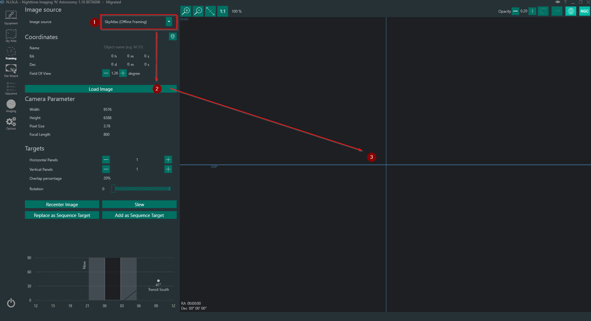

### 在离线天图中移动

天图集初始化后，将鼠标光标移到图像上，使用鼠标滚轮缩小画面，并使用鼠标左键拖动天图。
在移动天图集并熟悉控制方式的同时，注意图像左下角的坐标以及选项卡左下方的高度角图表。两者都显示当前天图显示区域中心像素的坐标和高度角！

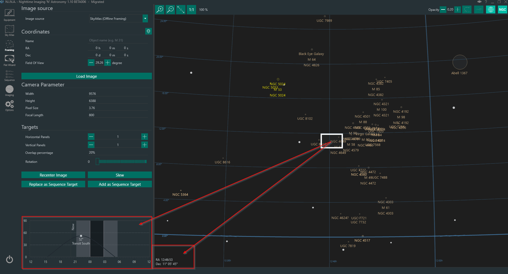

### 选择合适的目标

一般来说，好的目标其高度角峰值应位于拍摄时段的中间。本指南假设你整晚拍摄。
现在将图像中心移动到高度角图表的峰值位于夜晚中间的位置，如下所示。

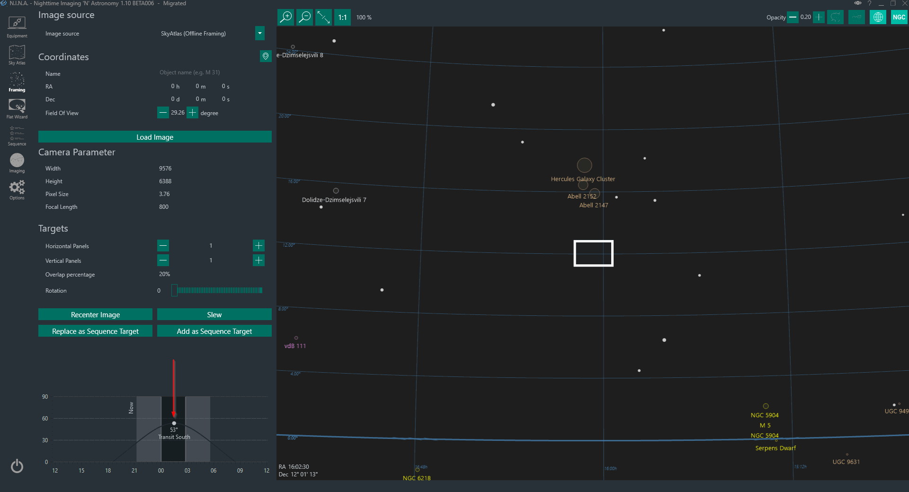

现在你只需要将矩形框上下移动即可，因为由于坐标系的布局方式，高度角的峰值将保持在中心位置。看看哪个目标靠近那条想象中的垂直线，然后将矩形框拖到目标上。
记住，你还可以放大和缩小画面，以在画框中看到更多或更少的目标。在本示例中，我选择了"武仙座星系团"。如你所见，该目标完美地融入了夜晚时间，其尺寸也适合当前画框。

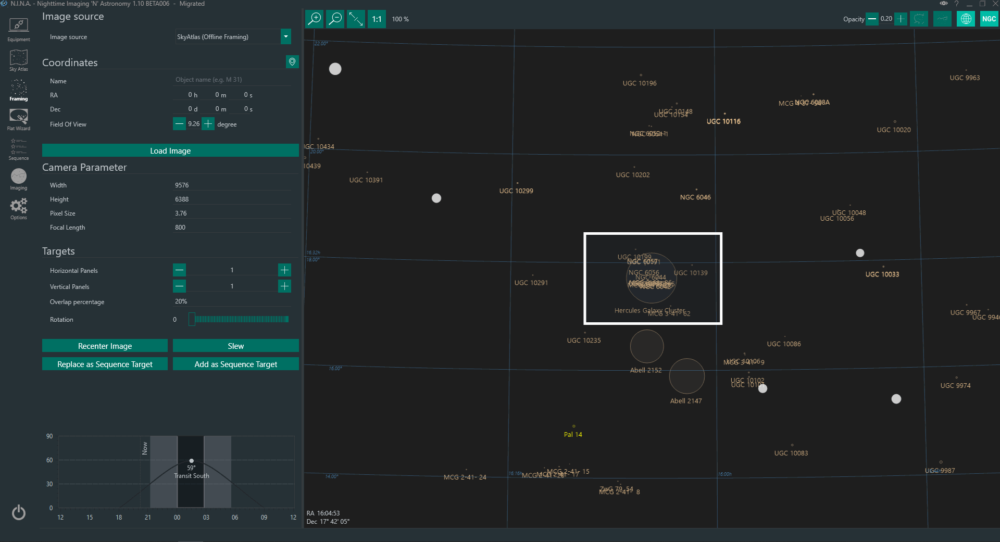

### 用可视化图像调整构图（可选）

由于离线天图没有实际图像，现在你可以使用不同的来源来最终确定构图（这需要互联网连接）。从左上角下拉菜单中选择一个在线巡天天图源，将视场角调整到一个恰好适合你构图的小值（或者直接在离线构图中缩小，使矩形几乎填满整个屏幕），然后点击**"重新对中图像"**。本示例中我使用的是 NASA Sky Survey。当你点击重新对中后，图像将从网络下载并显示。这可能需要一点时间。最后，拖动并旋转矩形到你想要的构图。

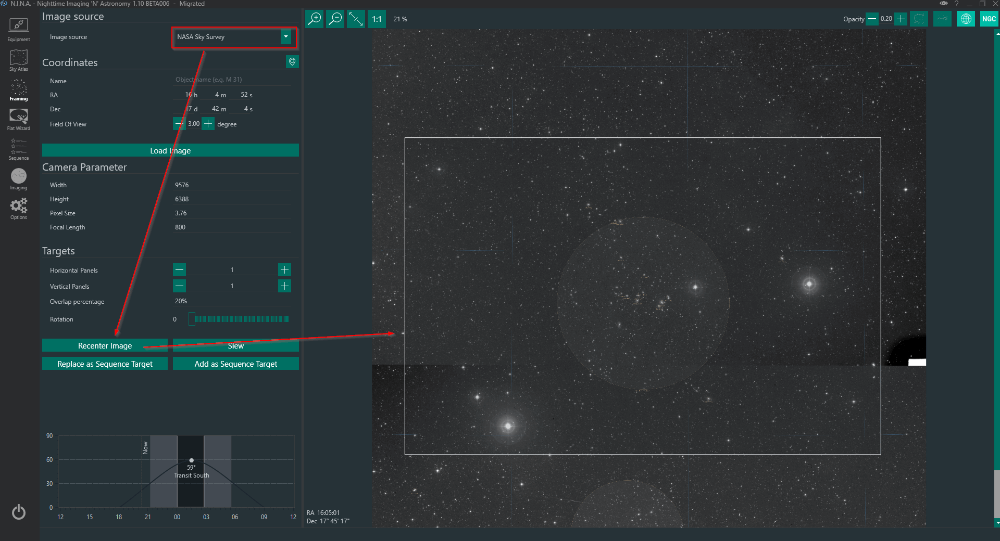

## 为特定目标构图

为特定目标构图的流程与上一节所述相同。基本上，你跳过搜索目标的步骤，直接输入目标的坐标，然后使用离线天图或任何在线巡天天图来构图。

## 继续之前的拍摄会话

当你已经拍摄过某个特定目标，并希望获得相同的构图时，可以方便地将之前拍摄会话中的图像加载到应用程序中。通过选择图像来源"文件"，你可以快速加载单张图像或叠加图像，它将被加载到应用程序中。加载后，你只需拖动并旋转矩形到你想要的构图。

加载文件有三种可能的情况：

### 图像已解析且包含所有必需的头信息（仅 XISF 或 FITS）

这是使用起来最方便的类型。图像已经包含了在 N.I.N.A. 中显示所需的所有信息。只需加载文件，它将几乎立即渲染图像和具有正确比例的矩形，而无需重新解析。此外，目标名称会设置为你当前的参考坐标。

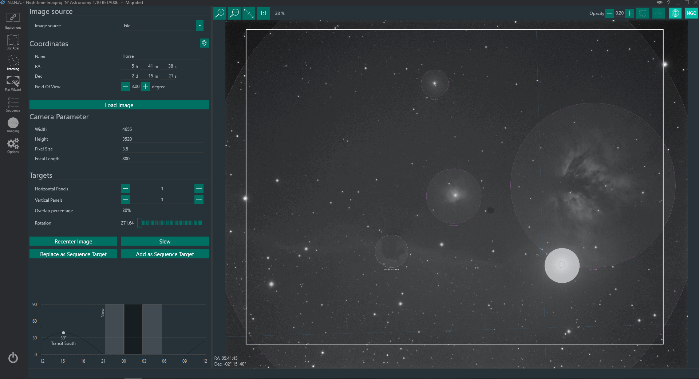

### 图像没有解析坐标，但有参考坐标（仅 XISF 或 FITS）

当图像尚未解析，仅包含诸如目标名称和目标坐标之类的头信息时，N.I.N.A. 不知道实际的图像比例和画框中心位置。为此，需要快速解析该帧图像。由于已有头信息作为参考，解析应该非常快。将弹出一个对话框，询问你是否使用找到的坐标作为参考，然后解析图像。图像解析后，将显示以供构图。

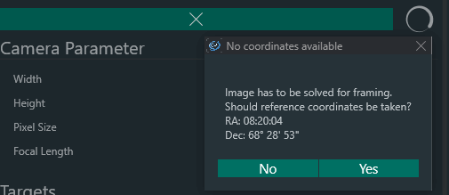

### 图像不包含任何相关信息

如果你的图像不包含所需的头信息，或者图像格式根本没有任何头信息（如 JPG 或 RAW 格式），应用程序将需要一些用户协助来获取正确的参考坐标，以便能够快速解析图像。在点击"加载图像"之前，你应该先指定目标的坐标。你可以在**坐标**字段中输入名称进行快速搜索，如果找到，选择正确的坐标；或者你需要手动输入坐标。坐标填好后，点击"加载图像"，应用程序将询问你是否应使用这些坐标进行解析。
解析成功后，图像最终将显示出来。

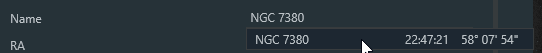
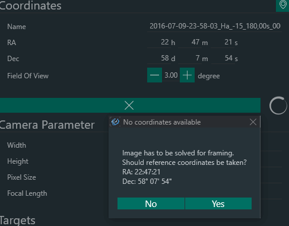

## 最终确定构图

你的矩形框已拖到了预定位置，旋转角度也已确定。要最终完成此过程并投入使用，你需要基于它创建一个序列。
有两个选项可用：

*"替换为序列目标"*：这将用当前的构图目标替换**所有**当前设置的序列。
*"添加为序列目标"*：当你已经从之前的构图中添加了目标时，你可以将当前目标添加到整体序列中。这对于计划在一晚内拍摄多个目标特别有用。

## 记住旋转角度！

你的构图完成了，你开始拍摄，但图像的旋转角度与你构图选项卡中设置的角度完全不同？
很遗憾，除非你有电动旋转器，否则应用程序无法神奇地旋转你的相机。对于大多数没有旋转器的用户，N.I.N.A. 提供了一种快速的方法，以确保你的序列旋转角度与构图中设置的旋转角度匹配。
在**设备 -> 旋转器**中，你需要选择"手动旋转器"并连接到它。当这个小型工具"已连接"时，应用程序将在`转向、对中并旋转`命令期间考虑旋转角度。在目标对中过程中，解析器将确定实际旋转角度，将其与所需旋转角度进行比较，然后向旋转器发送旋转信号。由于我们已启用手动旋转器，会弹出一个提示窗口，引导你按所需角度旋转相机，直到你进入旋转容差范围（在[选项 -> 解析 -> 旋转容差](../tabs/options/platesolving.md#旋转容差)中设置）。

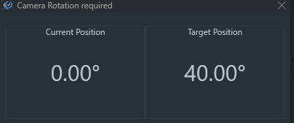

## 马赛克构图

马赛克构图非常简单。你可以遵循前面提到的所有步骤来为马赛克的构图和方向选择合适的目标。唯一不同的是，你需要另外设置**"水平面板"**和**"垂直面板"**以及这些面板的重叠百分比。
当选择多于一个面板时，单个矩形会扩展并根据面板数量和重叠百分比分割为多个矩形。此外，每个面板都会被分配一个编号。

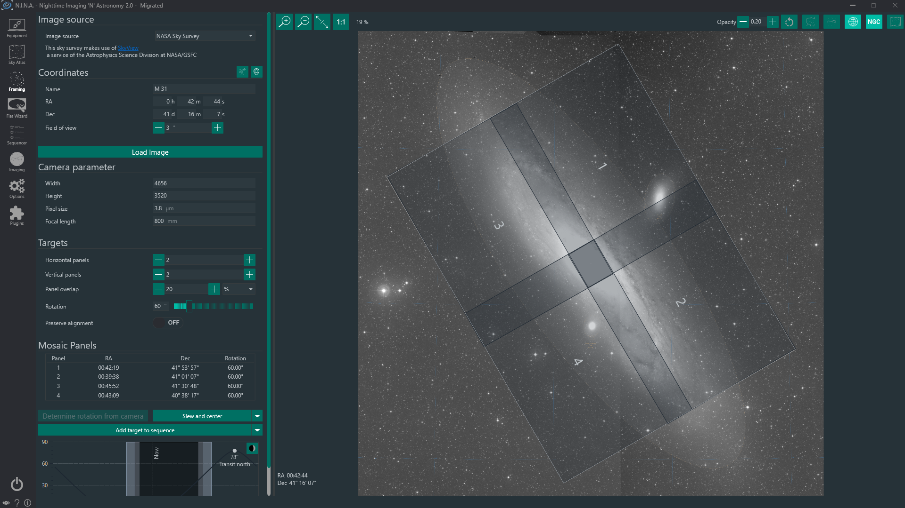

完成马赛克规划后，你可以通过替换或添加到序列中。建议在将马赛克计划添加到序列之前，先设置好序列模板，这样就不必单独设置每个面板。
将马赛克添加到序列时，目标名称将是在坐标区域中选择的目标名称，并根据面板编号附加"Panel X"后缀，以便轻松区分这些面板。坐标将根据面板自动偏移，你的马赛克应该可以顺利工作，无需担心任何事情。

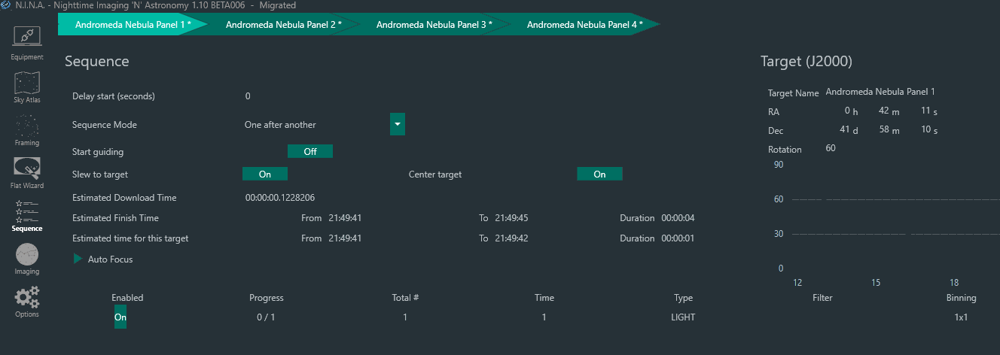

**要让马赛克成功拍摄，确保相机实际旋转正确至关重要。**
