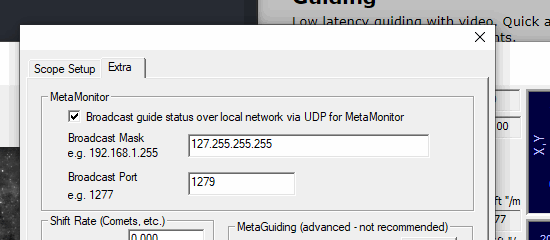
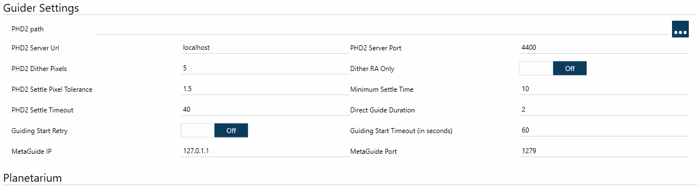
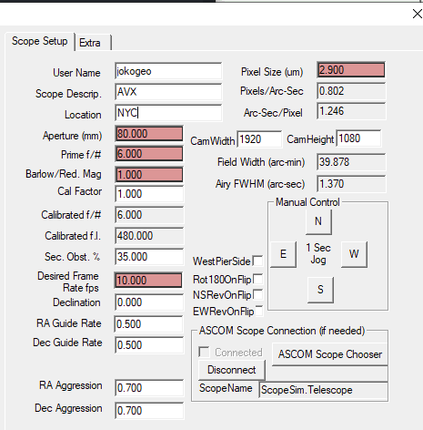
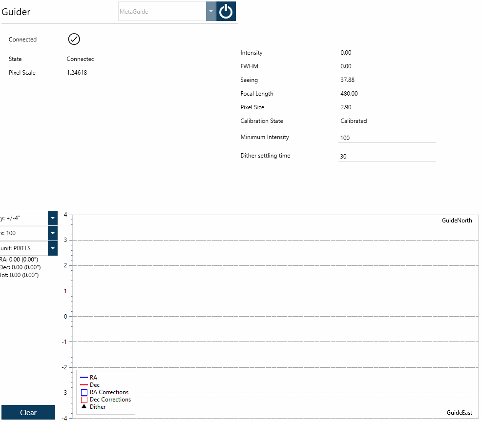

## 概述
望远镜赤道仪本身存在误差，导致其无法在地球自转过程中完美跟踪天空中的天体。这些误差包括：
* 极轴对准不完美
* 驱动齿轮的机械误差
* 风和其他环境条件

改善长曝光质量、克服这些问题的方法之一是使用一台辅助相机、一个导星镜或离轴导星器（OAG），以及一款**导星应用程序**。其原理是锁定一颗导星，并发送微小修正脉冲来抵消导星的移动。N.I.N.A. 支持以下**导星应用程序**：
* PHD2
* MGEN2
* MetaGuide
* 赤道仪抖动

## PHD2
PHD2 是最常用的导星应用程序。它是免费的开源软件，可从[此处](https://openphdguiding.org/)获取。

### PHD2 设置
为了让 N.I.N.A. 能够与 PHD2 通信并命令其执行抖动等操作、接收导星遥测数据，必须启用 PHD2 的内部服务器。要启用 PHD2 的内部服务器，请前往 PHD2 的**工具**菜单，确保**启用服务器**已选中。

网上有大量关于设置 PHD2 的教程。N.I.N.A. 提供的一个不错的功能是，在你首次设置后，它可以自动启动 PHD2 并连接到它。

## MetaGuide
MetaGuide 采用与 PHD2 不同的导星方法——它使用*幸运成像*技术。它是免费的，由 Frank Freestar8n 在[此处](http://www.astrogeeks.com/Bliss/MetaGuide/)提供。

### MetaGuide 设置
MetaGuide 的设置比 PHD2 更复杂，请务必仔细阅读文档。设置完成后，可以按照以下步骤将其连接到 N.I.N.A.：

1. 启用 MetaMonitor 服务器。使用广播掩码 127.255.255.255 仅允许通过本地 PC 连接，出于安全考虑我们建议这样做。广播端口默认为 1277，但如果这对你来说不适用，可以尝试其他端口。添加此功能的 N.I.N.A. 贡献者需要使用不同的端口，因此他们使用了 1279。 

2. 在设备 -> 导星器设置中设置 IP 和端口。如果你按我们推荐的广播掩码操作，IP 地址应为 127.0.0.1。 

3. 确保根据你的导星相机和望远镜正确配置了像素尺寸（µm）、口径（mm）和主焦比（Prime F/#）。像素比例（角秒/像素）基于这些设置，N.I.N.A. 使用 MetaGuide 报告的像素比例来正确交互（如执行正确的抖动值）。 

### MetaGuide 扩展状态
N.I.N.A. 为 MetaGuide 提供了与 PHD2 相同的跟踪精度和状态信息，以及一些 MetaGuide 特有的额外信息。 

1. **强度**是一个 0-255 的值，表示所选导星的饱和度。通常希望此值接近 255，如果完全饱和，可以在 MetaGuide 中减少曝光时间。该值在导星期间可能因云层遮挡而下降，这正是下一项设置的作用。
2. **最低强度**是 N.I.N.A. 允许导星继续的**强度**最低值。如果**强度**低于此阈值数秒，导星将暂停，直到**强度**恢复。
3. **抖动稳定时间**是 N.I.N.A. 在触发抖动后等待恢复拍摄的时间。这与 PHD2 不同——PHD2 会告知 N.I.N.A. 导星在抖动后何时已稳定。你可能需要根据赤道仪的实际表现来调整此项。
