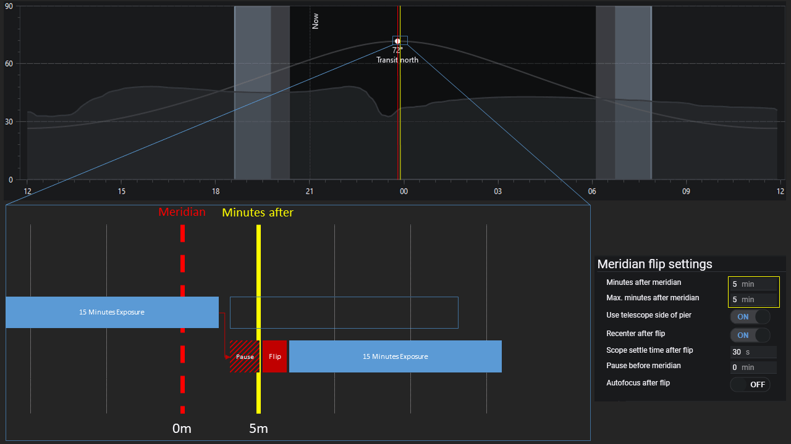
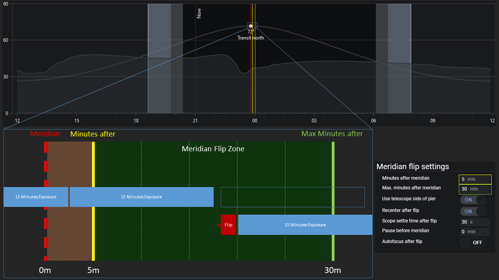
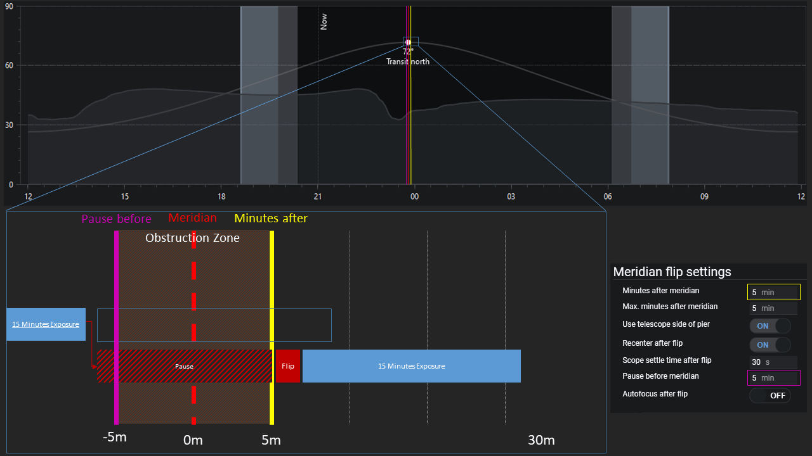

## Overview

Mount operations known as Meridian Flips are important when using a German Equatorial Mount (GEM).
The meridian is an imaginary line that divides the sky into east and west halves.
It starts at 180 degrees (south) and passes directly overhead to 0 degrees (north).
It is static and does not move with the sky.
Imaging an object typically begins when it is in the east half of the sky.
As the night progresses, the object will approach the meridian, cross it, and then be in the west half of the sky.

When a GEM's RA axis approaches the meridian, with the telescope on the west side of the mount and looking east, a "flip" must be performed to swap the side of the mount that the telescope is on.
This is to avoid the mount tracking past the meridian.
Otherwise the counterweights will be higher than the telescope (an undesirable situation on some mounts) and the telescope (or some part of it) contacting the pier or tripod legs.
Some mounts and equipment configurations are more tolerant than others to these conditions.
Some mounts can track for hours after passing the meridian in a counterweight-up condition.
Some telescopes are both short enough in length and height that they will not crash into the pier or tripod legs.
Every situation is different, so it is up to the user to know when a meridian flip should be commanded.

## Automating Meridian Flips

An Automatic Meridian Flip operation swaps the telescope to the west side of the mount.
Meridian flips prevent that your telescope and camera bump into the mount and do major damage to your equipment.
N.I.N.A. has built-in functionality for the automated flip, even if your mount does not support it in firmware.
After a flip, N.I.N.A. verifies that it is still imaging the desired area of sky through [Plate Solving](platesolving.md), and the imaging session continues.

To enable the Automated Meridian Flip you need to enable it in the legacy sequence target set options or when using the advanced sequencer, the meridian flip trigger needs to be added to the sequence. For customizing the behavior of the meridian flip, the [meridian flip settings](../tabs/options/imaging.md#auto-meridian-flip) can be customized.

## Meridian flip settings in detail

The meridian flip settings offer a variety of settings that will affect how a meridian flip is performed. Most notable are the `Minutes after meridian`, `Max. Minutes after Meridian` and `Pause before meridian`. These will lead to three different kind of scenarios, depending on how they are set up.

### Min and Max time after meridian are equal

In earlier versions of N.I.N.A. there was no `Max. Minutes after meridian` setting and it is synonymous to having both settings set to an equal value.  
As you can see in the picture above, the `Minutes after meridian` settings will define the point in time where a flip must happen.  
N.I.N.A. will try fit in exposures until one exposure is longer than the remaining time to `Minutes after meridian`. When this happens, the application will pause the tracking of the mount and will wait for the point in time to come to actually flip the mount. Once the `Minutes after meridian` time has been reached, the telescope will flip and the sequence will continue afterwards.  
  
A setup like this will result in a little downtime, as some time is spent just waiting until the flip can happen.

### Min and Max time after meridian define a time range

When you set different points in time for `Minutes after meridian` and `Max. minutes after meridian` you can basically define a time range where a flip *could* happen. Anywhere inside this time range a flip can happen safely.  
N.I.N.A. will try to fit in exposures until an exposure ends inside this time range. When the application detects that it is now inside this flip time range, the next exposure will not happen, but instead a flip will immediately be executed without any wait time. Afterwards the sequence will continue as normal.

The big advantage with a configuration like this is that there is absolutely no downtime between exposures except for the actual flip. No time is wasted to waiting.

### A pause before meridian is used

Setting a `Pause before meridian` time as non-zero will result in creating an obstruction zone. This means that your equipment will hit the tripod before actually passing the meridian (e.g. you have a very long telescope tube). During this period of time, no imaging must happen as the telescope cannot safely track past this time before crossing the meridian.  
N.I.N.A. will try to fit in exposures until one exposure is longer than the remaining time to `Pause before meridian`. When this happens, the application will pause the tracking of the mount and will wait for the point in time to come to actually flip the mount at `Minutes after meridian`. Once the `Minutes after meridian` time has been reached, the telescope will flip and the sequence will continue afterwards.  

Use this setting only when your equipment hits the tripod before crossing the meridian, as it will result in a long downtime to wait for the object to get out of the obstruction zone!
