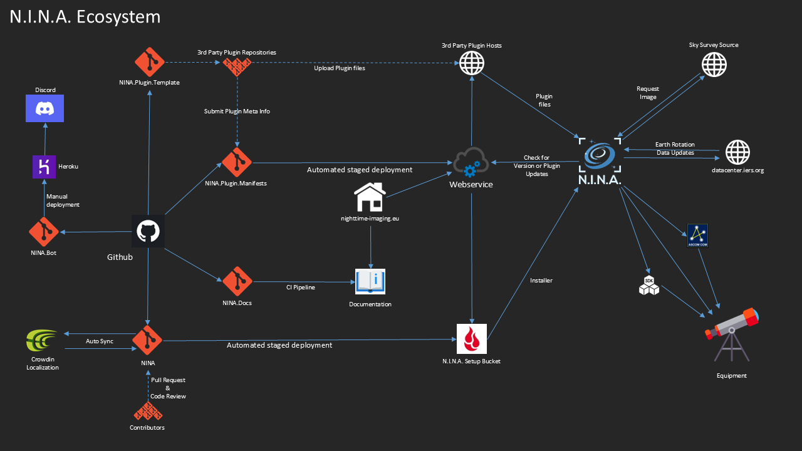

N.I.N.A. 的生态系统远不止主应用程序本身。为了能够构建今天的应用程序，后台进行了相当多的协调工作。

## 代码仓库
[主应用程序](https://github.com/isbeorn/nina/) - 主应用程序源代码  
[插件清单](https://github.com/isbeorn/nina.plugin.manifests) - 插件的元定义文件可推送至此  
[插件模板](https://github.com/isbeorn/nina.plugin.template) - 作为插件开发者的起点  
[文档](https://github.com/isbeorn/nina.docs) - 使用 mkdocs 定义文档  
[Discord 聊天机器人](https://github.com/isbeorn/nina.bot) - 一个让 Discord 聊天中的生活更轻松的机器人  

## Crowdin
[Crowdin 本地化管理](https://nina.crowdin.com/)  
有关更多详细信息，请参阅专门的[本地化](./localization.md)页面

## 主页
[主页](https://nighttime-imaging.eu/) 是收集资源的中枢。它还托管了一项网络服务，用于告知用户和应用程序哪里可以获取更新，同时托管着文档。
