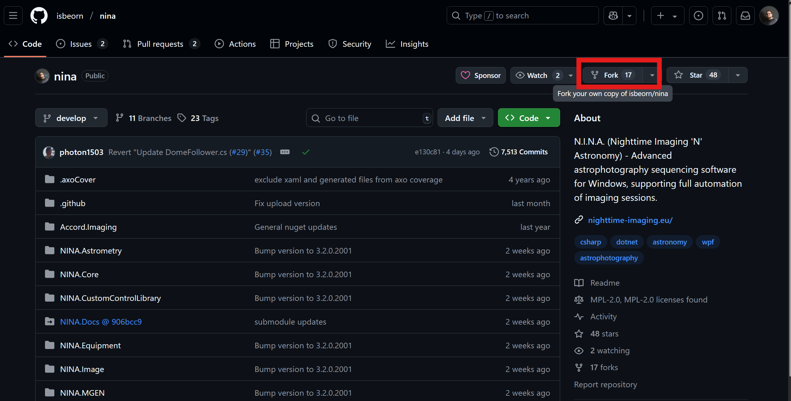

## Forking the repository

1. Login to your github account
2. Navigate to [N.I.N.A.'s main repository](https://github.com/isbeorn/nina)
3. Click "Fork"

4. You will see a configuration wizard for your fork.
5. Enter a name for your forked repository.  
6. Give a short description what your intention is with this fork (optional)
7. Click on "Create fork"
8. You will be navigated to your new repository at `https://github.com/<your_username>/<your_fork's_name>/`

## Cloning Repository

1. On the top right of your forked repository click on the "Clone" button
2. A pop up will show the command how to clone this repository to your local machine
3. Open a command window
4. Navigate to the folder where you want your repository folder to be created in
5. Enter the command that was shown in step 2.
```bash
git clone -n -b develop https://<YourUserName>@github.com/<YourUserName>/<YourForkName>.git
# NOTE: the -n flag for "don't checkout the branch"
# Ignore any LFS smudge errors for now. They are not yet synced and will get synced in a later step
```
6. Navigate to the created folder
```bash
cd <YourForkName>
```
7. Next you need to add the "upstream" to the root repository (where your fork is based on). This is later required for merging from the main dev branch etc.
```bash
git remote add upstream https://github.com/isbeorn/nina.git
```
8. Github will not automatically copy over the LFS into the fork repository. This has to be done manually. Run the following commands to sync the lfs
```
git lfs fetch upstream --all
git lfs push origin --all
```
9. Now we need to checkout the develop branch
```
git checkout develop
```
10. Fetch the submodules for the external dependencies. These contain all third party vendor DLLs that are not part of any nuget package, e.g. Camera Drivers, VCRedist etc.  
```
git submodule update --init --recursive
```
## Keeping your repository up-to-date with the upstream root repository

1. Open command line and navigate to your project folder
2. Fetch changes from the upstream repository
```
git fetch upstream
```
3. Merge incoming changes from the upstream develop branch into your develop branch
```
git merge upstream/develop
```
4. In case you run into unresolvable merge conflicts you have to solve these in your favorite merge tool