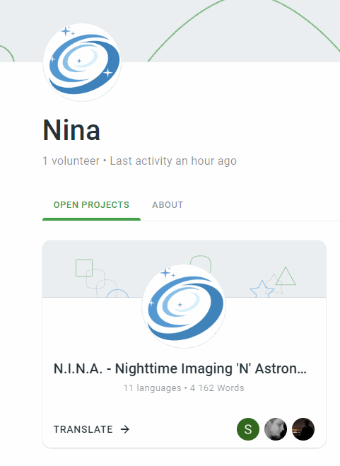
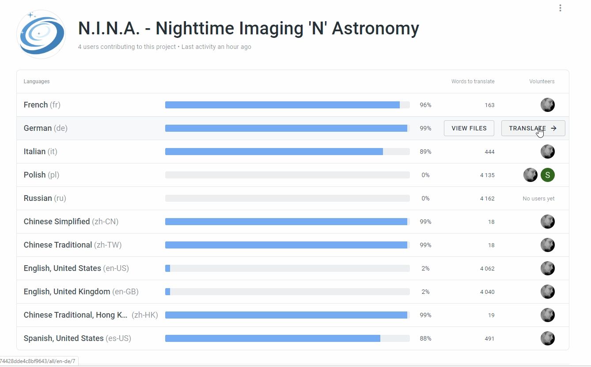
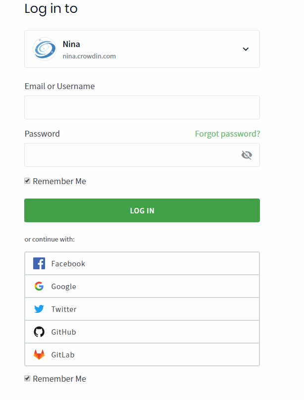
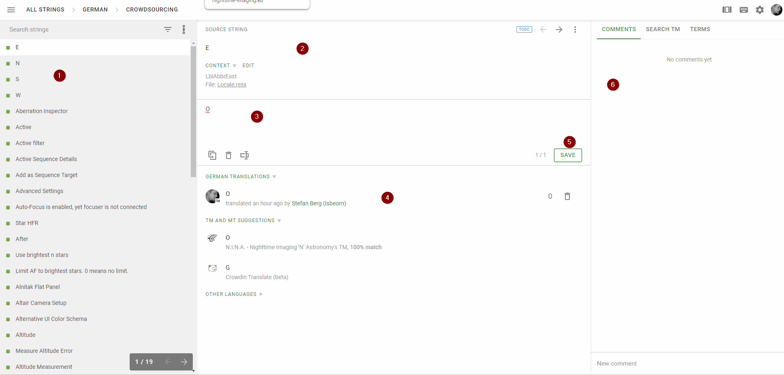

# Localization

N.I.N.A. uses an external translation management software called Crowdin to localize the application.
This software offers an easy access for all people that are interested in contributing to the localization without having to know anything about coding.
The software can be found at  
  
**[nina.crowdin.com](http://nina.crowdin.com/)**

## Quick Start

1. Visit the project's localization overview via the link above and click on "Translate" 
2. You will see an overview of all currently available languages where you can add new or improved translations 
3. Hover over the language where you want to start and click on "Translate" 
4. In case you are not logged in yet, you need to log into Crowdin now. Either register a new user or use one of the alternative OAuth logins 
5. The next screen will greet you with the actual translation interface and you can now start your translations 
   1. On the left side you can find a list of all available Labels. A red box indicates if no good translation is available yet and these are shown first by default.
   2. In the top middle section you will see the original Text of the label for the default language as well as the label code
   3. To provide a new translation you have to enter your proposal into the textbox here
   4. In the bottom list you can see all previous translation proposals as well as some proposals given by machine learning
   5. Once you are happy with your translated string you click on "Save"
   6. On the right section you can find comments of other contributors as well as a convenient quick search for some terms and uses.

## Integration into N.I.N.A.

The crowdin platform offers an automatic synchronization into the project's code repository.
Every *30 minutes* a sync is triggered and new translations will be pushed into a separate branch inside N.I.N.A.'s repository and a pull request will be opened to be reviewed.
Once that pull request is approved and the new version is installed, all the translations will be reflected inside the User Interface

