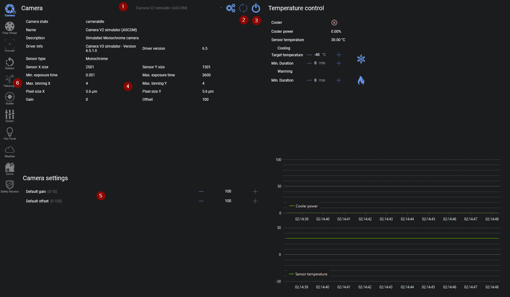
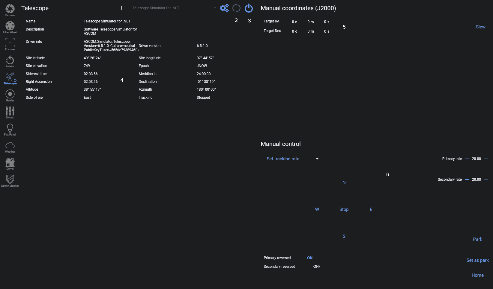

# 连接设备

现在让我们来首次连接你的相机和赤道仪。

:::note
你应该已经将相机和赤道仪实际连接到运行 N.I.N.A. 的电脑上了。如果还没有，现在请连接。
:::

你需要在下拉菜单（1）中选择你的相机。
如果列表中没有出现你的相机，请点击刷新按钮（2）。
某些相机需要先安装驱动程序才能在列表中显示。
选择相机后，点击连接按钮（3）以连接设备。

设备连接成功后，相机区域（4）中将显示关于相机的各种信息（如果可用）。

:::note
请注意，如果你使用的是 DSLR 相机，信息可能不完整或缺失。这并不会影响 N.I.N.A. 的正常工作，但如果需要查找相关信息，你只能自行上网搜索。
:::

当你连接的相机具备增益（ISO）调节能力时，
该设置会显示在相机设置区域（5）中。
这是将使用的默认增益值，后续拍摄时的设置可以覆盖该值。

连接相机后，你还需要连接赤道仪。为此，我们需要切换到望远镜选项卡（6）。

连接赤道仪的步骤与连接相机相同。
从下拉菜单（1）中选择赤道仪，如果未显示则刷新（2），然后按下连接按钮（3）即可连接赤道仪。

在望远镜区域（4）中，你可以找到有关纬度、经度、海拔、恒星时以及到达中天时间的有用信息。
你可以通过（5）手动将赤道仪转向指定坐标，或在手动控制区域（6）中手动操控赤道仪。如果你没有使用赤道仪的手控器，这将非常有用。

:::tip
到达中天的时间取决于纬度和经度设置是否正确！
:::
