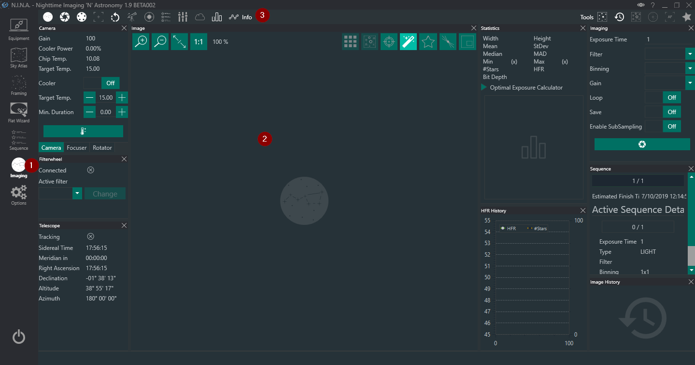
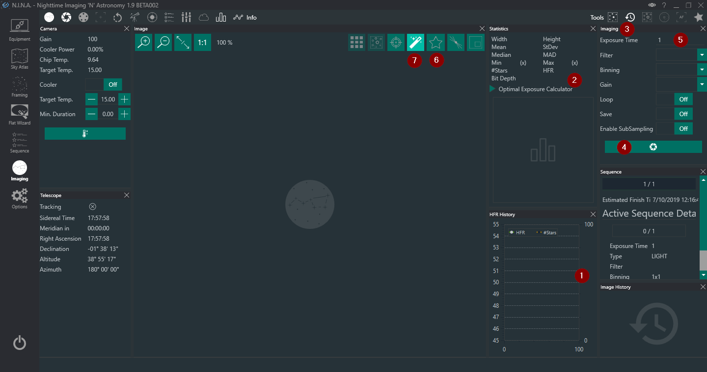
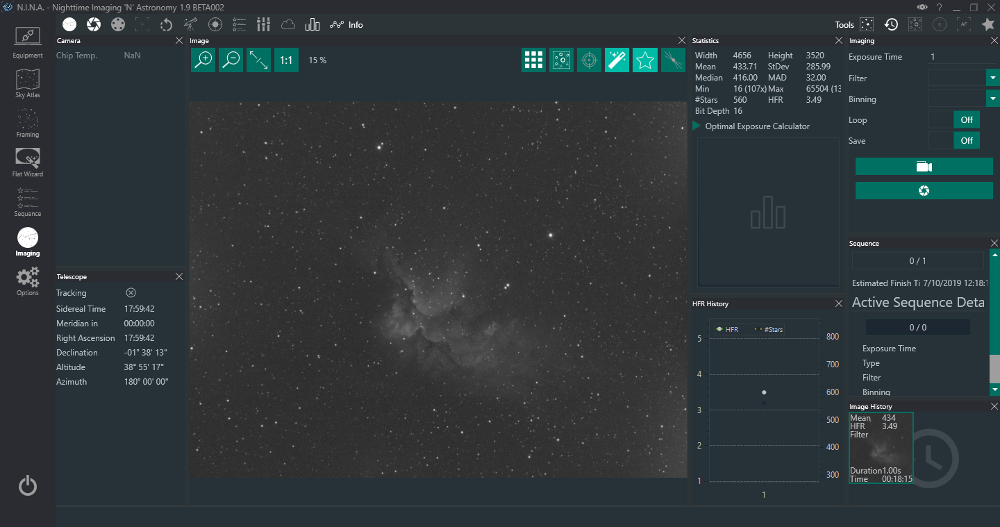
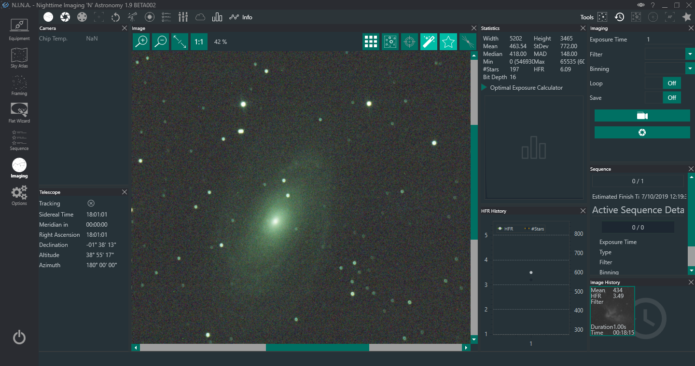

开始拍摄之前，你需要先进行对焦。为此，让我们切换到拍摄选项卡（1）。

进入后，你会看到如下界面。
界面上有不少信息和面板，但总体上分为两个区域：
第一个区域用于查看面板并与之交互（2），第二个区域用于启用和禁用各种面板（3）。
由于我们只使用一台一次性彩色相机（OSC）和赤道仪，为了更清晰地查看界面，让我们先禁用一部分面板。
你可以根据自己的需要自由启用或禁用面板，在本示例中，我将通过点击图标来禁用以下面板：

你既可以保留这些面板的启用状态，也可以根据自己的意愿禁用其他面板。
欢迎你随意尝试，找到自己喜欢的布局。
你还可以在拍摄窗口内拖动面板，重新排列和自定义你的界面风格。
出于教程目的，这里暂时保持当前布局。

由于我们当前的目标是对望远镜进行对焦以获得锐利的星点，因此需要使用以下当前已启用的面板。

:::tip
另一种对焦方法是使用 Bahtinov 对焦罩（鱼骨板）。你可以通过启用图像面板中的对应图标来尝试我们实验性的鱼骨板检测功能。
:::

通过 HFR 历史记录面板（1），你可以查看星点在 HFR（半通量半径）方面的表现。
统计面板（2）中也会呈现相同信息。
HFR 值越低，说明图像对焦越好。
要开始手动对焦流程，你需要选择拍摄选项卡（3）并按下开始拍摄按钮（4）。
如果需要，你也可以调整该快照的曝光时间（5）。

要启用星点检测和 HFR 分析，你需要按下星点分析按钮（6）。
这将对图像进行全面分析，并将 HFR 值填入统计面板（2）中。
你会注意到，启用星点分析按钮（6）后，自动拉伸按钮（7）也会随之启用。

以下是合焦和失焦星场的两个示例。

如你所见，HFR 值已经显示在统计数据中。
第二张图像明显处于失焦状态，HFR 为 6.09，而第一张图像达到了尽可能好的对焦状态。
你的 HFR 值会有所不同，因为它们取决于望远镜的焦距和传感器的像素尺寸，但你应该尽量调整望远镜的对焦，直到 HFR 值尽可能低。
