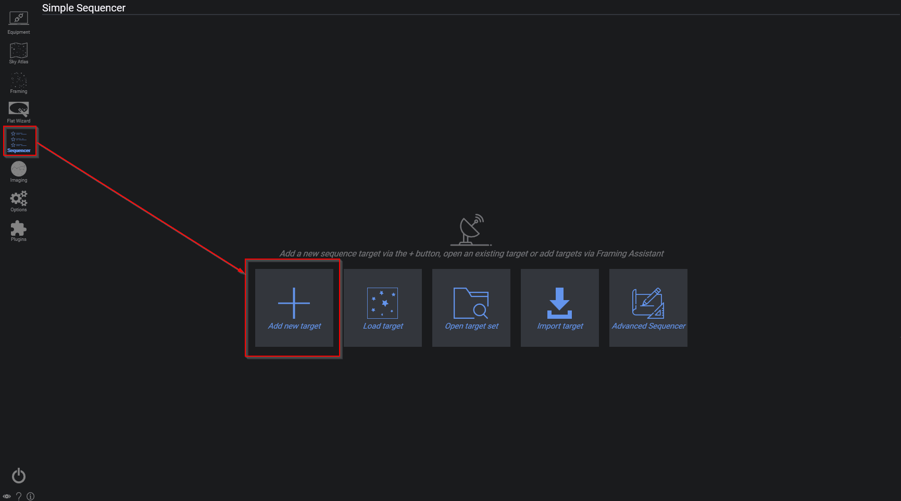
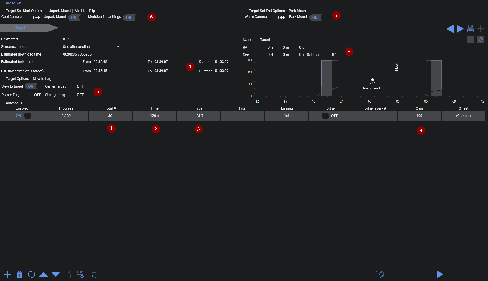
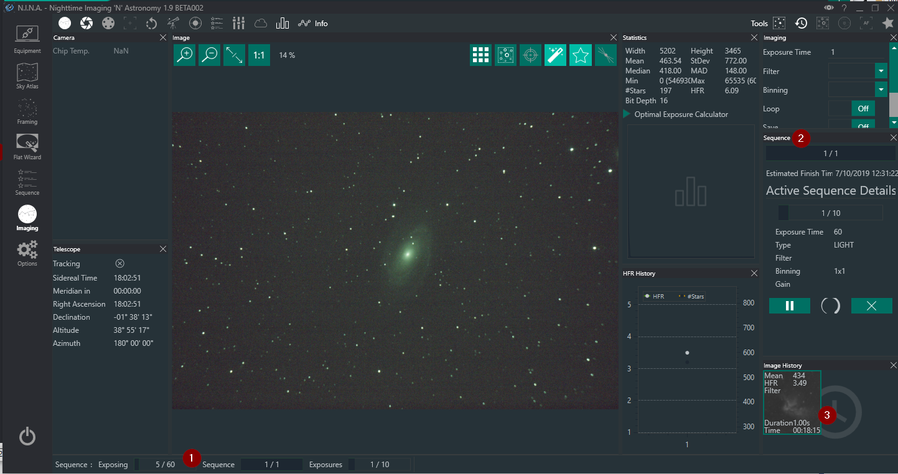

对焦调整到位后，你可以切换到序列选项卡。在这里，你需要创建一个新的目标。

这里我们可以看到各种选项。
对于一次性彩色相机（OSC）用户来说，操作相对简单。
在"总数 #"（1）中输入你想拍摄的图像数量，输入单张图像的曝光时间（2），选择类型（3），此时通常为 LIGHT（亮场）。
你可能还想在增益列（4）中为该序列调整增益值。

现在打开"目标选项"（5），启用"转到目标"，这样赤道仪就会转向指定的目标。此外，在（6）中启用赤道仪解锁和中天翻转功能。如果要在全部完成后也归位赤道仪，请在（7）中启用"归位赤道仪"选项。
现在，为了让赤道仪实际转向一个特定目标，请在（8）中输入坐标和名称。

你可以看到序列预计完成时间的估算值（9）。该值会在序列运行过程中根据相机的平均下载时间而变化。
最后，按下右下角的"开始序列"按钮以启动拍摄序列。
序列运行后，返回左侧边栏的拍摄选项卡。

在这里，你会看到序列状态的一些细微变化。
在左下角（1）处，你可以看到相机的当前状态，该状态会根据相机正在执行的操作而变化。
在序列选项卡（2）中，你可以看到预计完成时间以及当前正在拍摄的图像信息。
你还可以使用序列选项卡底部的按钮提前取消序列。
最后，在图像历史记录（3）中，你可以看到之前拍摄的图像，并可以从那里打开它们进行查看。
接下来，就是等待序列完成了。

祝你拍摄顺利，晴空万里！

有关序列拍摄的更深入信息，请参阅[序列概述](../sequencer/overview.md)
