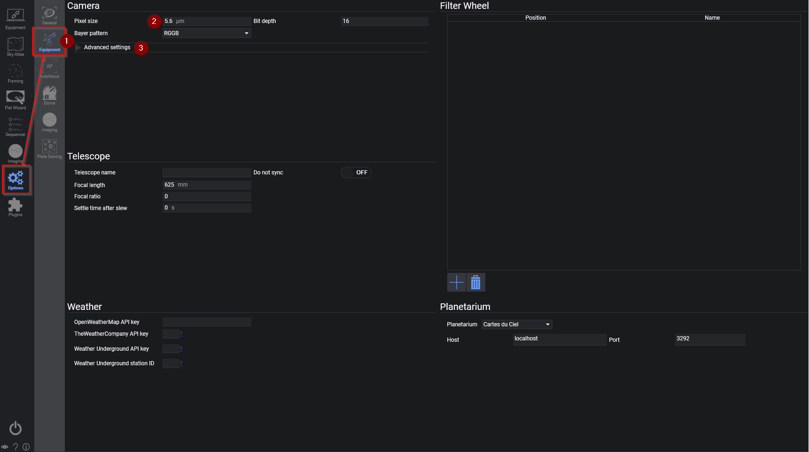
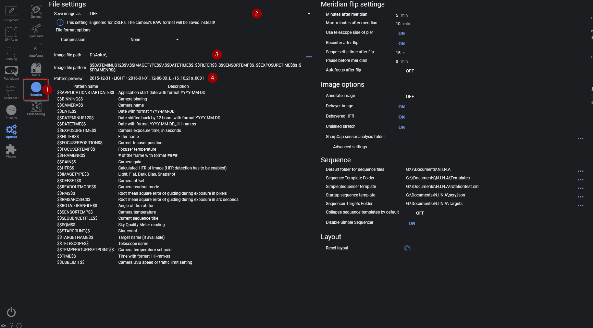

以下整个设置流程只需针对特定配置文件执行一次。
一旦你设置好了默认的赤道仪和相机，在 N.I.N.A. 启动后只需按下左下角的连接按钮，即可自动连接到已保存的设备。

在开始拍摄之前，我们还需要完成几个小步骤。为此，我们需要切换到选项选项卡。

在选项中，我们直接进入设备选项卡（1），首先需要设置一些内容。你应该将像素尺寸设置为你的相机实际像素尺寸（如果未自动设置的话，大多数 DSLR 和某些 ASCOM 驱动不会自动设置）。请在线搜索你相机的像素尺寸，并将值填入（2）中。
对于大多数相机，位深保持在 16 位即可，因为这里指的并非传感器位深，而是相机驱动产生的实际原始数据位深。大多数驱动会自动将其缩放为 16 位。如果你使用的是 DSLR 并且将原始转换器选择为"FreeImage"（在高级设置中），则需要输入相机的实际位深！

:::tip
如果你使用的是较旧的 Nikon 相机，可能无法使用通过 USB 控制的原生 B 门模式进行超过 30 秒的曝光。如果你有 RS232（串口）快门线，或者你的赤道仪有相机快门控制端口，请在高级设置（3）中更改**B 门模式**。请参考使用 RS232 或赤道仪进行 B 门快门控制的高级主题。
:::

现在，我们还需要设置一些与图像保存相关的其他选项。为此，请切换到拍摄选项卡（1）。图像可以保存为 TIFF（也支持两种不同的压缩算法）、XISF 和 FITS 格式（2）。FITS 是一种通用格式，所有天文相关软件都可以读取，可以保留默认设置。不过，如果你偏好其他格式，也可以随时更改。
接下来，你需要设置图像文件路径（3）。这就是你保存图像的位置。最后，如果你愿意，可以更改图像文件命名模式（4）。这决定了图像文件的命名方式。你可以在面板下方看到可用的变量，在模式下方可以预览文件名的最终效果。你可以保留默认设置或按自己的喜好进行自定义。

完成这些设置后，我们就可以开始对焦并启动拍摄序列了。
