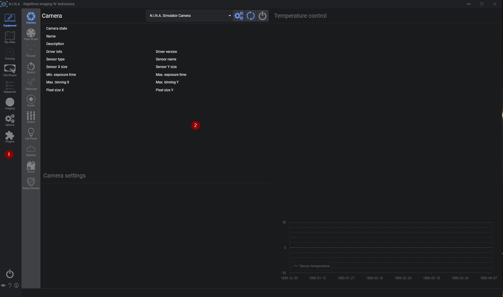

# 界面概览

首次启动 N.I.N.A. 时，你将看到如下界面。
让我们花几分钟了解一下基本布局，以便熟悉该软件的使用。

界面分为两个区域。
在左侧的选项卡区域（1）中，你可以找到连接设备所需的所有选项卡，
右侧通常显示当前选中选项卡的详细信息。
当前选中的选项卡在左侧会高亮显示（1），这样你随时都能知道自己的位置。
你可以随意点击浏览所有选项卡；所有选项卡的详细说明请参阅"选项卡"章节。
现在，我们假设你拥有一台一次性彩色相机（OSC）和赤道仪，没有滤镜轮或其他额外设备，只是想启动一个传统序列。

:::note
本快速入门指南假设你已经知道如何将设备连接到电脑，并已安装了相应的 ASCOM 驱动程序和相机驱动（如有必要）。如果你还没有完成这些准备工作，欢迎在 N.I.N.A. 官方 Discord 服务器上向我们提问。
:::
