# 高级序列器

高级序列器使得用户可以根据自己的特定需求，以非常精细的粒度完全规划和自定义拍摄运行。设备可以通过各种可用的指令逐步控制，每条指令还可以通过特定参数进一步定制。

## 导航
主区域将包含实际的指令。在这里可以添加指令、自定义参数并查看序列器的进度。
此外，该区域分为三个部分，用于管理序列开始指令、目标指令和序列结束指令。

在左下角，可以锁定序列器以防止任何手动输入，禁用拖放功能，以及保存和加载完整的序列运行。在右下角，可以启动和停止序列。
右侧边栏将显示所有可用的指令，以及模板和目标。下面将更详细地介绍这些内容。
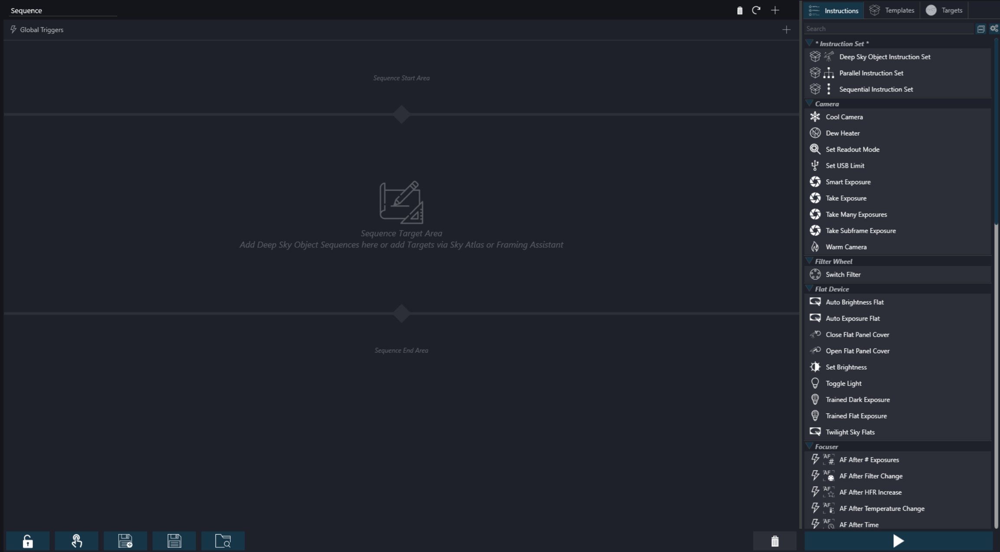

高级序列器中的所有内容都支持拖放操作。例如，可以通过按住鼠标左键抓取一条指令，然后将其拖到序列器区域中，在鼠标位置添加一条指令。
不过，也可以完全不使用拖放，通过使用可用的"+"按钮来规划一切。
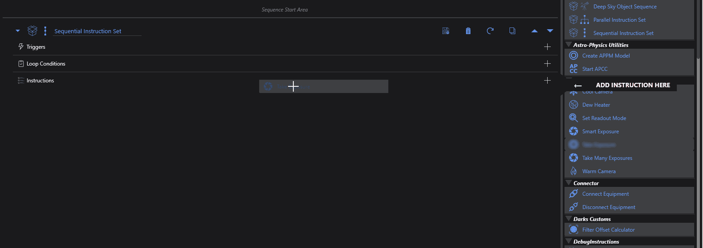

## 序列器的执行流程

从高层来看，高级序列器的概念相当简单。一个序列由多个小型构件块组成，这些构件块执行一些逻辑操作，序列器将从上到下逐个执行这些块。
除了单条构件块，还可以添加所谓的*指令集*。可以将它们视为指令的逻辑分组。这些分组的工作方式与整个序列器相同，它们将从上到下执行属于该分组内的指令块。
*指令集*可以包含所谓的*循环条件*，这会略微改变操作流程，因为指令集会重复执行其包含的指令，只要这些循环条件所定义的所有条件仍然满足。某些指令集还可以改变其内容的运行时机或方式，例如并行运行或仅在表达式为真时运行。
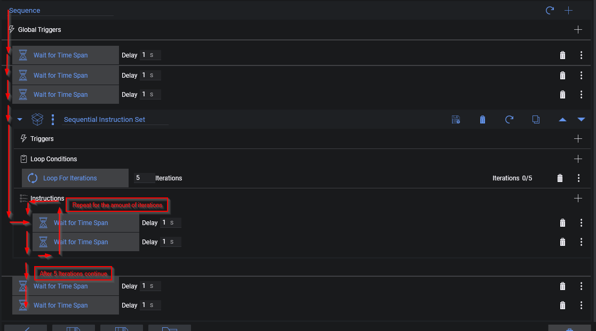
    
## 指令
指令是序列器将执行的单条命令。每条指令有不同的用途，可以控制各种类型的设备、设置参数，或者是自动化拍摄流程的实用工具函数。
可用指令的完整列表可以在高级序列器的右侧找到，每条指令都有一个简短的描述以及其用途的提示。 [指令页面](./instructions.md) 也将详细描述每条可用的指令。
指令可以添加到序列器中，并且可以在那里设置具体的参数。然后序列器将遍历每条指令并处理它们。
从可用列表中，指令可以从右侧拖到左侧并放入序列器中。
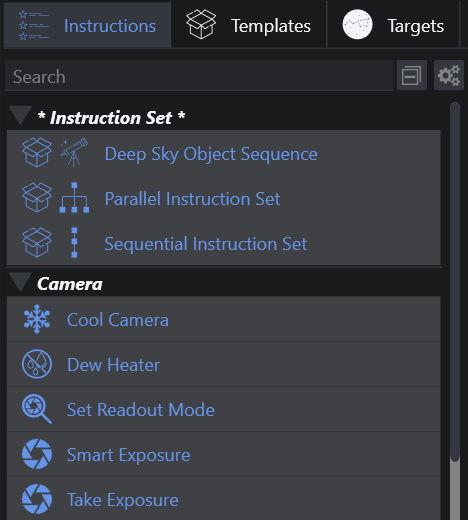

此外，也可以通过点击顶部的 + 按钮直接将指令添加到序列中。
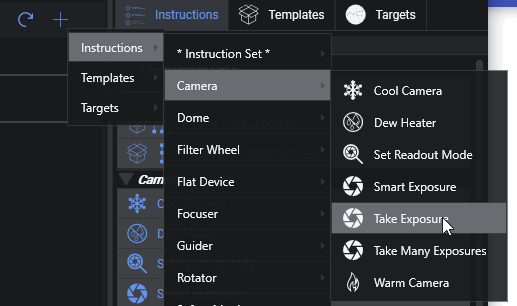

一旦指令成为序列器的一部分，它将显示每条指令的具体选项以自定义行为。例如，可以设置一个项目将相机冷却到特定温度，另一个项目切换到特定滤镜等。
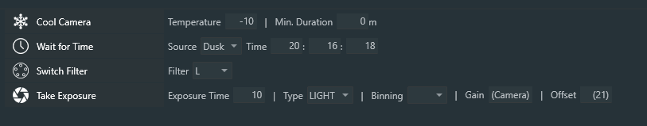

### 表达式（NINA 3.3）
NINA 3.3 新增了在数值之外使用表达式来自定义指令选项的功能。表达式是文本字符串，表示需要进行*计算*或*求值*的内容；求值结果必须是该指令的有效选项。表达式可以包含数值、符号（下文定义）、数学运算、位运算和逻辑运算符（例如 +、-、|、&、||、&&），以及函数（例如 if、floor、between）；在特定位置，字符串（用单引号括起来的文本）也可以是表达式的一部分。更多详细信息请参见[表达式](../advanced/expressions.md)。

### 自定义指令列表
通过侧边栏中的齿轮图标，可以启用自定义模式。在此模式下，可以将每条指令标记为隐藏。标记后，该指令将不再显示在侧边栏或上下文菜单中。这对于以下情况很有用：例如，你没有某种特定类型的设备，并且不希望看到与之相关的指令占用你的界面。那些是序列的一部分但在侧边栏中被隐藏的指令，仍然会在序列中可见且有效。
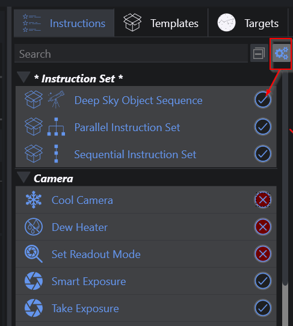

### 验证
每条指令都具有一定的验证能力，会检查前置条件是否满足。当检测到问题时，指令旁边会出现红色感叹号。将鼠标悬停在红色指示器上可获取更多详细信息。
例如，当连接了一台没有制冷元件的相机时，将"冷却相机"指令拖入序列中，该指令将显示视觉指示器，同时提示信息会显示该相机不具备制冷功能。
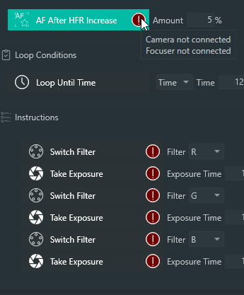

:::tip
报告问题的指令将始终被跳过，提示存在错误，并且完全不会运行！
:::

## 指令集
指令集是指令的分组。每个指令集会根据其内部的参数处理其内容。它们的行为可以通过循环条件和触发器进一步控制，下文将更详细地描述这两者。
指令集可以以与指令相同的方式添加到序列器中。此外，还可以在指令集内部嵌套指令集。
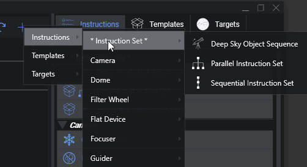
### 顺序指令集
此指令集将从上到下逐条处理指令。
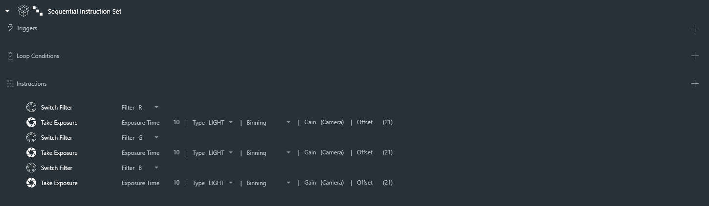
### 条件指令集
此指令集在到达时检查其表达式。如果表达式求值为 true，则内部的指令从上到下运行一次。如果求值为 false，则跳过内部指令，序列在指令集之后继续执行。

表达式及其当前的求值结果显示在指令集标题中，这样即使指令集折叠时条件也保持可见。

### 并行指令集
此特殊指令集中的所有指令将并行处理。由于所有内容将并行运行，此指令集没有可用的条件或触发器。
并行指令集中的指令顺序未定义，也没有暗示的顺序。

- 注意： 
   同一设备的多个指令通常不应在同一个并行指令集中使用。 
   例如：赤道仪锁定时寻找零位将并行执行，哪一个先执行不是固定的。 
   等待指令与其他所有指令并行执行，因此不会强制指令的执行顺序。 
   通常在并行指令集中使用关机和关闭 N.I.N.A 指令是不明智的。 
        
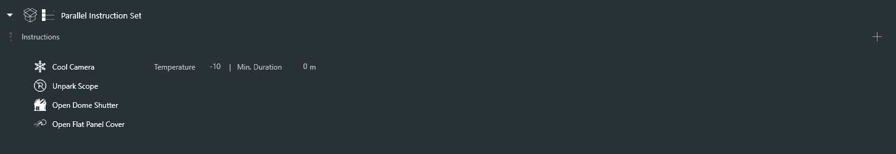
### 深空天体指令集
这个特殊的指令集行为类似于顺序指令集。主要区别在于可以指定带有坐标和旋转的特定目标，然后所有依赖于坐标或旋转的指令将自动获取这些坐标，这样用户无需多次输入这些坐标。
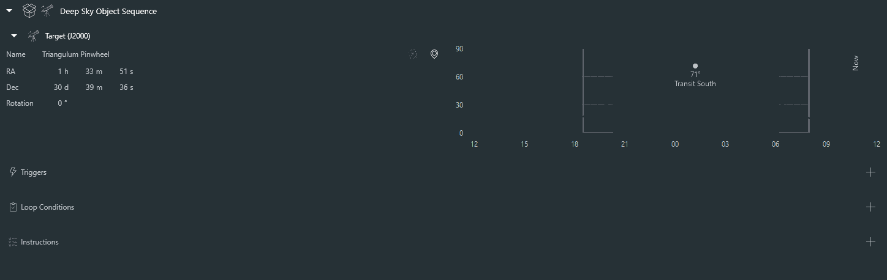

## 循环条件
循环条件将驱动指令集的行为。没有条件时，指令集只会处理其中的每个序列项一次，然后结束。当附加了循环条件时，此行为将被改变。当指令集附有循环条件时，它将在处理完其项目后，只要附加的循环条件仍然满足，就再次循环自身。一旦至少其中一个循环条件不再满足（例如，要求循环到特定时间的条件且时间已过），当前指令将被完成，之后该指令集内的其余指令也将被跳过，并且该指令集被标记为已完成。条件将持续在后台进行评估，因此基于时间的条件或安全监控条件一旦不再满足，将中断正在执行的指令。

这些条件可以拖放到指令集内部的循环条件部分。
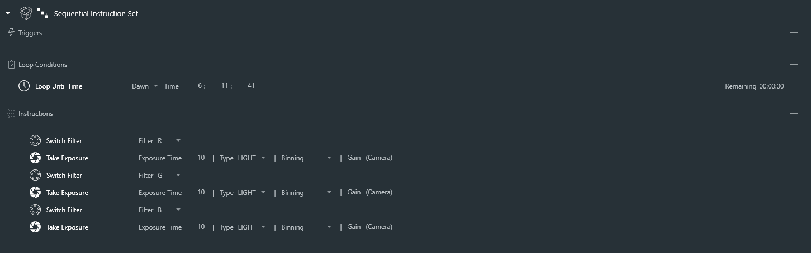
循环条件也可以通过点击指令集内部循环条件区域旁边的 + 图标直接附加到指令集上。
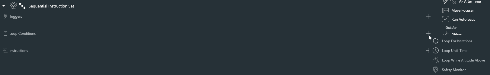

由于指令集可以嵌套，因此循环条件也会针对当前指令集以及所有上级指令集中的循环条件进行评估。
让我们看看下面的例子。最顶层的指令集附加了一个条件，要求循环到 12:24:09 时间。然后内部还有两个指令集，应分别循环 2 次和 3 次。
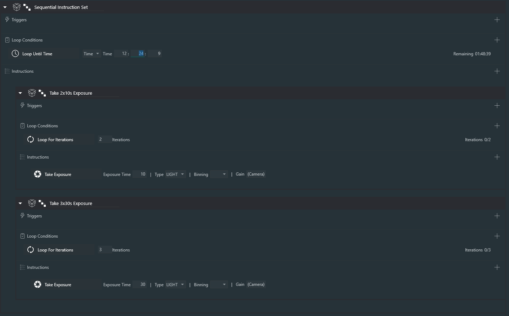
在这种情况下，将发生以下情况：
- 第一个指令集将循环 2 次。在每条指令之后，也会检查上级条件，确认剩余时间是否仍然足够继续。
- 然后第二个指令集将循环 3 次。在每条指令之后，也会检查上级条件，确认剩余时间是否仍然足够继续。
- 一旦两个指令集都完成，整个指令集将再次重置，因为"循环直到时间"条件仍然有效。
- 这种行为将重复直到时间到达。一旦时间到，整个指令集中的所有项目都将被跳过。

## 触发器
触发器是仅在特定事件发生时应该执行的指令。这些触发器可以附加到指令集上。附加后，它们将在指令集中每条指令执行后进行评估，类似于循环条件的评估方式。当定义的事件发生时，触发器将执行其指令。例如，在一定数量的曝光后触发某些操作。
右侧指令旁边的闪电图标表示该指令实际上是一个触发器。这些只能拖到指令集的触发器区域。此外，可以通过点击 + 按钮直接向指令集添加触发器。
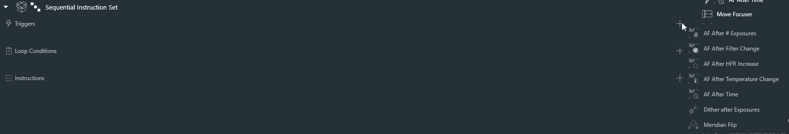
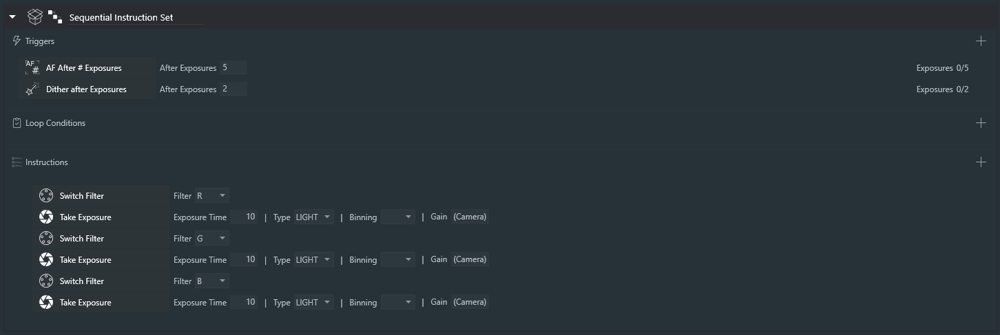

由于触发器的评估方式与循环条件相同，你可以在更高级别设置触发器，当当前执行的是嵌套指令集中的指令时，这些触发器仍然会被评估。在下面的例子中，触发器将在每 5 次曝光后触发，即使触发器定义在比实际曝光项目更高的级别上。
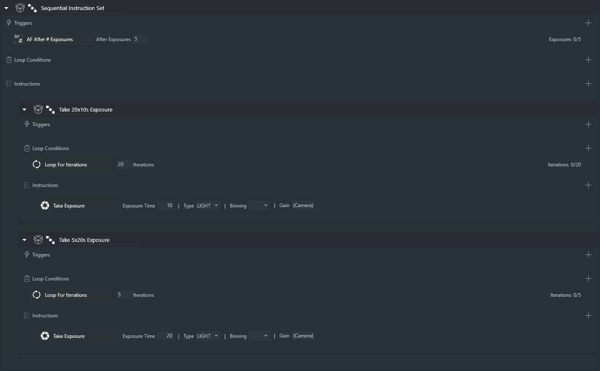

## 模板
模板是一组各种自定义指令的集合，设置了预定义值以便反复使用。为了能够快速为拍摄运行设置序列，模板将发挥关键作用，使用户能够在极短时间内轻松创建特定类型的序列。
每个指令集都可以被制成模板。当将指令集制成模板时，其所有内容和内部设置的值都将被保存并放入模板中。当模板再次添加到序列时，它将创建其副本，并创建一个与该模板设置完全相同的指令集。

### 链接模板
默认情况下，将模板添加到序列会创建一个独立的副本。如果你希望序列跟随源模板的未来更改，在将模板拖入序列器时按住 Ctrl 键，或从"链接模板"菜单中添加它。这将创建一个链接模板容器，而不是复制模板。

链接模板会直接在序列中显示当前模板的内容，但实例化的内容为灰色且只读，以便你可以检查而不会意外更改。当源模板发生变化时，链接模板会自动刷新。

如需有意识地通过序列更改源模板，可以使用链接模板上的"编辑模板"功能。编辑时，实例化的内容变为可编辑状态。"保存模板"将更改写回用户模板；"取消"将放弃编辑并从当前源刷新。默认模板不能直接编辑。

当链接模板基于深空天体指令集时，目标信息存储在链接模板实例上，而非可复用模板本身。在链接模板上输入目标或将目标拖放到其上。此目标覆盖将与该链接使用一起保存，并在模板每次刷新时重新应用，因此同一模板可以复用给多个目标。

模板位于右侧边栏的模板选项卡中。应用程序提供了一些基本模板。
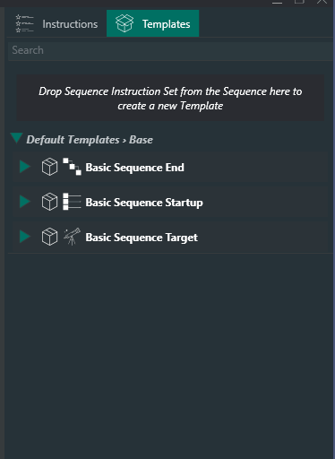

用户特定的模板列在基本模板下方。
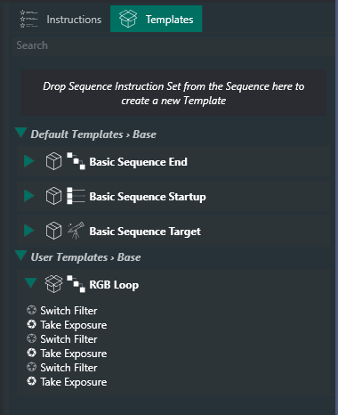

要创建用户模板，需要先将指令集添加到序列器中。然后在指令集中添加所需的指令、触发器和循环条件。一旦指令集设置好所有所需参数，点击指令集旁边的保存按钮，即可将其保存为模板。指令集的名称将被用作模板名称，一个新的模板将显示在侧边栏中。如果名称已被占用，应用程序将询问是否应覆盖现有模板。
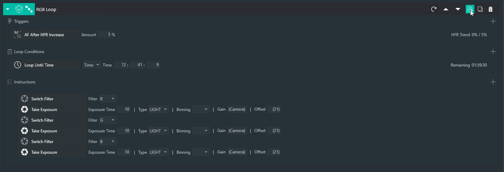

此外，也可以直接将指令集拖放到模板区域来创建新模板。
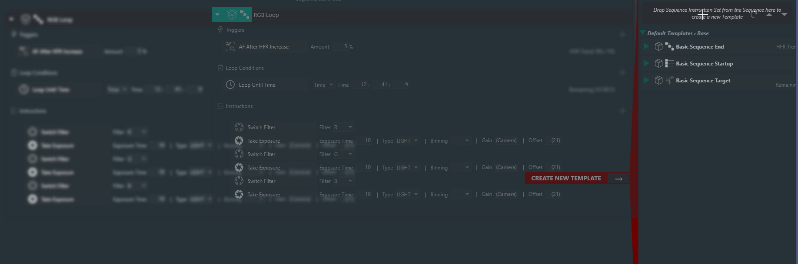

:::tip
使用深空天体指令集的模板将可在天图集和构图助手中选择，用于将目标添加到序列中
:::

## 目标
目标选项卡提供了将目标存储起来以备将来使用的功能。它们包含一个深空天体序列，可以像模板一样拖放到序列器中。与模板不同，这些深空天体序列将自动填充目标坐标和旋转信息，就像它们保存时一样。
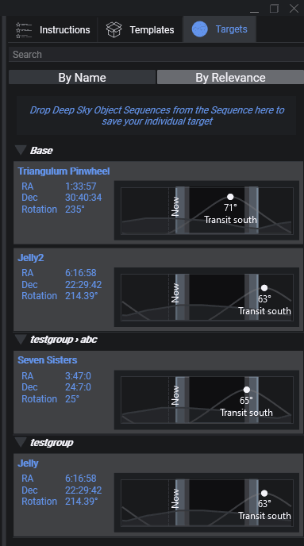

要使用目标，只需将其拖入序列器。其底层的指令将被加载到序列器中。
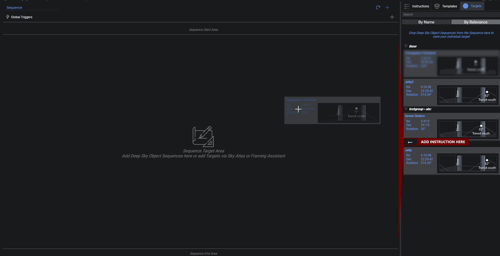

除了直接将它们拖入序列之外，还可以通过将目标从目标选项卡拖到深空天体序列的目标区域，用特定目标更新现有的深空天体序列。这样只有该指令集的目标信息会被更新。
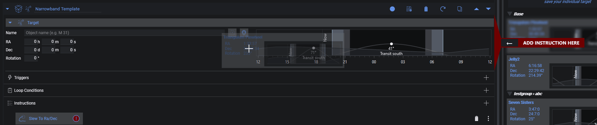

要将目标保存到目标区域，只需点击深空天体序列标题中的保存目标按钮。
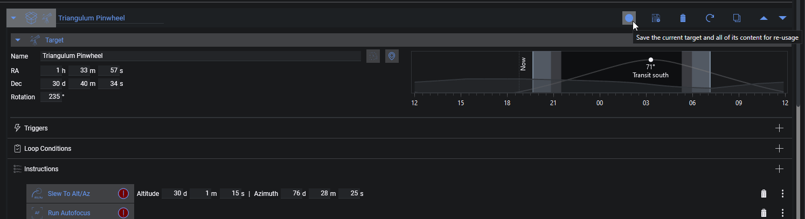

或者将其拖到目标选项卡的放置区域中。
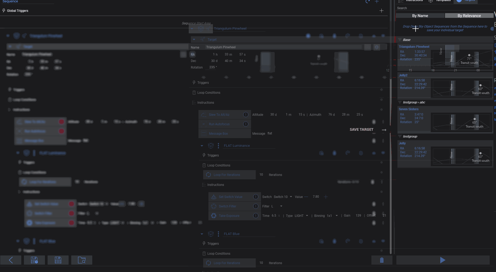

## 快捷键
| 按键          | 命令                        | 备注                                                        |
|--------------|-----------------------------|-------------------------------------------------------------|
| Ctrl+S       | 保存当前序列                 |                                                             |
| Ctrl+Shift+S | 将当前序列保存到新文件         |                                                             |
| Ctrl+O       | 打开已有序列                 |                                                             |
| Alt          | 复制当前指令或指令集           | 在将指令或指令集拖到新位置的过程中按住                       |
