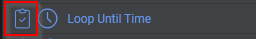
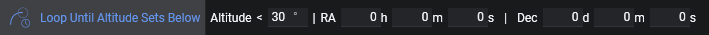
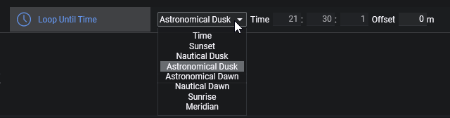
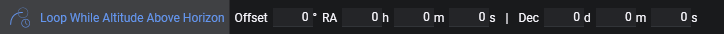
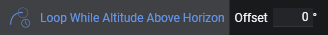
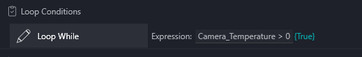
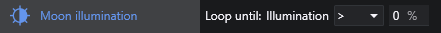

循环条件驱动指令集的行为。没有条件时，指令集只会处理每个序列项目一次便完成。当附加了循环条件后，此行为将改变。当指令集附有循环条件时，它会处理其项目，并在附加的循环条件满足期间重复循环自身。一旦这些循环条件中至少有一个不再满足（例如，循环到特定时间的条件，且时间已过），当前指令将完成，之后该集内剩余的指令将被跳过，指令集也将标记为已完成。条件会在后台持续评估，因此基于时间的条件或安全监控器条件一旦不再满足，就会中断正在进行的指令。

条件可以通过序列器侧边栏中它们旁边的高亮图标来识别。

### 循环指定次数

将指令集循环执行指定的迭代次数。

### 循环指定时长

将指令集循环执行指定的秒数。

### 循环直到高度角低于

对于给定的目标坐标，该条件将循环直到高度角低于指定值。
当此条件属于"深空天体序列"的一部分时，坐标将由此序列继承，无需手动输入坐标。

### 循环直到指定时间

将指令集循环直到特定的本地时间或天文事件。时间源可以是手动输入的时间、太阳事件或当前目标的中天时刻。对于计算型时间源，时间字段会自动填充，并可通过设置分钟偏移量将其提前或推迟。

此条件在剩余时间足以运行下一条指令时保持为真。如果对于当前观测日所选时间已过，或者下一条指令的预估耗时将超过所选时间，则该条件变为假，指令集停止。

* **时间**：手动输入的本地时间，格式为 `hh:mm:ss`
* **日落**：太阳降至 0° 高度角以下的时刻
* **民用黄昏**：太阳降至 -6° 高度角以下的时刻
* **航海黄昏**：太阳降至 -12° 高度角以下的时刻
* **天文黄昏**：太阳降至 -18° 高度角以下的时刻
* **天文黎明**：太阳升起超过 -18° 高度角的时刻
* **航海黎明**：太阳升起超过 -12° 高度角的时刻
* **民用黎明**：太阳升起超过 -6° 高度角的时刻
* **日出**：太阳升起超过 0° 高度角的时刻
* **中天**：当前目标经过中天的时刻。如果没有目标坐标可用，则解析为当前时间。

| 时间源              | 翻转时间 |
|---------------------|---------------|
| 时间                | 日出，若日出不可用则为正午 |
| 日落                | 日出，若日出不可用则为正午 |
| 民用黄昏            | 日出，若日出不可用则为正午 |
| 航海黄昏            | 日出，若日出不可用则为正午 |
| 天文黄昏            | 日出，若日出不可用则为正午 |
| 天文黎明            | 日落，若日落不可用则为正午 |
| 航海黎明            | 日落，若日落不可用则为正午 |
| 民用黎明            | 日落，若日落不可用则为正午 |
| 日出                | 日落，若日落不可用则为正午 |
| 中天                | 中天 + 12 小时 |

:::note
`Loop Until Time` 没有日期字段，因此 N.I.N.A. 使用翻转时间来判断所选时间属于当前观测日还是下一个观测日。条件中显示的翻转时间是当前使用的值。
:::

    以下示例假设日出时间为 09:00：

    * 当前时间：18:00 | 循环到时间：19:00 -> 循环一小时
    * 当前时间：20:00 | 循环到时间：19:00 -> 条件为假，因为 19:00 已过
    * 当前时间：18:00 | 循环到时间：02:00 -> 循环八小时
    * 当前时间：02:00 | 循环到时间：03:00 -> 循环一小时
    * 当前时间：04:00 | 循环到时间：03:00 -> 条件为假，因为 03:00 已过
    * 当前时间：08:00 | 循环到时间：18:00 -> 条件为假，因为 09:00 翻转尚未发生，所以 18:00 仍属于上一个观测日

:::note
如果计算型时间源（如日落、天文黄昏或天文黎明）在当前地点和日期不可用，N.I.N.A. 会将条件标记为无效，而非使用当前时间。
:::

### 循环直到离开地平线以下

此条件将在指定目标位于地平线以上期间循环指令集。若设置了[自定义地平线](../../tabs/options/general.md)，将视为目标需要位于自定义地平线以上。若未设置自定义地平线，则默认以 0° 高度角为准。还可以指定一个高度角偏移量。
当此条件属于"深空天体序列"的一部分时，坐标将由此序列继承，无需手动输入坐标。

### 安全时循环

在安全监控器报告安全状况期间持续循环。当安全监控器状态切换为不安全时，当前正在运行的指令将被取消，指令集剩余部分将被跳过。
建议将此条件与其他条件结合使用，以避免在安全监控器始终报告安全时陷入无限循环。
*需要连接安全监控器设备*

### 不安全时循环

在安全监控器报告不安全状况期间持续循环。当安全监控器状态切换为安全时，当前正在运行的指令将被取消，指令集剩余部分将被跳过。
建议将此条件与其他条件结合使用，以避免在安全监控器始终报告不安全时陷入无限循环。
*需要连接安全监控器设备*

### 条件循环（NINA 3.3）

在表达式为真期间循环。

### 月亮高度角

在月亮符合指定参数期间持续循环。

### 月亮光照度

在太阳符合指定参数期间持续循环。

### 太阳高度角

在太阳高度角高于或低于指定度数期间循环。

