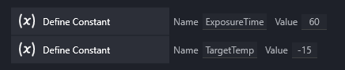
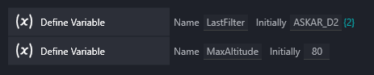
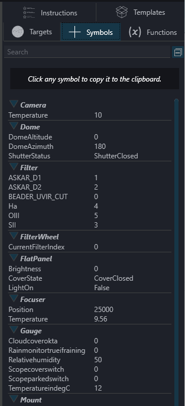
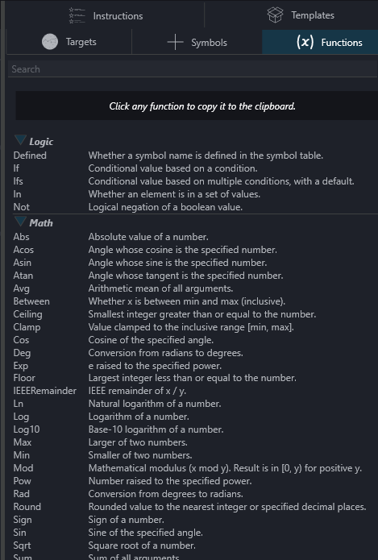
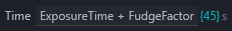
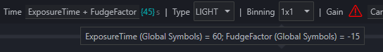
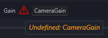
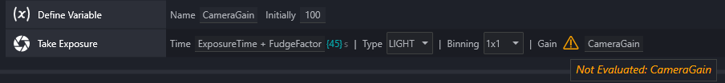
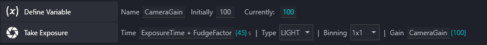
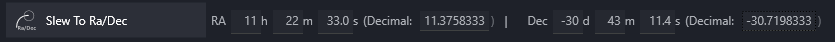

## General

NINA 3.3 adds the ability to use Expressions, in addition to numeric values, to customize instruction options.  Expressions are strings of text that represent something to be *calculated* or *evaluated*; the result of this evaluation must be a valid option for the instruction.   Expressions can include numeric values, Symbols (defined below), mathematical, bitwise, and logical operators (e.g. +, -, |, &, ||, &&), and functions (e.g. if, floor, between); in specific places, a string (text surrounded by single quotes) can also be part of an Expression.

### Symbols

Symbols are names of things that have a value. These names must be made up of numbers, letters, and the underscore character, and must begin with a letter. Fooble, fooble, foo_ble, and fooble11 are all valid Symbols; 7fooble and foo#ble are not. In NINA, there are three basic kinds of Symbols:

#### Constants

Constants are created using the Define Constant instruction, by providing a name and a value. When loaded into the sequencer, the Define Constant instruction is *immediately* executed, and the Constant becomes valid everywhere in the sequence. You can always change the value of the Constant by changing its value in the Define Constant instruction; if you do, however, *all* references to that Constant will immediately reflect the new value. Constants *cannot* be changed by a running sequence; there is no instruction that changes the value of a Constant. Therefore, Constants are best used to define a Symbol that doesn't change during the course of running a sequence.

#### Variables

Variables are created using the Define Variable instruction, also by providing a name and a value. Unlike Constants, Variables have *no* value until the Define Variable instruction is executed in a sequence, and they *can* be modified by a running sequence using the Set Variable instruction (or the Set Variable to Date/Time instruction). Variables, then, are best used to define a Symbol whose value is expected to change during the running of a sequence.

#### Data

Data are *read-only* Symbols (i.e. you cannot modify them) that are created either by NINA itself (representing the status of connected devices or NINA itself) or by Plugins that define them (for whatever that Plugin wishes to make available). The list of available Data appears in the sidebar of the Sequencer under "Symbols". This list visually updates every five seconds, but instructions that *use* Data Symbols will always use the value that exists *at the time the instruction is executed*.

!!! tip "Variables and Scope"
    Variables in NINA have a property called *scope* (a computer programming term; sorry!).  In simple terms, scope defines *where* within a sequence the Variable is *visible* (i.e. where it can be used).  For the sake of simplicity, the Define Variable instruction creates a Variable with *global scope*, meaning that it can be used *anywhere* in a sequence (once the Define Variable instruction has been run).

    There are times, however, when you might want the visibility of a Variable to be limited to a specific instruction set or Template.  To do this, use the Define Scoped Variable instruction.

If Symbols are the *nouns* of an Expression, then Operators are the verbs. They describe how the values interact - add, compare, combine, choose, etc.  There are arithmetic, comparison, logical, and bitwise operators (the first two are the sorts of things that you would have learned in grade school).  Parentheses can also be used in Expressions.  Here are the Operators you can use in Expressions:

| Type                | Examples                   |
|---------------------|----------------------------|
| Arithmetic          | - ,   + ,  *,  /,  %       |
| Comparison          | ==, !=,  &gt,  &lt;,  &gt=,  &lt;=   |
| Logical             | &&,  &nbsp;\|\|,&nbsp;   !                  |
| Bitwise             | &,  &nbsp;\|,  ^,&nbsp;   ~,&nbsp;   &lt;&lt;,  &gt&gt         |
| Conditional         | condition ? value_if_true : value_if_false      |

### Functions

Functions are a very powerful addition to Expressions.  There are many built-in functions, in categories such as Math, Logic, Strings, and Time.  They are all listed in the sequencer sidebar, as seen below.  Hovering over the name of a function shows an example of how the function is used.

### Expression Errors, Warnings, and Information

Here's a Take Exposure instruction as it might appear in NINA 3.3; you'll see a few things that are new.

The current value of an Expression is shown in curly brackets (braces).

If you hover over the Expression itself, you'll see how each of the Symbols in the Expression is evaluated.  In this example, the values of ExposureTime and FudgeFactor are shown.

On the right, there is a red error triangle, indicating that something is wrong with the Expression.  Hovering over the triangle indicates the problem; in this case, there's a reference to a Symbol, CameraGain, that hasn't been defined.

In this example, there is an orange warning triangle; this is just to alert you to a *potential* problem and will not stop a sequence from running.  The reason is that the CameraGain Variable has been *declared* in the instruction above, but that instruction has not yet been *run*.  As noted earlier on this page, Variables don't have a value until the defining instruction is actually *run*.  When it *does* run, CameraGain will have a value of 100, and the warning will disappear.

Here's how these same two instructions look after they have been run in the sequencer.  Note two things: first, the Define Variable instruction now shows the *current* value of the Variable (in this case, 100); and second, the warning triangle is gone in the Take Exposure instruction and CameraGain now shows a value in curly braces.

### Instructions Updated for NINA 3.3

Instructions that use celestial coordinates look a little different in NINA 3.3; there is now the ability to enter those coordinates in decimal format (in addition to hours-minutes-seconds or degrees-minutes-seconds). Changing the decimal value will automatically update H-M-S/D-M-S values, and vice versa.  You can also use Expressions in place of a decimal value.

  

### Conditional Execution

Use a Conditional Instruction Set when a group of instructions should only run if an Expression is true. The Expression is evaluated when the set is reached. If it is true, the instructions inside run once; if it is false, they are skipped and the sequence continues after the set.

The Expression and its evaluated result are shown in the set header, including while the set is collapsed. Conditional Instruction Sets do not have their own loop condition or trigger sections; parent loop conditions and triggers still apply when the set is placed inside another instruction set.

