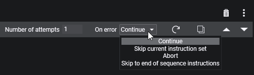
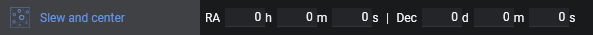
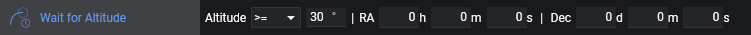
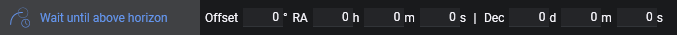

## 概述

指令是应用程序要执行的单个命令。每个指令有不同的目的，可以控制各种设备类型、设置参数或提供辅助功能以自动化拍摄过程。

每条指令可通过其名称和图标来识别。

### 验证

指令能够验证前置条件并在出现潜在问题时警告用户。当指令旁边显示红色感叹号时，表示运行该指令的前置条件尚未全部满足。将鼠标悬停在红色圆圈上，会显示缺少哪些前置条件的详细信息。
**重要**：不满足前置条件的指令将被跳过，且该指令被视为失败。

### 选项

大多数指令还提供各种选项，以便在运行时调整其行为。例如，您可以调整曝光时间、增益和偏置来控制拍摄照片的指令。每条指令有不同的选项集，详见下文。

### 按钮

指令右侧有删除、复制、移动或调整高级设置的按钮，这些对所有指令都适用。
### 高级设置

点击指令右侧的三个点，将展开一个高级区域，显示指令的高级设置。

**尝试次数**
此设置决定指令在失败时的重试次数。

**错误处理**
当所有尝试均未成功时，此设置决定如何继续序列。
- *继续*：序列器将继续执行下一条指令
- *跳过当前指令集*：将跳过当前正在运行的指令集
- *中止*：序列将完全停止
- *跳转到序列结束指令*：跳过启动区和目标区中剩余的所有指令，继续执行序列结束区中的指令

**重置**
此按钮将重置指令的状态，如曝光进度等。

**复制**
创建当前指令集的精确副本，并将其添加到当前指令下方。

**上移**
将指令上移一行。如果它已是某个指令集的第一条指令，则将移到该指令集上方的父指令集中。
如果上一条指令是一个未折叠的指令集，该指令将移到该指令集的底部。

**下移**
将指令下移一行。如果它已是某个指令集的最后一条指令，则将移到该指令集下方的父指令集中。
如果下一条指令是一个未折叠的指令集，该指令将移到该指令集的顶部。

## 相机
控制[相机](../../tabs/equipment/camera.md)的基本功能。此类别中的每条指令至少需要连接一台相机。

### Cool Camera

将相机冷却到指定温度和指定的最短持续时间。对于大多数相机，持续时间可以设为 0，因为驱动会处理冷却时长。
一旦相机达到指定温度，该指令即完成。
*需要支持设定点制冷的相机*

### Warm Camera

使用指定的最短持续时间将相机升温至环境温度。对于大多数相机，持续时间可以设为 0，因为驱动会处理升温时长。
一旦相机达到环境温度，制冷器将关闭，指令即完成。
*需要支持设定点制冷的相机*

### Dew Heater

此指令将开启或关闭相机的结露加热器。
*需要具有可控结露加热器的相机*

### Set Readout Mode

将相机设置为特定的读出模式。数字表示相机下拉列表中读出模式的索引——从 0 开始。
*需要具有可设置读出模式的相机*

### Take Exposure

此指令使用指定的曝光时间、像素合并、增益和偏置拍摄一张曝光。

### Take Many Exposures

与"Take Exposure"指令类似，但增加了指定在继续之前需要完成的曝光数量的功能。

### Take Subframe Exposure

与"Take Exposure"指令类似，但增加了指定相对于中心点的子帧百分比的功能。

### Smart Exposure

与"Take Many Exposure"指令类似，但增加了指定特定滤镜以及在特定曝光次数后抖动的功能。
将抖动间隔曝光次数设为 0 可完全跳过抖动。
*需要连接滤镜轮以切换滤镜，并需要连接导星器以执行抖动*

:::note
有趣的知识——"Take Many Exposures"和"Smart Exposures"实际上是指令集，具有静态内容，只是以普通指令的形式显示，为方便起见捆绑了最常见的拍摄操作。
:::

## 圆顶
控制[圆顶](../../tabs/equipment/dome.md)的基本功能。此类别中的每条指令至少需要连接一个圆顶。

### Close Dome Shutter

关闭圆顶快门。
*需要可控的圆顶快门*
### Enable Dome Sync

启用望远镜与圆顶的自动后台同步。
*需要连接望远镜*

### Disable Dome Sync

禁用望远镜与圆顶的自动后台同步。
*需要连接望远镜*

### Open Dome Shutter

打开圆顶快门。
*需要可控的圆顶快门*

### Park Dome

将圆顶停放至其指定的归位位置。
*需要支持停放功能的圆顶驱动*

### Slew Dome Azimuth

将圆顶旋转到指定的方位角位置。
*需要支持设置方位角的圆顶驱动*

### Synchronize Dome

将圆顶同步到望远镜的当前位置。

## 滤镜轮
控制[滤镜轮](../../tabs/equipment/filterwheel.md)的基本功能。此类别中的每条指令至少需要连接一个滤镜轮。

### Switch Filter

将滤镜轮切换到指定的滤镜。与所有滤镜轮切换一样，如有可用偏移量，将应用调焦器偏移量。

## 平场板
控制[平场板](../../tabs/equipment/flatpanel.md)的基本功能。此类别中的每条指令至少需要连接一个平场板。

### Close Flat Panel Cover

关闭平场板。
*需要能够自动开合的平场板*

### Open Flat Panel Cover

打开平场板。
*需要能够自动开合的平场板*

### Set Brightness

将平场板的亮度设置为指定值。（不会自动打开平场板）。

### Toggle Light

根据设置打开或关闭平场板灯光。

### Trained Flat Exposure

此指令将根据指定的滤镜、曝光时间、增益和偏置查找已训练的平场曝光参数，关闭平场板（如有），设置平场板亮度，打开灯光，拍摄指定数量的平场帧，关闭平场板灯光，最后重新打开盖板（如有且未设置"保持关闭"）。
*需要连接相机，且已在[平场板选项卡](../../tabs/equipment/flatpanel.md)中设置了与指令中数值匹配的训练平场值*

### Trained Dark Exposure

此指令将根据指定的滤镜、曝光时间、增益和偏置查找已训练的平场曝光参数，关闭平场板（如有），关闭灯光，拍摄指定数量的暗场帧，最后重新打开盖板（如有且未设置"保持关闭"）。
*需要连接相机，且已在[平场板选项卡](../../tabs/equipment/flatpanel.md)中设置了与指令中数值匹配的训练平场值*

## 调焦器
控制[调焦器](../../tabs/equipment/focuser.md)的基本功能。此类别中的每条指令至少需要连接一个调焦器。

### Move Focuser

将调焦器移动到指定的绝对位置。

### Move Focuser By Temp.

将调焦器移动到基于调焦器报告温度计算出的位置。这可用于"跟踪"最佳对焦点随温度变化的趋势。

依赖关系通过简单的线性模型建模。有两种工作模式：

* 绝对模式：新对焦位置 = 斜率 × 当前温度 + 截距
* 相对模式：新对焦位置 = 当前对焦位置 + 斜率 × (当前温度 - 上次调焦器移动时的温度)

使用相对模式时，如果对焦位置变化小于一步，调焦器实际上不移动，但小数部分会累积到下次执行 Move Focuser By Temp. 指令时，这样即使非常缓慢的温度变化也不会因舍入误差而丢失。

*需要带温度探头的调焦器*

:::note
要确定斜率和截距，您可以使用自动对焦运行的历史记录，对这些最佳对焦点进行线性回归。截距是直线在 0°C 处与 y 轴的交点，斜率是温度梯度。
为获得最佳拟合效果，尽量仅使用单个观测夜的自动对焦点，并确保望远镜已完全冷却。
插件 `Autofocus Report Analysis` 可以帮助您确定这些参数，但注意要有良好的、拟合度高的数据点，否则这些值容易出错。
:::

### Move Focuser Relative

基于当前位置和从该位置指定的偏移量，将调焦器移动到目标位置。

### Run Autofocus

基于[自动对焦设置](../../tabs/options/autofocus.md)启动[自动对焦运行](../../advanced/autofocus.md)。

## 导星器
控制[导星器](../../tabs/equipment/guider.md)的基本功能。此类别中的每条指令至少需要连接一个导星器。

### Dither

命令导星器执行[抖动](../../advanced/dithering.md)。

### Start Guiding

如果尚未开始导星，则开始导星。此外，可以启用强制校准的开关。启用后，导星器将被强制运行校准，即使已有有效的校准数据。当此开关关闭时，导星器将自行判断是否需要校准。

### Stop Guiding

当导星处于活动状态时，停止导星。

## 旋转器
控制[旋转器](../../tabs/equipment/rotator.md)的基本功能。此类别中的每条指令至少需要连接一个旋转器。

### Rotate By Mechanical Angle

将旋转器旋转到指定的绝对机械角度。

### Solve and Rotate

从望远镜当前指向位置拍摄图像，进行解析，然后将旋转器移动到指定的天空角度。将重复此过程，直到旋转器在旋转容差范围内。
**此指令不会移动赤道仪，只会同步并移动旋转器到目标天空角度！**

## 安全监控器
控制[安全监控器](../../tabs/equipment/safetymonitor.md)的基本功能。此类别中的每条指令至少需要连接一个安全监控器。

### Wait Until Safe

等待直到安全监控器再次报告安全状况。

## 开关
控制[开关](../../tabs/equipment/switch.md)的基本功能。此类别中的每条指令至少需要连接一个开关。

### Set Switch Value

将开关设置为指定值。当没有开关连接时，会显示按编号排列的通用开关列表。设备连接后，列表将更新为实际的开关。当指定的开关值超出范围时，指令将显示验证错误。

## 望远镜
控制[望远镜](../../tabs/equipment/telescope.md)的基本功能。此类别中的每条指令至少需要连接一台望远镜。

### Find Home

将赤道仪移动到归位位置。
*需要支持归位功能的赤道仪驱动*

### Park Scope

将赤道仪移动到停放位置。已停放的赤道仪不会接受 GOTO 命令。
*需要支持停放功能的赤道仪驱动*

### Set Tracking

启用赤道仪跟踪，设为指定的跟踪速率。

### Slew and center

停止导星（如果正在运行），GOTO 到指定坐标，调用解析引擎居中到指定坐标，然后恢复导星（如果之前在开始时停止了）。
当此指令属于"深空天体序列"的一部分时，坐标将被继承，此处无需输入坐标。
*需要设置好[解析](../../advanced/platesolving.md)引擎*

### Slew To Alt/Az

GOTO 到指定坐标。

### Slew To Ra/Dec

停止导星（如果正在运行），GOTO 到指定坐标，然后恢复导星（如果之前在开始时停止了）。
当此指令属于"深空天体序列"的一部分时，坐标将被继承，此处无需输入坐标。

### Slew, center and rotate

停止导星（如果正在运行），GOTO 到指定坐标，调用解析引擎居中到指定坐标，同时结合[旋转器](../../tabs/equipment/rotator.md)考虑旋转角度，然后恢复导星（如果之前在开始时停止了）。
当此指令属于"深空天体序列"的一部分时，坐标将被继承，此处无需输入坐标。
*需要设置好[解析](../../advanced/platesolving.md)引擎并连接旋转器*

### Solve And Sync
使用当前赤道仪位置进行解析，并根据解析结果同步位置。
**此指令不会将赤道仪居中，只是将赤道仪同步到其当前指向的位置！**
*需要设置好[解析](../../advanced/platesolving.md)引擎*

### Unpark Scope

解除赤道仪的停放状态，使其能够接收 GOTO 命令。
*需要支持停放功能的赤道仪驱动*

## 实用工具
此类别中的指令是实用工具命令，不一定依赖任何设备，提供有用的工具和辅助功能来改进序列。

### Annotation

此指令不执行任何操作。它纯粹用于在序列中添加自定义文本标注，以提醒您某些事项或记录说明来阐明特定序列布局等。

### External Script

从文件系统启动自定义可执行文件的指令。点击三个点浏览文件资源管理器并设置文件路径。

### Message Box

当此指令启动时，会弹出一个消息框，并暂停序列直到用户确认该对话框。例如，消息框可用于停止序列并提醒您盖上盖子以拍摄平场等。

### Wait For Altitude

对于给定的目标坐标，此指令将简单地等待直到达到指定高度角。
当此指令属于"深空天体序列"的一部分时，坐标将被继承，此处无需输入坐标。

### Wait For Time

等待直到特定的本地时间或天文事件。时间源可以是手动输入的时间、太阳事件或当前目标的中天时刻。对于计算型时间源，时间字段会自动填充，并可通过设置分钟偏移量将其提前或推迟。如果对于当前观测日所选时间已过，该指令等待零秒并继续。

* **时间**：手动输入的本地时间，格式为 `hh:mm:ss`
* **日落**：太阳降至 0° 高度角以下的时刻
* **民用黄昏**：太阳降至 -6° 高度角以下的时刻
* **航海黄昏**：太阳降至 -12° 高度角以下的时刻
* **天文黄昏**：太阳降至 -18° 高度角以下的时刻
* **天文黎明**：太阳升起超过 -18° 高度角的时刻
* **航海黎明**：太阳升起超过 -12° 高度角的时刻
* **民用黎明**：太阳升起超过 -6° 高度角的时刻
* **日出**：太阳升起超过 0° 高度角的时刻
* **中天**：当前目标经过中天的时刻。如果没有目标坐标可用，则解析为当前时间。

| 时间源              | 翻转时间 |
|---------------------|---------------|
| 时间                | 日出，若日出不可用则为正午 |
| 日落                | 日出，若日出不可用则为正午 |
| 民用黄昏            | 日出，若日出不可用则为正午 |
| 航海黄昏            | 日出，若日出不可用则为正午 |
| 天文黄昏            | 日出，若日出不可用则为正午 |
| 天文黎明            | 日落，若日落不可用则为正午 |
| 航海黎明            | 日落，若日落不可用则为正午 |
| 民用黎明            | 日落，若日落不可用则为正午 |
| 日出                | 日落，若日落不可用则为正午 |
| 中天                | 中天 + 12 小时 |

:::note
`Wait For Time` 没有日期字段，因此 N.I.N.A. 使用翻转时间来判断所选时间属于当前观测日还是下一个观测日。指令中显示的翻转时间是当前使用的值。
:::

    以下示例假设日出时间为 09:00：

    * 当前时间：18:00 | 等待时间：19:00 -> 等待一小时
    * 当前时间：20:00 | 等待时间：19:00 -> 跳过，因为 19:00 已过
    * 当前时间：18:00 | 等待时间：02:00 -> 等待八小时
    * 当前时间：02:00 | 等待时间：03:00 -> 等待一小时
    * 当前时间：04:00 | 等待时间：03:00 -> 跳过，因为 03:00 已过
    * 当前时间：08:00 | 等待时间：18:00 -> 跳过，因为 09:00 翻转尚未发生，所以 18:00 仍属于上一个观测日

:::note
如果计算型时间源（如日落、天文黄昏或天文黎明）在当前地点和日期不可用，N.I.N.A. 会将指令标记为无效，而非使用当前时间。
:::

### Wait For Time Span

等待一段指定的时长。

### Wait If Moon Altitude

在月亮符合指定参数期间保持等待。

### Wait If Sun Altitude

在太阳符合指定参数期间保持等待。

### Wait Until（NINA 3.3）

此指令将等待直到表达式变为真。
### Wait Until Above Horizon

此指令在指定目标位于地平线以下期间保持等待。若设置了[自定义地平线](../../tabs/options/general.md)，将视为目标需要位于自定义地平线以上。若未设置自定义地平线，则默认以 0° 高度角为准。还可以指定一个高度角偏移量。
当此指令属于"深空天体序列"的一部分时，坐标将被继承，此处无需输入坐标。

