This page is intended to give some hints on how to transition from the legacy sequence to the advanced sequence as well as optimize the imaging run using the capabilities of the advanced sequencer.
In this section we will cover a single target for the night and we will utilize the capabilities of a camera, a goto mount, a filter wheel, and a focuser.
 
Most likely when you wanted to run a target for the night with LRGB filters you would have set up a sequence like this.
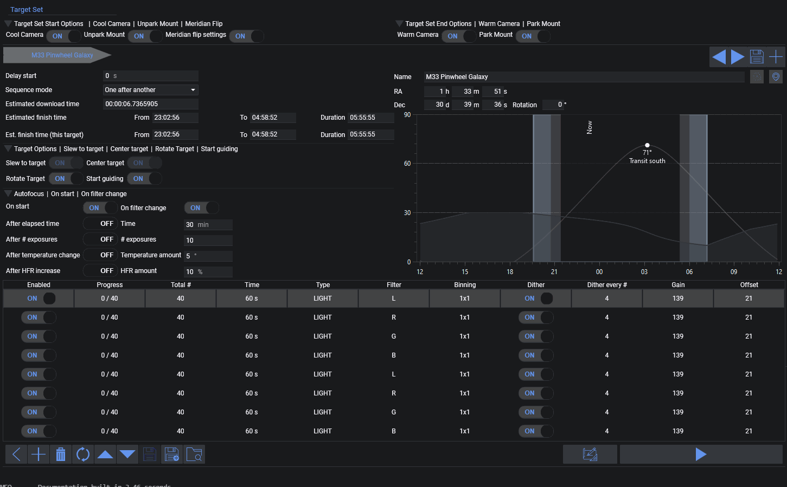

The goal here is to get exposures of each filter for usable color data and to autofocus after the filter change when the batch of exposures is completed. Furthermore, the number of exposures is added based on the estimated duration to fully fill the night.
This approach, however, has some downsides, which we want to fix using the advanced sequencer step by step. For simplicity, AF after HFR or other conditions is ignored, as this is dependent on the current night's conditions and not a problem of the general setup.

* Problem 1: Repeating yourself - The rows 5-9 repeat the same thing that row 1-4 have already defined
* Problem 2: The estimation could be off - most likely it will take longer - so you will end up with uneven amount of exposures as the last exposures will be unusable. Additionally you have to fiddle around with the amount of exposures to fill the night.
* Problem 3: Clouds could roll in or sky conditions could worsen, resulting in further subs being bad and an uneven amount of good exposures
* Problem 4: Autofocus runs are required when changing to the next filter, taking up some imaging time (7x after the initial one)
* Problem 5: Dithering will be necessary and in this example we have chosen to dither after 4 exposures. Dithering takes up quite a bit of imaging time. For this example run it will take 80 dithers. When we estimate about 20 seconds per dither, this will already take up almost half an hour of image time.

## Transforming to an advanced sequence

To get rolling with the advanced sequencer, there is a tool button on the bottom right to easily generate an advanced sequence out of the legacy sequence.
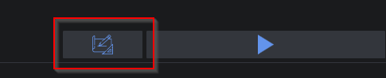

!!!note
    **Did you know?** The legacy sequencer is actually running an advanced sequence behind the scenes. The User Interface is just wrapped around to give the traditional experience of the legacy sequence. This will ensure that the effort to maintain the code for the sequencer is not doubled and that everything is working the same way. This approach also makes it possible to keep the legacy sequencer alive.

Let's break apart how the sequence will look compared to the advanced sequence. Remember that on a high level the advanced sequencer will run the instructions from top to bottom.

### Target Set Start Options -> Start Area  

The legacy sequence had toggles set to on for *Cool Camera*, *Unpark Mount*, and *Meridian Flips*. These options will be put into the topmost section of the advanced sequence.

* Meridian Flip: This option is basically a trigger. As the meridian flip is always relevant, it is put into the *Global Trigger* section. This means that the trigger will watch for the whole sequence run if a meridian flip should be performed or not.
* *Cool Camera* and *Unpark Mount* are put into the start area on the top of the sequencer. These will be executed as the first action.
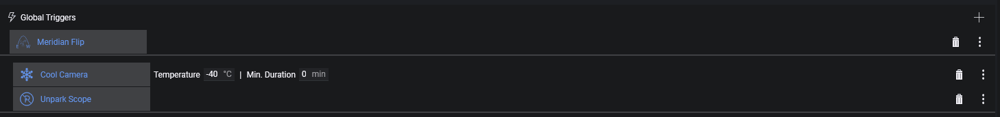

### Target Set End Options -> End Area

Just like the start options, the end options will be put into the bottommost part of the sequencer. For the end options, the legacy sequence had *Warm Camera* as well as *Park Mount* enabled.

* *Warm Camera* and *Park Mount* will just be put into the bottom. Also these operations can run in parallel, that's why these are inside a *Parallel Instruction Set*.

### Target -> Target Area
What's left now is in the middle section of the sequencer. This area is reserved for all the targets that you want to image. A *deep sky object sequence* per target will be generated here containing all imaging instructions as well as instructions to prepare the target, e.g. centering the target, starting guiding, and running an initial autofocus.
To show a high-level view of the target, the next screenshot shows the internal instructions collapsed for a better overview. Simply put, a target has a structure similar to the outer sequence, as it has start instructions, imaging instructions, and end instructions.
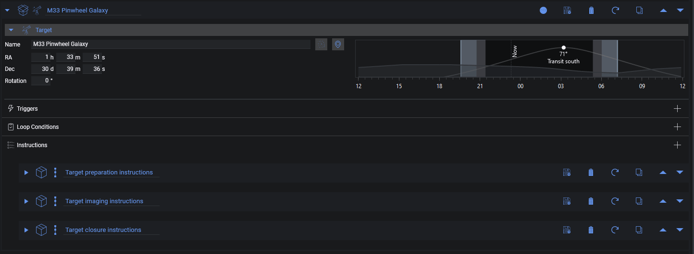

### Target Options -> Target preparation instructions
When starting the target, the target options from the legacy sequencer are put into this *Target preparation instructions* area. In the simple sequencer it was enabled to slew, center and rotate, to start guiding, and to start autofocus on start. The first imaging instruction was set to the L filter, so the start needs to switch to that filter too. These options are directly translated into the preparation block.
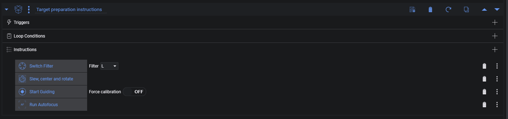

### Target closure instructions
This one is an implicit instruction from the legacy sequencer, as there was no toggle to do it there, and it will only contain the *Stop Guiding* instruction. The reason is that when a target is finished, guiding is no longer necessary as you will most likely park the mount or slew to a different target. It will just be added at the closure of the target to be safe.
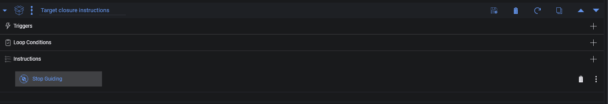

### Exposure Rows -> Target imaging instructions
Now let's finally look into the important part which is the actual gathering of light frames.
Each row of the legacy sequencer will be directly translated to an instruction that is called *Smart Exposure*. This instruction should look quite familiar to you, as it contains all the same information as the rows of the legacy sequencer.  
One additional option that was enabled in the legacy sequencer was to make sure that an autofocus run is triggered when the filter changes. This is directly added to this imaging set in the form of a trigger in the *Triggers* section. It is also called *AF After Filter Change* and will make sure that an autofocus is triggered when the filter changes.
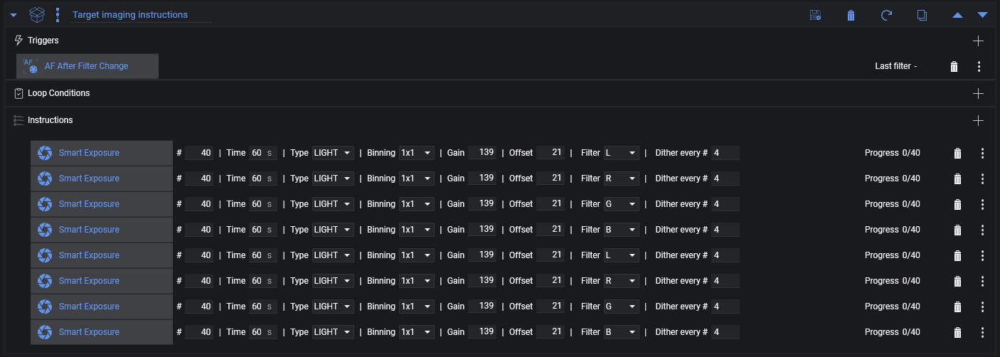

Hopefully this explanation gives you a good overview about how an advanced sequencer will look like and how it will operate when directly compared to a legacy sequence screen. The user interface looks quite different, but it should be much clearer about what will happen and when it will happen, as it will explicitly show all the individual steps.  
**So why bother with the advanced sequencer? Well, now that we understand the basics, we can tackle the problems that were mentioned earlier.**

## Problem 1 - Stop repeating yourself
The advanced sequencer can utilize [Loop Conditions](./conditions.md) to repeat sequence blocks. These *loop conditions* have, as their name suggests, certain conditions that should be fulfilled, and for as long as these conditions are fulfilled they will loop the instruction set they are placed inside.
So for this example we could utilize a condition called *Loop for iterations* and set it to two iterations. Then we can remove 4 of the instructions without losing anything.
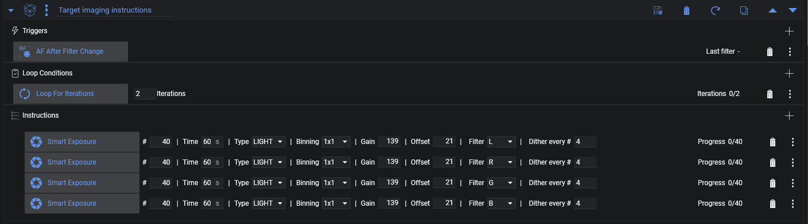

## Problem 2 - Estimations may be off
While the imaging loop runs, the time to take these exposures might still exceed the remaining time of the night. Estimates can be off due to dithering taking longer, an autofocus run taking a bit longer, etc. To make sure that the imaging run will stop on time, other loop conditions can be added. One that is a staple for the advanced sequencer is the *Loop Until Time* condition set to *(Nautical) Dawn*. Now with two loop conditions, whichever of the two has its end condition met first will cause the sequencer to stop the current instruction set and continue with the next target, or with the end of the sequence if there is no further target.
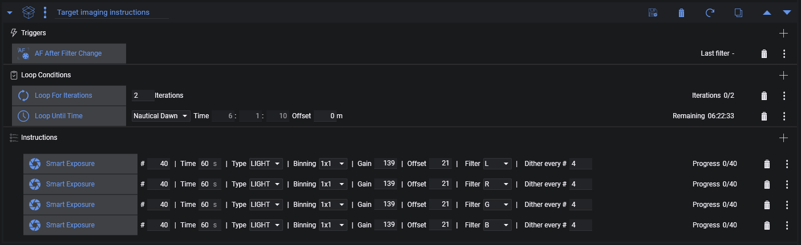

## Problem 3 & 4 - Unexpected events causing uneven exposures and autofocus runs between each filter change
To solve Problem 3, we also need to solve Problem 4. This can be solved by setting up [filter offsets](../../tabs/options/autofocus.md#filter-offsets). Filter offsets are a very powerful feature, and with these it will no longer be necessary to refocus when switching between filters, as the focus shift due to slightly different optical paths with different filters will be counteracted by these.
Setting these up is explained in detail on the linked page, so before continuing please determine the offsets and maintain these in the [autofocus options](../../tabs/options/autofocus.md).
Now that filter offsets are set up, the *AF After Filter Change* can be removed. What can also be removed now is the amount of exposures per *Smart Exposure*. This can be safely turned to four exposures each now. Furthermore, the *Loop For Iterations* can be removed, as the *Loop Until Time* is sufficient.
The sequence will take 4 exposures, dither, go to the next filter, and repeat for each of the filters again and again until *(Nautical) Dawn*. As the individual instructions take only four images and continue, the chances of having a big discrepancy in the amount of exposures for a filter are minimized.
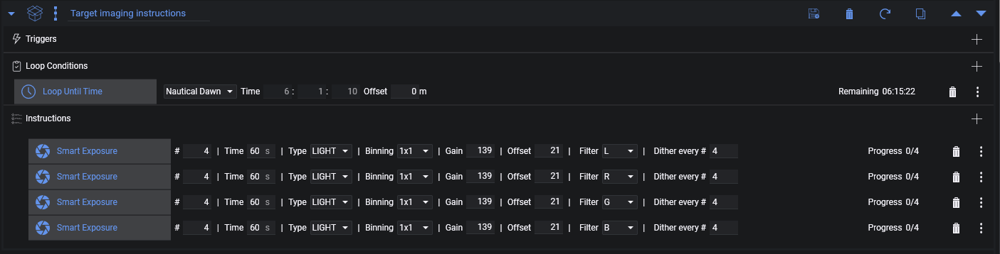

## Problem 5 - Dithering too many times
Most of the issues are resolved now, and some time has already been saved by removing the intermediate autofocus runs after filter changes. What remains is the amount of dithering. This can be reduced by a factor of 4! Look again at the sequence. Each filter will take four exposures, then dither, then go to the next filter. But why do we need to dither when we switch the filter anyway? We don't. We would only need to dither when each set of LRGB is passed. So let's do it by setting *Dither every #* to 0 for all *Smart Exposures* and instead add a *Dither* instruction after the last *Smart Exposure*!
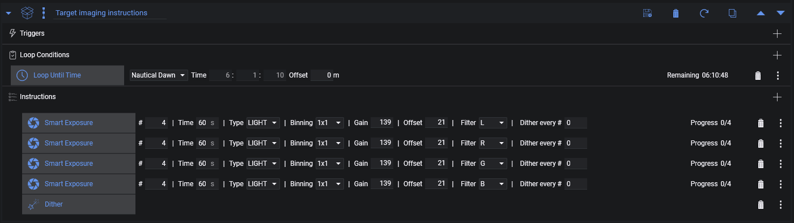  
This one is a real time saver!

## Summary
So to sum it up, we went from a legacy sequence and having to calculate how many exposures *could* potentially fit into a night's worth of imaging to a highly optimized sequence that will run a loop of LRGB filters for the whole night and get as many frames as possible. We don't have to worry about the amount of subs being taken and will always end up with a set of images to create a full-color LRGB image. In addition to that, we drastically reduced the amount of dithering required, giving us back at least 20 minutes of imaging time.

!!!note
    Hopefully this guide will help you reduce the fear of using the advanced sequencer and also give you the confidence and tools to create highly optimized sequences. This set of examples is only the beginning, and the capabilities to optimize even further and adjust it to your specialized needs and equipment are now possible!

