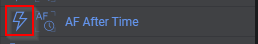
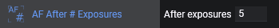
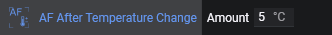
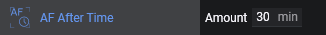
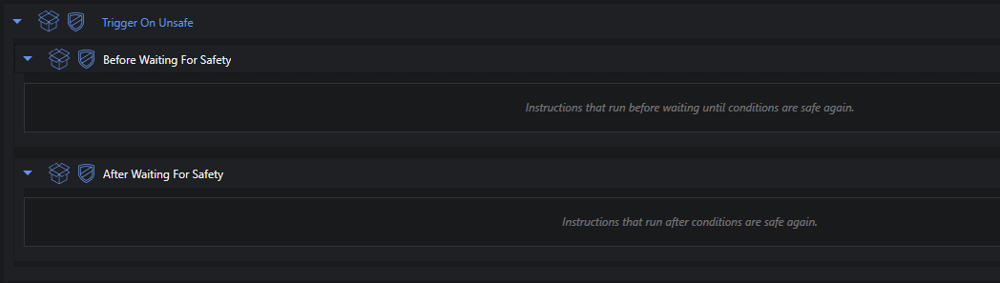
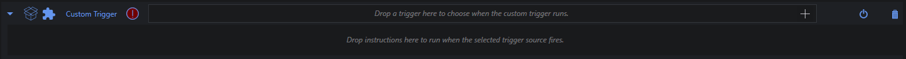

# 触发器

触发器是仅当特定事件发生时才应执行的指令。这些触发器可以附加到指令集。附加后，它们将在指令集内每条指令之后被评估，类似于循环条件的评估方式。当定义的事件发生时，触发器将执行其指令。触发器执行完成后，序列将从之前暂停的位置继续。
触发器可以通过序列器侧边栏中它们旁边的高亮闪电图标来识别。

## 圆顶
圆顶的触发动作。此类别中的每个触发器至少需要连接一个圆顶。

### Synchronize Dome

N.I.N.A. 能够自动将圆顶与望远镜指向方向同步。然而在某些情况下，例如重型圆顶，移动产生的振动可能会影响拍摄质量。因此有了此触发器，仅在指令之间同步圆顶，而不是持续调整。这也将防止在曝光期间移动圆顶。
*需要禁用圆顶跟随*

## 调焦器
调焦器的触发动作。此类别中的每个触发器至少需要连接一个调焦器。

### AF After # Exposures

一个简单地在指定曝光次数后运行自动对焦的触发器。由于曝光次数是一个任意指标，不推荐使用此触发器。

### AF After Filter Change

当滤镜轮切换滤镜且未计算滤镜偏移量来自动调整调焦器位置以补偿因滤镜切换导致的对焦变化时，此触发器可以通过在拍摄中切换滤镜时运行自动对焦来缓解问题。

### AF After HFR Increase

此触发器将监控序列中拍摄的图像历史。它将获取截至上次自动对焦的所有曝光（如果尚未进行自动对焦，则为全部），并按当前活动滤镜进行筛选。自动对焦后的第一个点将作为参考点，最后 n 个点（n 为指定样本量）作为参考。从最后 n 个点中确定趋势并与参考点比较。如果趋势超过指定百分比，将触发自动对焦。
如果您不了解设备的温度敏感性，这是一个不错的通用触发器，但它要求您的自动对焦结果一致且视宁度不差。

### AF After Temperature Change

当温度升高或降低时，大多数设备会轻微偏移焦点。当您大致了解设备在哪个温度下焦点偏移足以超出临界对焦区域时，此触发器可以在温度漂移达到指定量时自动运行自动对焦程序。
*需要带温度探头的调焦器*

### AF After Time

一个简单地在指定时间后运行自动对焦的触发器。由于时间量是一个任意指标，不推荐使用此触发器。

## 导星器
导星器的触发动作。此类别中的每个触发器至少需要连接一个导星器。

### Dither After Exposures

使用此触发器将在指定曝光次数后启动抖动操作。有关抖动的更多信息，请访问[专用页面](../../advanced/dithering.md)。

### Restore Guiding

此触发器将在其上下文中的每条指令之后重新启动导星。如果导星已在运行，则不采取任何操作。使用此触发器可确保导星软件在某些故障（如云层遮挡）后重新获取导星。
此触发器最好与"Center After Drift"触发器结合使用，以防止因云层遮挡而偏离目标。

## 安全监控器
[安全监控器](../../tabs/equipment/safetymonitor.md)的触发动作。此类别中的每个触发器至少需要连接一个安全监控器。

### Trigger On Unsafe

当安全监控器报告不安全状况或在已连接后断开连接时，运行配置的指令。触发器首先运行**等待安全之前**中的指令，然后暂停执行 [Wait Until Safe](instructions.md#wait-until-safe)，最后在监控器再次报告安全状况后运行**等待安全之后**的指令。
如果安全监控器在 N.I.N.A. 已看到有效连接后断开连接，该断开将被视为不安全状态，触发器将运行。如果监控器从未成功连接过，则不会仅因当前未连接而触发此行为。
如果此触发器触发时 N.I.N.A. 正在处理深空天体目标，像 GOTO 或居中这样的指令将自动使用该目标的坐标。即使触发器本身放置在更高层级（如**全局触发器**中）也是如此。

## 望远镜
望远镜的触发动作。此类别中的每个触发器至少需要连接一台望远镜。

### Center After Drift

在指定曝光次数后，此触发器将在后台解析已保存的图像。当解析坐标与当前目标坐标的距离超过指定的角分量时，此触发器将启动重新居中操作。
*需要设置好解析引擎，且触发器需要位于深空天体序列内部以具有目标参考*

### Meridian Flip

当望远镜根据[选项](../../tabs/options/imaging.md)中的中天翻转设置经过中天时，此触发器将启动中天翻转。
有关设置和翻转工作方式的更多信息，请参见[中天翻转页面](../../advanced/meridianflip.md)。

## 实用工具
允许您复用现有触发器时序并配合自定义指令集的触发动作。

### Custom Trigger

使用现有触发器作为触发源，然后添加您自己的指令，在原触发器本应触发时运行。当内置触发器的时序符合您的需求，但您希望用自定义动作替代内置行为时，此功能非常有用。
如果此触发器触发时 N.I.N.A. 正在处理深空天体目标，像 GOTO 或居中这样的指令将自动使用该目标的坐标。即使触发器本身放置在更高层级（如**全局触发器**中）也是如此。
并非每个触发器源都一定适合作为**Custom Trigger**的包装。某些触发器可能依赖其原始的内置行为或特殊的运行时处理，因此如果包装后的触发器行为不符合预期，可能需要直接使用原触发器。
*需要一个触发器源和至少一条指令*
