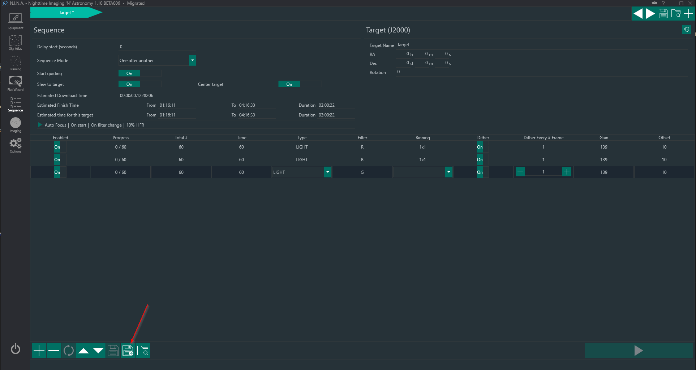
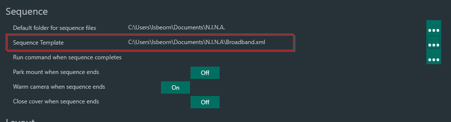
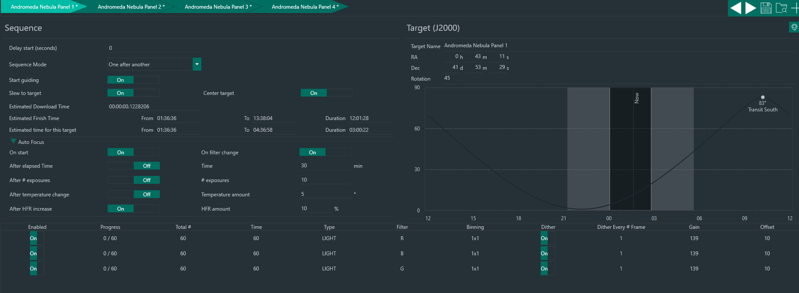
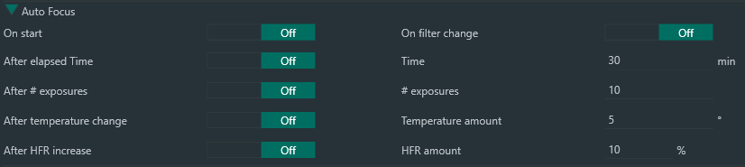
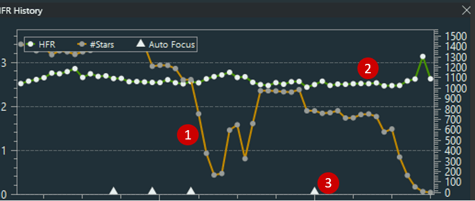

## 序列模板

当通过构图创建新的序列项，或者从应用程序任何位置添加新目标时，序列的默认值很可能不能满足用户的需求。
因此，N.I.N.A. 提供了创建序列模板并在设置中进行配置的功能。

### 导出一个序列模板

要创建序列模板，你只需要按照自己的喜好设置一个标准序列。在下面的示例中，我设置了一个用于宽带拍摄的序列。所有序列设置完成后，只需点击保存按钮将序列 XML 存储到硬盘上。模板设定后，你创建的每个新序列都将预填充此模板。由于目前每个配置文件只能有一个模板，你可以创建配置文件的两个副本并设置不同的模板，例如一个用于窄带拍摄，一个用于宽带拍摄。

导出的序列可以在**选项->拍摄->序列**中设置为模板

:::tip
这些模板的最佳用途是通过构图助手创建的序列。例如，当设置好前面提到的宽带序列模板后，你只需设置好马赛克，点击"替换序列"，基于模板就能生成以下序列
:::

## 序列自动对焦

当拥有电动调焦器时，序列提供了多种选项，以确保在序列运行期间对焦尽可能良好。让我们逐一查看每个选项并更深入地解释它们的用法。

*开始时* - 这个选项比较明显。大多数情况下，你会希望在第一个目标中启用此选项，以确保初始对焦位置良好。

*更换滤镜时* - 当你不知道或没有设置滤镜偏移量，且滤镜不是齐焦的，因此对应不同的对焦位置时，此选项很有用。当你在整个夜晚只进行几次滤镜更换时，这是一个不错的选择。否则，测量并设置滤镜偏移量会更有优势。

*经过一定时间后* - 在经过特定时间后触发自动对焦几乎总是一种猜测，应尽量避免。更好的方法是根据 HFR 上升来触发对焦。

*温度变化后* - 这将使用调焦器温度传感器作为参考，每次温度相对于上次启动的自动对焦漂移指定量时重新对焦。当你知道你的设备在一定温度变化后会偏移焦点时，这是一个好选项。

*HFR 上升后* - 此方法仅在测量的 HFR 趋势上升一定百分比时触发。仅有一张对焦较差的子帧不一定会触发此操作，因为它可能只是由于导星不佳或天空条件较差导致的单张问题。总的来说，这是在拍摄运行期间确保最佳自动对焦的好方法，几乎随时可以使用。HFR 历史的可视化表示可以在拍摄选项卡中查看，用于确定基线。

