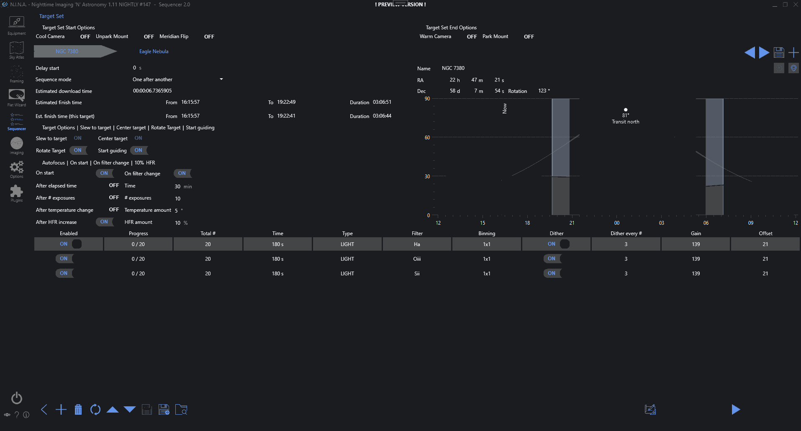
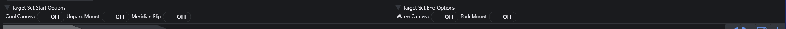
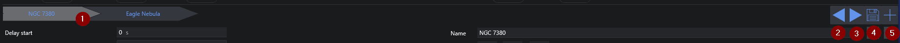
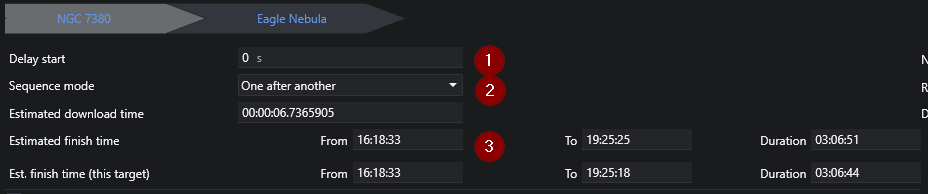
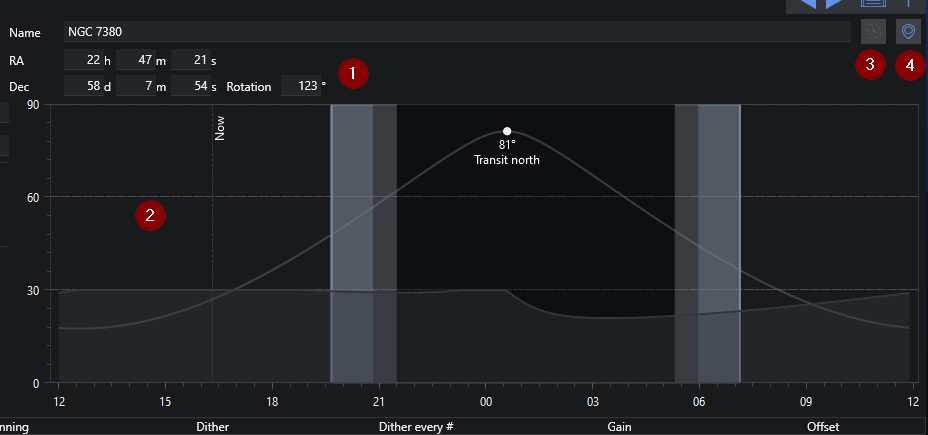
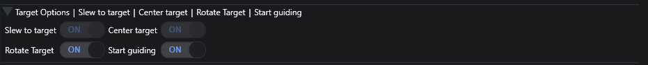
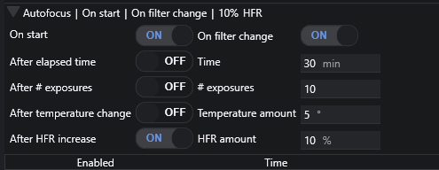
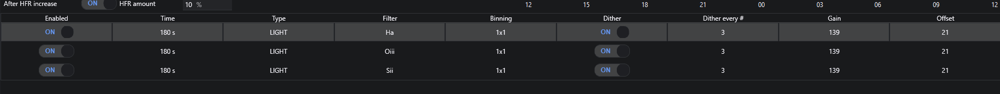

The legacy sequencer offers the traditional experience of planning complete sequences for the most common use cases. The capabilities range from cooled cameras, goto mounts, automated focusers, filter wheels and guiders. 
With this sequencer you can plan straight forward sequences with a set amount of exposures for specific filters and some basic added automation like centering of targets and keeping the objects in focus using auto focus.  
For more advanced use cases refer to the [advanced sequencer](../advanced/advanced.md) which offers a lot more planning granularity, capabilities and supports more types of equipment.

### Sequence Target Set Options

In this section you can adjust which instructions should be considered for the complete set of targets.   
When *Cool Camera* and *Unpark Mount* are enabled, these instructions will be executed before the *first* target.  
The same applies to the *Warm Camera* and the *Park Mount* option, except that they will be run after the *last* target.  
In addition to that there is the option to enable the [auto meridian flip](../../advanced/meridianflip.md) feature that will be enabled for the complete sequence run.  

### Sequence Target Tab List  
  

Multiple sequences can be loaded into N.I.N.A., with each residing in its own tab at the top of the Sequence window. When multiple sequences are opened, N.I.N.A. will run each sequence in order after the prior sequence is completed. This allows you to specify multiple targets to image over the course of a night, each with their own settings and behaviors.

1.  **Target tabs**
    * Clicking on a tab will switch to that target's sequence
    * Sequence settings are specific to the target
    * Hovering the cursor over a tab will reveal the Reset Progress and Delete buttons
2. **Prioritize target**  
    Move the current target further to the left in the list of targets
3. **Deprioritize target**  
    Move the current target further to the right in the list of targets
4. **Save target**  
    Save the current target
5. **Add target**  
    Add a new empty target  

!!!tip 
    If a **Sequence Template** file is specified under **Options > Imaging > Sequence**, that template will be automatically loaded in the new tab.

### Target General Options

1. **Delay start**  
    Specifies a delay (in seconds) before the first operation when the sequence starts.

2. **Sequence Mode**  
    Specify the preferred mode of sequence entry advancement.

    * **One after another**: N.I.N.A. processes each sequence entry in full before advancing to the next sequence entry.
    * **Loop**: N.I.N.A. takes a single exposure from the sequence entry and then advances to the next entry. The entire sequence will loop until all sequence entries are completed.

3. **Estimated Download Time**  
    By default, the value here will be automatically populated with the average download time of a single image from the camera, as measured by N.I.N.A. If the user wishes, this value may be changed by editing it. This time specified here will effect the Estimated Finish Time.

4.  **Estimated Finish Time and Estimates time for this target**  
    Displays the time and duration (in the computer's configured time zone) that N.I.N.A. estimates the entire sequence/active sequence will complete. This estimation takes into account the number and length of the sequence/sequences exposures, as well as the time required to download each exposure from the camera (See Also: Estimated Download Time.)

### Target Information

1. **Target coordinates**  
    Displays the target name, right ascension, declination, and desired rotation angle. These may be edited as needed. The right ascension, declination, and rotation angle specified will be used to slew, center and rotate on target start (if enabled)

2. **Target altitude**  
    Displays the target object's altitude, the direction point at which it will transit, the darkness phase of the current day, and includes a vertical marker for the current time.  The accuracy of the altitude curve requires that the latitude and longitude be set under **Options > General > Astrometry**.

3. **Send to framing assistant**  
    This button will send the current coordinates and rotation back to the framing assistant to re-plan the target

4. **Import from planetarium**  
    Using this button, the application will import the selected coordinates and rotation from the planetarium that is set up

### Target start options

1. **Slew to target**  
    At the beginning of the sequence, N.I.N.A. will command the mount to slew to the coordinates that are specified in RA and Dec fields. This does not plate solve to verify it is on target.

2. **Center target**  
    When set to on, N.I.N.A. will use the configured [plate solver](../../advanced/platesolving.md) to ensure that the target is centered on the specified RA and Dec coordinates. 

3. **Rotate Target**  
    If a rotation angle is specified and a rotator is configured and connected (See Also: **Equipment > Rotator**), N.I.N.A. will rotate the camera to the desired angle.
    If the Manual Rotator is in use, the sequence will be paused and the user prompted to manually rotate the camera. The prompt will specify the necessary amount of degrees clockwise or anti-clockwise to rotate the camera, and N.I.N.A. will verify the rotation angle again until the angle is within the tolerances configured under **Options > Plate Solving > Rotation Tolerance**.

4. **Start Guiding**  
    When Start Guiding is set to On, N.I.N.A. will command PHD2 to choose a guide star and begin guiding when the sequence starts. N.I.N.A must be connected to PHD2 (See Also: **Equipment > Guider**.)

    !!! Note
        Since sequences typically start with a slew and centering process, the guider will be stopped at the beginning of the sequence and only restarted if this option is set to On.

### Auto Focus behavior

Due to the large number of auto focus options that can be configured in a sequence, they are grouped under an expandable menu. When the menu is not expanded, a summary of the activated options will be displayed. Expanding the menu by clicking on the arrow will reveal the auto focus settings and make them available for altering.

Many of the options are self-explanatory, however two in particular may require some clarification:

* **After temperature change**  
    Triggers an auto focus operation if the temperature changes the specified amount since the previous auto focus operation. The temperature used is sourced from the focuser, if it provides it. This option does not yet use a Weather source if the focuser does not have a temperature reporting capability.
 
* **After HFR increase**  
    If measured HFR from the previous exposures is more than the specified percent of the baseline, an auto focus operation will be triggered. The baseline HFR is determined from the first exposure after an auto focus operation.

### Sequence entries

Sequence entries define the image acquisition order and behavior of N.I.N.A. Each sequence entry consists of up to 11 columns which determine how the images will be exposed:

* **Progress**: Displays the current progress of the sequence entry in terms of exposures completed out of the total number specified
* **Total #**: Specifies the number of frames to expose
* **Time**: Specifies the exposure time, in seconds
* **Type**: Specifies the type of the exposure and sequence entry. BIAS, DARK, LIGHT, FLAT.
* **Filter**: Specifies the filter to be used
* **Binning**: Specifies the camera binning level
* **Dither**: When enabled, N.I.N.A. will command a dither operation. To save time, dither operations are initiated while the preceding image is being downloaded from the camera

!!! important
    Dithering will work only when a guider is connected. See **Equipment > Guider**

* **Dither Every # Frame**: Initiates a dither operation after the specified number of frames are exposed
* **Gain**: Specifies the camera gain to use for the entry. This option is available only if camera is capable of setting exposure gain
* **Offset**: Specifies the camera offset to use for the entry. This option is available only if camera is capable of setting an exposure offset

### Sequence Buttons

On the bottom left area the target specific buttons can be found. Explained from left to right:  

1. Go back to the [sequence dashboard](../../tabs/sequencer.md)  
2. Adds a new row to the sequence (new rows will be defaulted to the previous one)  
3. Deletes the active sequence entry  
4. Resets the progress of the selected sequence entry to 0  
5. Moves the selected entry up  
6. Moves the selected entry down  
7. Saves target to the previous location
8. Saves target as a XML file in the specified folder  
9. Loads a saved Sequence. The opened sequence's settings will overwrite all settings in the current sequence.  

On the bottom right are the target set buttons.
  
1. **Build Sequence**

    Pressing this button will generate an advanced sequence and send it to the [advanced sequencer](../advanced/advanced.md). This will allow a much more granular adjustment of the sequence.

    !!! note
        Pressing the build sequence button after having changed something on the advanced sequencer will overwrite the whole advanced sequence that was already present in the advanced sequencer tab!

2. **Start Sequence**

    Pressing the start button starts the sequence, either from the beginning or from where it was last stopped. Once a sequence is started.
    Cancel will abort any active operation (including any in-progress exposures) and stop the sequence.

