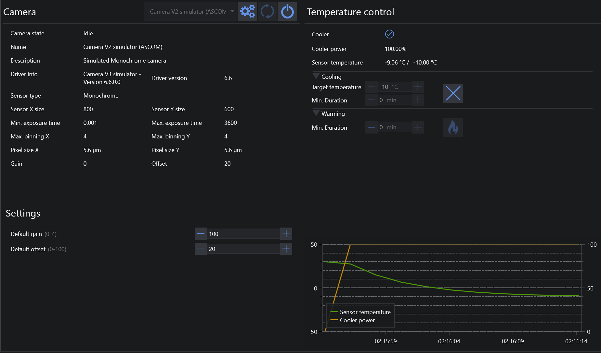

The Camera tab lets you connect an ASCOM-compatible camera or one of the native camera integrations supported by N.I.N.A.

The header contains the usual device controls for connecting, disconnecting, refreshing the device list, and opening the driver setup dialog when one is available.

## Camera Information

The left side of the page shows the current camera information. Depending on the connected camera, this can include:

* camera state
* camera name and description
* driver information and version
* sensor type and sensor name
* sensor width and height
* minimum and maximum exposure times
* maximum binning values
* pixel size
* battery level
* gain and offset

Some native camera integrations can also show additional driver-specific information or settings.

## Camera Settings

The camera settings area contains the default settings that are used throughout the application unless a sequence or tool overrides them.

The exact controls in this area depend on the selected camera and driver.

### File Camera Setup

When you use the File Camera integration, its setup dialog lets you configure:

* the folder to watch for incoming images
* the expected file extension
* whether to use bulb mode
* whether incoming images are Bayered
* whether N.I.N.A. should keep listening continuously
* an optional download delay

## Temperature Control

When a cooled camera is connected, the right side of the page provides camera cooling control and monitoring.

### Status

The status area can show:

* dew heater state, if the camera supports a dew heater
* cooler on/off state
* cooler power
* current chip temperature
* target chip temperature while cooling is active

### Cooling

The **Cooling** section lets you:

* set a target temperature
* set an optional minimum cooling duration
* start or cancel the cooling run

### Warming

The **Warming** section lets you:

* set an optional minimum warming duration
* start or cancel the warm-up

### Charts

The charts below the controls show:

* camera cooler power
* chip temperature

!!! note
    Not every camera exposes every field or every control. The visible information depends on the selected driver and the hardware capabilities it reports.
   

   

