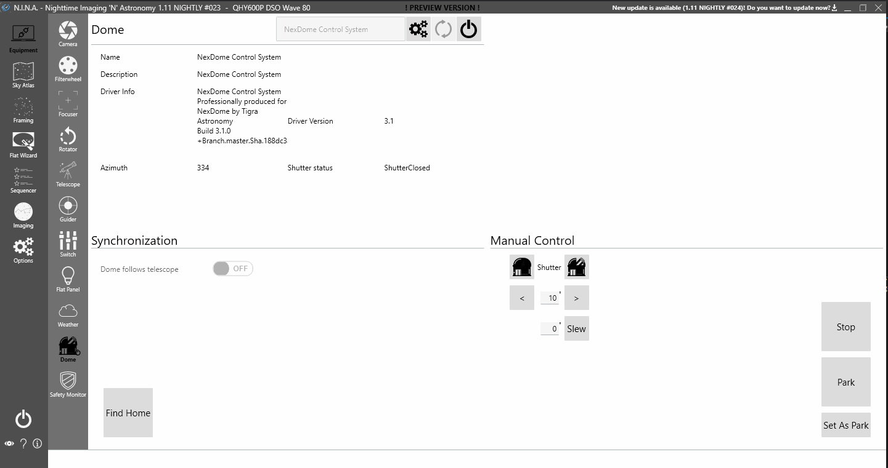

圆顶选项卡用于连接 ASCOM 兼容的圆顶。

连接到圆顶时，N.I.N.A. 提供了一些实用的功能，包括：

1. **望远镜跟随**
 当有望远镜连接时，启用*圆顶跟随望远镜*可确保圆顶的方位角（即圆顶开口所在方向）始终与望远镜指向的中心对齐。这涵盖了几种不同的场景：
      * *跟踪* — 当望远镜跟随地球自转时，圆顶与其保持同步。
      * *外部转向* — 如果 N.I.N.A. 以外的程序使望远镜转向，圆顶将旋转直到望远镜停止移动并重新对齐。不过，这种移动可能会显得断续——某些圆顶（如 NexDome）在旋转时不允许更改目标方位角，因此 N.I.N.A. 会根据望远镜当时的指向反复发送转向命令。<i>你可以在选项选项卡中禁用此行为。</i>
      * *N.I.N.A. 转向* — 如果 N.I.N.A. 向望远镜发出转向命令（例如来自构图向导），圆顶将直接转到与望远镜目标位置同步的目标方位角。

2. **归位前寻找原点**
 此设置位于[圆顶选项](../options/dome.md)中。具有原点位置的圆顶（如 NexDome）使用传感器将物理方位角与软件中的方位角同步。这在概念上类似于赤道仪的恒星校准。在归位前寻找原点位置可以提高找到精确归位位置的可靠性，如果要在此位置给电池充电，这一点可能很重要。

3. **等待圆顶同步**
 当望远镜移动时，圆顶通常需要额外的时间来跟随并重新同步方位角。N.I.N.A. 会等待望远镜停止转向*且*圆顶与之同步后，再开始进行需要拍照的操作（如解析和自动对焦）。

4. **手动快门控制**
 可以直接打开和关闭圆顶快门，圆顶可以直接旋转到指定方位角，也可以按可配置的增量旋转。

:::note
没有按住按钮直到转到目标位置的持续旋转控制。遗憾的是，ASCOM 标准没有提供实现此功能的操作。
:::

5. **同步方位角**
 有时圆顶的旋转可能偏离几度——例如齿轮打滑或齿轮齿数不精确时。如果你的圆顶支持"同步方位角"，左下角会显示一个"同步"按钮，该按钮可将圆顶方位角设置为望远镜当前指向的位置。使用时，需要先将圆顶手动对准望远镜，然后再进行同步。执行此操作时不应启用圆顶同步功能，但之后可以立即重新开启。
