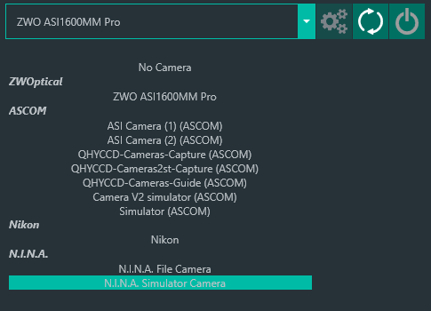
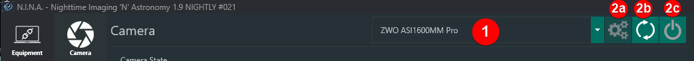

设备选项卡是管理 N.I.N.A. 所控制硬件的地方。N.I.N.A. 支持的硬件设备类型分别对应不同的子选项卡。

## 选择设备

每个选项卡都有一个下拉框，列出检测到的设备和驱动。设备按类别组织，以区分原生设备、ASCOM、N.I.N.A. 内部设备等不同类别。

以上方相机列表为例，`ZWO ASI1600MM Pro` 列在 `ZWOptical` 类别下。选择此设备即可直接连接相机。如果希望通过 ASCOM 连接相机，则需要在 `ASCOM` 区域下选择相应的 `ASI Camera` 驱动。驱动分类的存在是为了明确设备的*访问和操作方式*。

## 管理

下拉框旁边有一系列按钮：

1. 列出所有检测到的设备的下拉框。
2. 下拉框右侧的按钮可用于：
<ol type="a">
    <li>配置选中的设备或 ASCOM 驱动</li>
    <li>刷新已识别设备列表</li>
    <li>连接或断开所选设备</li>
</ol>

:::tip
如果你在启动 N.I.N.A. 之后才将设备连接到电脑，可以按下刷新按钮（2b），让 N.I.N.A. 执行系统扫描并更新设备列表。
:::

## 信息与控制

任何设备选项卡还会显示与所选已连接设备相关的信息。特定设备还可能在此区域显示控制功能。
