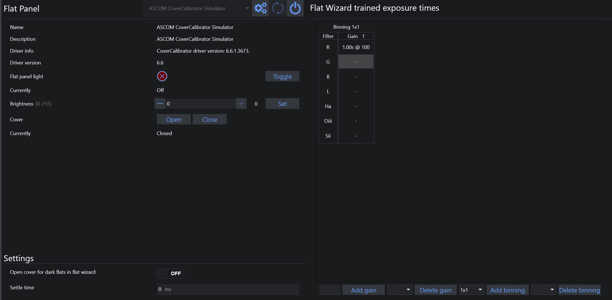

The Flat Panel tab lets you connect and control compatible flat devices.

The header contains the usual device controls for connecting, disconnecting, refreshing the device list, and opening the setup dialog when one is available.

## Device Information and Manual Control

The left side of the page shows the information reported by the flat device, including:

* name
* description
* driver information
* driver version

Manual controls are shown when the device supports them:

* light on/off state and a **Toggle** button
* brightness with its supported range and a **Set Brightness** button
* cover state
* **Open** and **Close** buttons for devices with a motorized cover

## Settings

The settings area below the device information contains:

* the flat device settle time
* any additional device-specific settings exposed by the selected flat device

## Trained Flat Exposure Times

The trained exposure table is populated automatically by the [Flat Wizard](../flatwizard.md). It stores the trained flat settings per filter and can include:

* filter
* binning
* gain
* offset
* flat device brightness
* exposure time

You can also manage this table manually:

* add rows with the **+** button
* remove rows with the trash button
* edit the values directly in the table

!!! note
    The visible columns depend on the connected camera capabilities. For example, gain and offset columns are only shown when they are relevant.

!!! tip
    To automate flat acquisition in a sequence:

    1. Populate the **Trained Exposure Times** table.
    2. Create or load an [advanced sequence](../../sequencer/advanced/advanced.md).
    3. Add the trained flat exposure instruction for the filters you want to capture.

    When the sequence reaches that instruction, N.I.N.A. can reuse the trained exposure time and flat panel brightness automatically.

    

 
