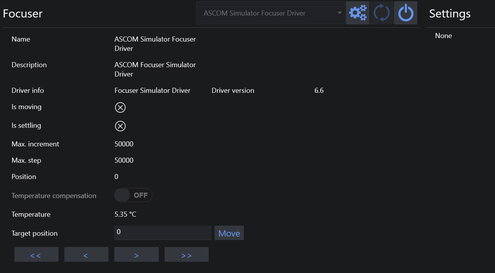

# 调焦器

调焦器选项卡用于连接 ASCOM 兼容的调焦器。

1. 此页面可找到各种调焦器信息。
3. 可在此处开启或关闭温度补偿。请注意，这是驱动内部的温度补偿。
   > 温度补偿必须在调焦器驱动中进行配置。
4. 如果调焦器有温度探头，此处将报告当前温度。
5. 要将调焦器移动到目标位置（步数），需要在目标位置输入值并按下移动按钮。
6. 调焦器移动：
    * 单箭头 `<`  `>`：自动对焦步长的一半
    * 双箭头 `<<`  `>>`：自动对焦步长的五倍
