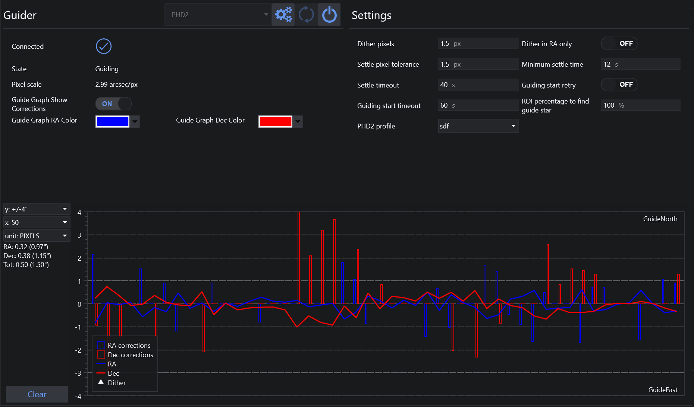
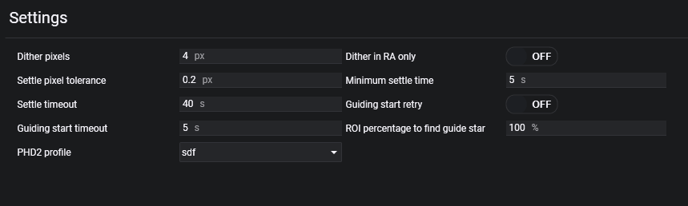

导星选项卡用于连接受支持的导星器，并配置导星和抖动所使用的设置。

标题栏包含常规的导星器控制按钮，用于连接、断开、刷新设备列表，以及在可用时打开设置对话框。

## 概览

页面左侧显示导星器状态和图表设置：

* 连接状态
* 当前导星器状态
* 导星器像素比例
* 导星器抖动距离
* 主相机像素比例
* 等效的主相机抖动距离
* 导星图表中的校正显示
* RA 和 Dec 导星图表颜色

右侧包含所选导星器的专用设置页面。以下导星器有专属设置页面：

* PHD2
* MGEN
* MetaGuide
* Direct Guider
* SkyGuard

底部的图表显示实时导星漂移、可选的校正条和抖动标记。

## PHD2 设置

### PHD2 路径
PHD2 安装路径。此路径用于在 PHD2 尚未运行时启动它。

### PHD2 服务器 URL
可在此处设置 PHD2 服务器参数。
> 通常情况下，默认设置即可正常工作。你还需要在 PHD2 中启用 PHD2 服务器。

### PHD2 服务器端口
PHD 服务器端口。通常默认值 4400 可以正常工作。如果你运行多个 PHD2 实例，每个实例的端口号会递增 1。例如，第二个实例使用端口 4401，第三个实例使用 4402，依此类推。

### PHD2 实例编号
当你在同一台机器上运行多个 PHD2 实例时使用此项。

## PHD2 设置

### 抖动像素与仅 RA 抖动
在 PHD2 中进行抖动的导星相机像素数。如果勾选"仅 RA 抖动"，抖动移动将仅在赤经（RA）方向上执行。

:::tip
有关抖动以及如何设置上述参数的更多信息，请参阅高级文档主题中的[抖动](../../advanced/dithering.md)。
:::

### 稳定像素容差
以导星相机像素表示的阈值，用于判断抖动移动后是否已完成稳定。

:::tip
如果在"最短稳定时间"之后、"PHD2 稳定超时"之前，PHD2 中的导星移动低于"PHD2 稳定像素容差"，则抖动将被视为已稳定。
:::

### 最短稳定时间
抖动过程完成后，稳定阶段至少需要等待的时间。

### 稳定超时
N.I.N.A. 在稳定过程中等待的最长时间，超时后将启动下一个操作。

### 导星启动重试
如果 PHD2 未能重新启动导星，N.I.N.A. 将再次发送启动导星命令，直到导星成功启动。

### 导星启动超时（秒）
向 PHD2 发送新的启动导星命令之前等待的秒数。

### 查找导星的 ROI 百分比
以全画幅百分比表示的感兴趣区域，以画面中心为参考点。如果希望避免在画面边缘附近选择导星，请减小此百分比。

### PHD2 配置文件
从可用的 PHD2 配置文件列表中选择要切换到的配置文件。

## 其他导星器专属页面

如果选择 PHD2 以外的导星器，设置面板将相应更改以匹配该导星器。例如，选择 MetaGuide、MGEN、Direct Guider 和 SkyGuard 时，各自会显示其专属控制选项。
