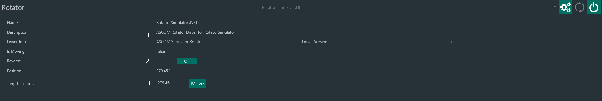
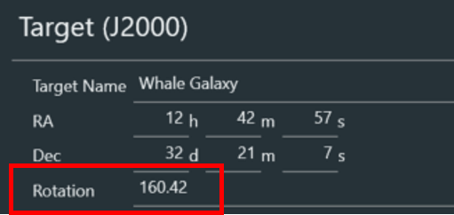
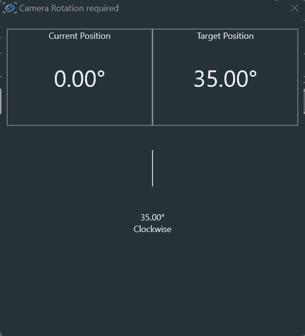

# 旋转器

旋转器选项卡用于连接 ASCOM 兼容的旋转器。
还提供一个手动旋转器选项。

1. 旋转器信息
2. 反转旋转器方向（如果可用）。当旋转器在对中和旋转过程中朝错误方向移动时，请启用此选项。例如，在 Hyperstar 这类水平图像轴翻转的配置中就需要这样做。
3. 将旋转器移动到所选角度

:::note
旋转器角度将在对中和旋转后与天空角度同步，并显示天空角度而非机械角度。
:::

## 手动旋转器

手动旋转器对于没有电动旋转器但仍希望匹配[构图选项卡](../framing.md)中定义的构图角度的配置来说，是一个非常实用的工具。

要启用手动旋转器，必须：

1. 在[选项 -> 解析](../options/platesolving.md)中定义*旋转器容差*
2. 在旋转器选项卡中连接手动旋转器
3. 在[构图](../framing.md)中构图目标，并添加到序列目标
4. 在[传统序列器](../../sequencer/simple/simple.md)中启用*旋转目标*，或在[高级序列器](../../sequencer/advanced/advanced.md)中使用*转向、对中并旋转*指令
5. 启动序列

序列启动且赤道仪完成转向目标后，N.I.N.A. 将进行解析以确定当前的构图坐标和旋转角度。如果解析确定的角度与*序列 -> 旋转*中指定的角度之间的差异超过*旋转器容差*，将弹出窗口指示你需要旋转相机的角度和方向。
旋转相机并关闭手动旋转器窗口后，将执行一次新的解析。如果角度仍然超过*旋转器容差*，该过程将重复进行。

:::tip
如果希望在主拍摄序列开始前设置相机旋转角度，可以使用一个 1 秒曝光的虚拟序列来启动手动旋转器。
:::
