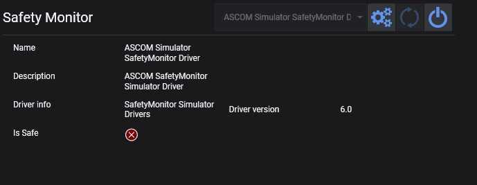

安全监测器选项卡用于连接和监视兼容的安全监测设备。这些设备报告当前条件是否适合安全拍摄。

标题栏包含常规的设备控制按钮，用于连接、断开、刷新设备列表，以及在可用时打开设置对话框。

## 设备信息

页面左侧显示所选安全监测器报告的信息：

* 名称
* 描述
* 驱动信息
* 驱动版本
* 当前**是否安全**状态

## 设置

当所选安全监测器提供设备特定设置时，右侧将显示这些设置。如果所选安全监测器没有额外的设置项，此区域将保持空白。

## 拍摄工作区

拍摄选项卡还可以显示一个紧凑的安全监测器面板，以便在拍摄时随时查看当前安全状态。
