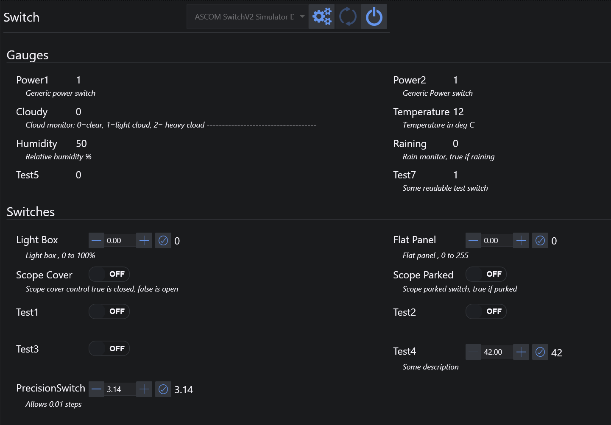

# 开关

开关选项卡用于连接和控制兼容的开关设备。

标题栏包含常规的设备控制按钮，用于连接、断开、刷新设备列表，以及在可用时打开设置对话框。

## 仪表盘

**仪表盘**区域显示设备报告的只读开关值。

每个条目显示：

* 开关名称
* 当前值
* 描述

## 开关

**开关**区域显示可写开关。

根据开关类型：

* 布尔型开关可以直接切换
* 数值型开关可以通过步进控件调整，然后使用勾选按钮应用更改

每个可写开关在其控件下方还显示描述信息。
