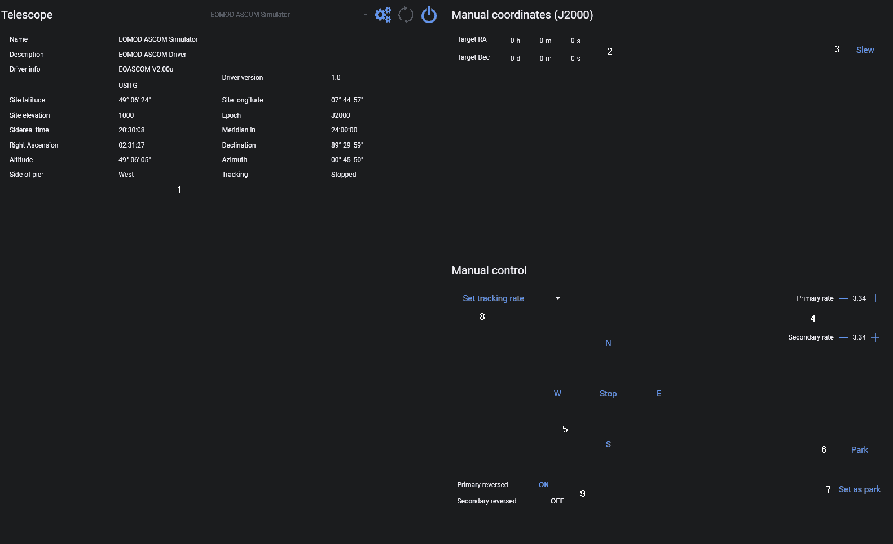

The Rotator Tab lets you connect an ASCOM-compatible telescope mount.

1. Telescope information 
2. Define manual target coordinates
3. Slew to manual target coordinates
4. Define movement rate
5. Manual movement commands
6. Park mount
7. Set current position as parking position
8. Set a specific tracking rate by selecting the desired tracking rate in the combo box
9. Reverse the primary and/or secondary axis direction

