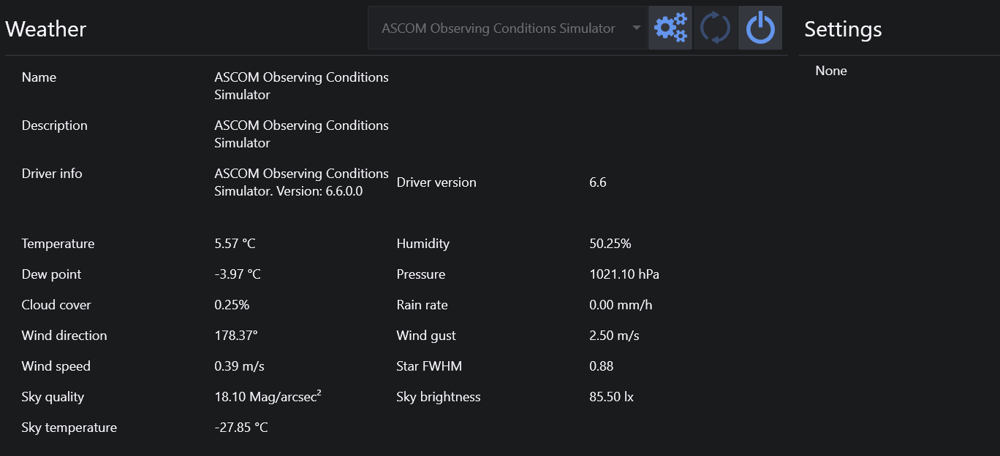

This tab lets you connect a compatible or ASCOM-compliant weather observing station

Currently the following devices are compatible with N.I.N.A.:

1. Any ASCOM-compatible devices
   
2. OpenWeatherMap (see [Equipment](../options/equipment.md))
   
3. Pegasus Ultimate Powerbox V2