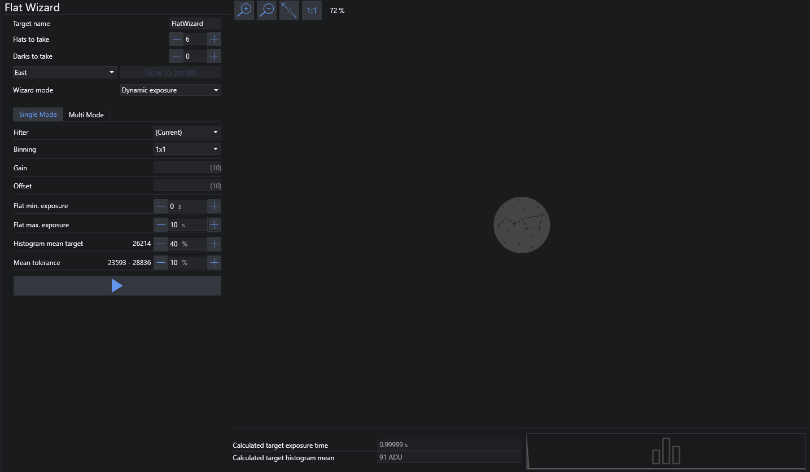
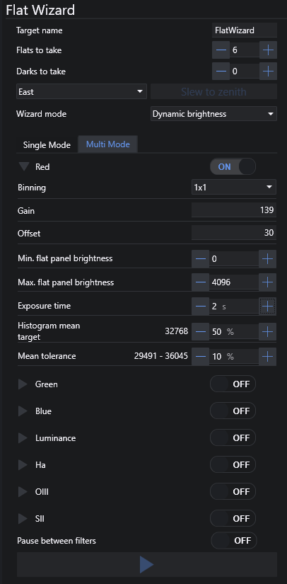

# 平场向导

平场向导提供了自动化平场图像采集的功能。它会拍摄多次曝光，直到为指定设置找到最佳的曝光时间。此外还有[多滤镜模式](flatwizard.md#多滤镜模式)。多滤镜模式可为配备了电动滤镜轮的用户自动采集每个滤镜的平场。

平场向导先拍摄 3 张测试曝光，并尝试通过线性外推法计算出平场图像的最佳曝光时间。如果这还不足以得出合适的曝光时间，它将继续拍摄测试曝光，直到能够确定最佳曝光时间为止，或者在无法找到合适曝光时间时提示你调整参数。

## 设置

### 目标名称
你可以在此字段中手动指定一个名称，该名称将用于填充 FLAT 和 DARK 帧的图像文件命名模式中的 `$$TARGETNAME$$`。

### 拍摄平场数量
每个滤镜要拍摄的平场数量。

### 拍摄暗场数量
每种曝光时间要拍摄的暗场数量。

:::note
"天空平场"模式下无法拍摄暗场，因为该模式下平场的曝光时间在每帧之间都在变化。
:::

### 转向天顶
根据按钮旁下拉框中选择的值，望远镜将转向天顶，中天柱位于东侧或西侧。

### 向导模式
此模式将根据不同的场景切换平场向导的操作行为：

- 动态曝光
    - 在此模式下，平场向导将尝试找到合适的曝光时间（如果连接了平场板，则使用固定亮度）。
    - 算法从曝光时间 `((最大曝光时间 + 最小曝光时间) / 2)` 开始：
        - 如果曝光过亮，算法将使用此曝光时间作为新的最大值并重复。
        - 如果曝光过暗，算法将使用此曝光时间作为新的最小值并重复。
- 动态亮度
    - 对于固定曝光时间，平场向导将尝试找到匹配所需曝光时间的平场板亮度。这需要连接可控制的平场板。
    - 算法从亮度 `((最大面板亮度 + 最小面板亮度) / 2)` 开始：
        - 如果曝光过亮，算法将使用此面板亮度作为新的最大值并重复。
        - 如果曝光过暗，算法将使用此面板亮度作为新的最小值并重复。
- 天空平场
    - 当没有平场板时使用的模式，而是使用黄昏或黎明时的天空来拍摄平场。在平场向导运行期间，曝光时间会根据不断变化的天空亮度持续调整，因此每张曝光的时间都会不同。
    - 算法从曝光时间 `((最大曝光时间 + 最小曝光时间) / 2)` 开始：
        - 如果曝光过亮，算法将使用此曝光时间作为新的最大值并重复。
        - 如果曝光过暗，算法将使用此曝光时间作为新的最小值并重复。
    - 一旦找到曝光时间，算法将计算曝光之间的天空通量变化，并相应地调整新曝光的时间。如果新曝光不在容差范围内，该过程将重新开始寻找初始曝光时间。

## 单滤镜模式

### 滤镜
-  如果连接了滤镜轮，可以为单滤镜模式选择滤镜。

### 像素合并
-  设置曝光的相机像素合并级别。

### 增益
-  设置曝光使用的相机增益。相机和驱动需要支持增益控制。

### 偏置
-  设置曝光使用的相机偏置。相机和驱动需要支持偏置控制。

### 平场最小曝光 / 最小平场板亮度
-  平场向导应使用的最小曝光时间或最小平场板亮度（取决于所选模式）。

### 平场最大曝光 / 最大平场板亮度
-  平场向导应使用的最大曝光时间或最大平场板亮度（取决于所选模式）。

### 直方图均值目标
-  设置平场图像直方图应使用的平均 ADU 值。
-  可以在右侧或使用滑块指定百分比。百分比左侧的数字显示所需百分比对应的 ADU 值。

### 均值容差
-  确定平场均值与均值目标（12）的容差大小。
-  可以在右侧或使用滑块指定百分比。百分比左侧的数字显示基于均值目标（12）的所需容差百分比所对应的 ADU 范围。20-30% 的容差值较为典型。

### 启动平场向导
-  此按钮使用当前设置启动平场采集流程。
-  首先，平场向导将使用测试曝光计算最佳曝光时间，然后按照（2）中设置的数量拍摄全部平场。在拍摄暗场之前，系统会提示你熄灭所有光源。

### 图像预览
-  右侧区域在确定最佳平场曝光时间期间显示最新的平场图像。请注意，一旦确定了最佳曝光时间，此区域将不再更新，以加快平场采集流程。

### 计算得出的目标曝光时间
-  平场向导确定必要的曝光时间后，将使用该时间拍摄所有平场。

### 计算得出的目标直方图均值
-  平场向导确定必要的曝光时间和得到的 ADU 后，ADU 均值将显示在此处。

## 多滤镜模式

本质上，多滤镜模式与单滤镜模式的工作方式相同，但适用于多个滤镜。大多��控件与[单滤镜模式](flatwizard.md#单滤镜模式)相同。

在多滤镜模式下，平场向导设置是按滤镜保存的，不会传递到单滤镜模式。

### 滤镜开关
- 启用特定滤镜以进行平场采集。

### 滤镜列表
- 按名称显示所有可用滤镜，点击 > 图标可展开。
