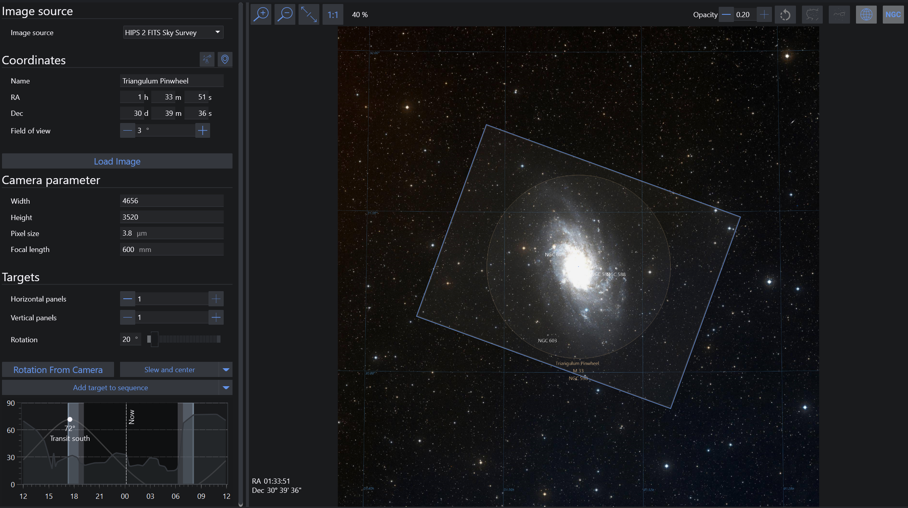
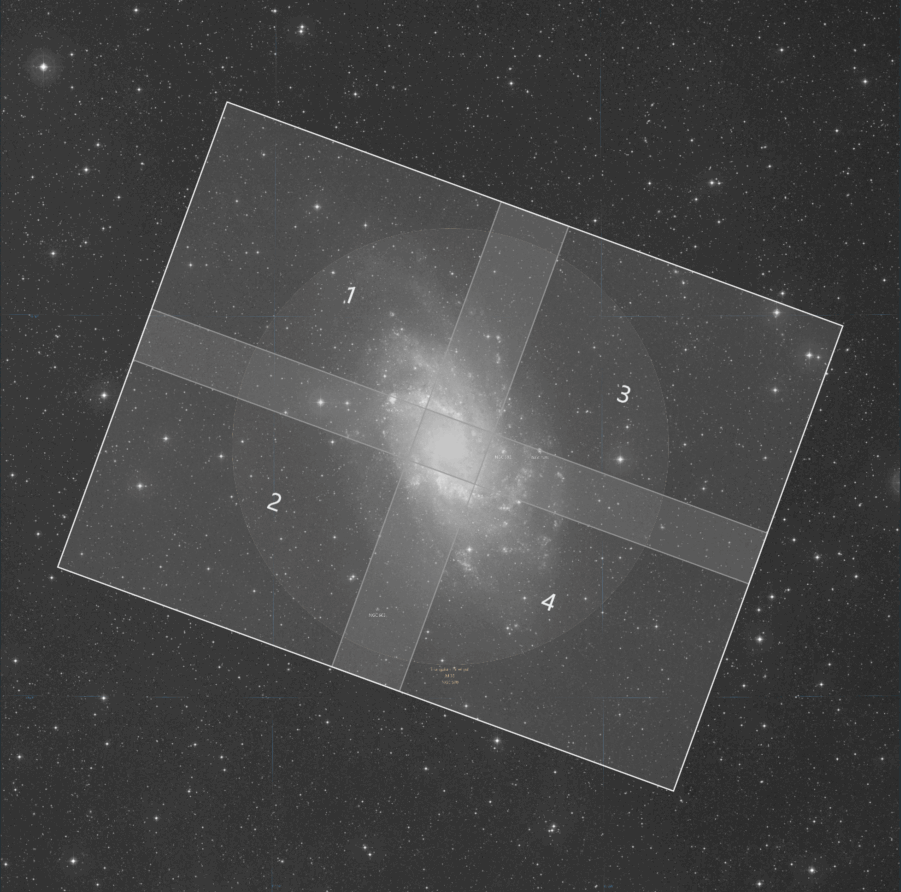

Framing Assistant allows you to frame the next shot perfectly via several online sky survey services, a built-in planetarium, or a user-supplied image. It can utilize plate solving to perfectly align your telescope and rotator (if equipped) to match the position of the framing rectangle.

For further information about using the Framing Assistant refer to the [Advanced Framing](../advanced/framingassistant.md) topic.

## Image source 

### Image Source selection menu
* Allows you to specify the source of an image to utilize in the Framing Assistant. Possible options are:
    * **Digital Sky Survey**: Fetch an image of the object from a sky survey server. This requires an internet connection
    * **Offline Sky Map**: N.I.N.A.'s own database of objects. Circles representing approximate target sizes will be displayed
        * If you have images in your Sky Survey Cache, they will be shown in the offline sky map
        * A pre-rendered cache of cache images spanning the whole sky can be downloaded on the homepage. This cache can be used to have a fast and complete offline framing tool.
    * **From File**: Load an existing JPEG, GIF, PNG or TIFF image of an object. When an image is provided through **From File**, the configured [Solver](../advanced/platesolving.md) is used to determine the coordinates and orientation of the image. Alternatively, for FITS and XISF files the WCS header coordinates are used if present.
    * **Cache**: Load images directly from a local cache of images that have already been downloaded from one of the Digital Sky Survey servers or loaded in from files
* Successfully-solved or downloaded local and sky survey images are cached automatically

### Planetarium Sync
* Pressing the Planetarium Sync button fetches the coordinates of a selected object from the configured external planetarium program. If no objects are selected in the planetarium the center of frame coordinates are selected as a fallback.

## Camera parameters

### Coordinates
* The RA, Dec, and Field of View of a location in the sky may be manually entered here 
* RA, Dec and Field of View are initially unavailable when loading an image from file, however these fields will be populated once the image has been automatically solved

### Load Image
* Starts the image download when using a sky survey 
* Starts the plate solving mechanism when using **From File**. If the uploaded file already contains WCS headers, these will be used instead of attempting a new plate solve.
* Attempts to load an image from the cache using the provided coordinates

### Width, Height, Pixel Size and Focal Length
* Values will be set from the connected camera automatically, if available 
* These settings are not available to DSLR users
* The specified Focal Length is **not** synchronized to the your Telescope settings. This allows you to experiment with various focal lengths
* These parameters determine the size of the framing rectangle (15)
> These parameters are only used for displaying the framing rectangle. For camera and focal length parameters used in plate solving, refer to [Options](../tabs/options/equipment.md).

## Targets

### Mosaic Panels and rotation
* Rotation can be set freely and should match your camera's orientation as determined by plate solving 
* You can specify the number of panels for an N x M size mosaic 
* You can specify the % overlap between each panel 
* Furthermore it is possible to enable "preserve alignment" which becomes relevant the further away from the celestial equator (declination at 0) the object is. Having this option enabled will adjust each mosaic panel separately with its own rotation to perfectly align to a big rectangle. Keep in mind that this will require separate rotation between each panel.
    

### Rotation from camera
* This will take an exposure from your connected camera, plate solve it, and determine the rotation of the frame. Afterwards, the rotation of the framing is updated.

### Slew and center
* Slews the mount to the coordinates of the center of the framing rectangle (16) and uses plate solving to recenter the mount to be precisely on target
* In addition when clicking on the arrow the operation can be adjusted to only slew to the target without solving or also consider the rotation (when a rotator is connected)

### Add target to sequence
* Takes the name, the RA and Dec coordinates, and the angle of the framing window, and adds it as a sequence target for either the legacy sequencer or the advanced sequencer using a deep sky object template
* In addition when clicking on the arrow and clicking on "Add target to target list", the target can be added to the advanced sequencer's target tab instead
* A third option is to click on "Update Existing Target in Sequencer" which becomes available when there is already a target inside the sequencer and the target should be updated with the new framing instead

### Altitude browser
* Displays the altitude of the target over time, indicating current position and meridian 

## Main tab

### Image display controls
* From left to right: Zoom in, zoom out, fit image to screen, show image in original resolution 

### Annotation controls
* From left to right: Rotate image instead of rectangle, Opacity of framing rectangle, constellation boundaries, constellation annotation, equatorial grid, annotate DSOs 

### Image
* The image as downloaded from the sky survey, cache, Sky Atlas or provided by **From File** 

### Framing rectangle
* Depends on the camera and focal length parameters (5) 
* Can be dragged around with the mouse 
* Can be rotated with (6) 

### RA/DEC Coordinates
* The coordinates of the center of the framing rectangle. These are used as a sequence target's coordinates.
