# 拍摄

拍摄选项卡是你的拍摄驾驶舱。
在这里，N.I.N.A. 将显示关于已拍摄图像的各种信息，并让你控制拍摄过程中的所有关键参数。

拍摄选项卡由多个窗口组成，这些窗口可以动态排列，创造出你个性化的布局。
可用窗口可以从顶栏激活和停用。
要排列窗口，只需从窗口标题栏拖动它，并根据建议的占位符放置即可。

根据连接的设备和启用的面板，拍摄工作区还可以显示圆顶、安全监测器、平场设备以及当前活动序列器的额外面板。

顶栏分为两个主要区域：**信息**和**工具**。

## 信息
这些窗口提供关于已拍摄图像和已连接设备的重要状态信息。

### A. 图像  
图像面板是拍摄选项卡的核心部分，用于显示最新拍摄的图像。

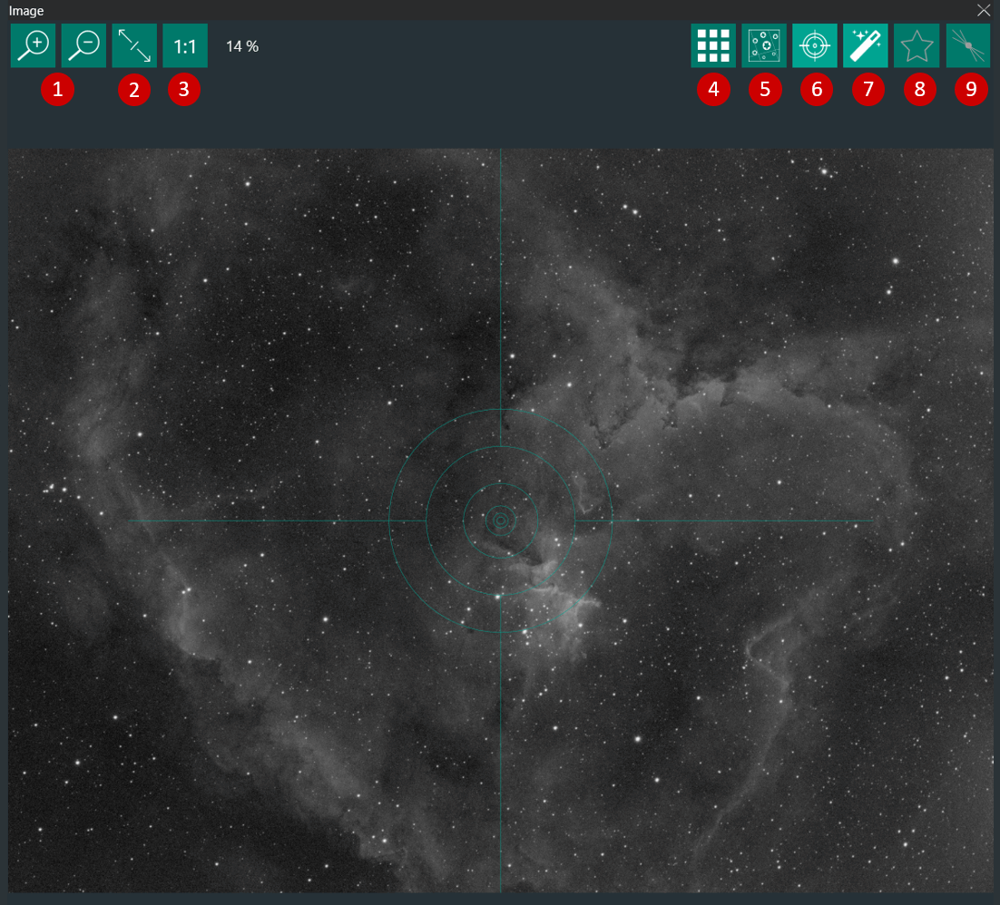

1.   放大/缩小
2.   适应窗口
3.   100% 缩放（1:1）
4.   打开当前图像的 3x3 裁剪马赛克，以检查畸变和倾斜
5.   对当前图像启动解析流程
6.   开启/关闭十字线叠加
7.   开启/关闭显示图像的自动拉伸（自动拉伸设置请参考[选项](options/imaging.md)）
8.   开启/关闭自动 HFR（半通量半径）星点检测分析。HFR 用于[自动对焦](options/autofocus.md)流程。当 HFR 检测开启时，每张拍摄图像的平均 HFR 值将绘制在 HFR 历史记录窗口中（M）。
> 如果在[选项->拍摄](options/imaging.md)中开启了*标注图像*，计算出的 HFR 值将显示在图像上。
   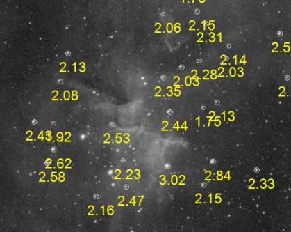
9.   激活鱼骨板分析辅助工具，用于配合鱼骨板进行手动对焦。

### B. 相机 
此面板显示主相机和传感器的属性以及制冷状态。
> 需要连接相机

1. 相机状态详情
2. 相机制冷属性
3. 相机升温

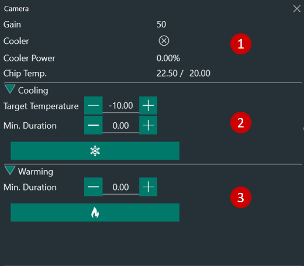

### C. 滤镜轮 
当连接滤镜轮时，此面板显示当前滤镜（1）并允许你通过下拉菜单（2）手动切换滤镜。

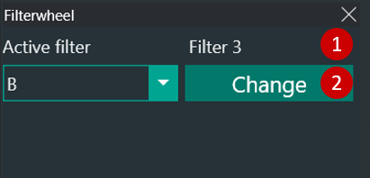

### D. 调焦器  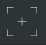
此面板显示调焦器状态，并允许你手动将其移动到所需位置。
> 需要连接调焦器

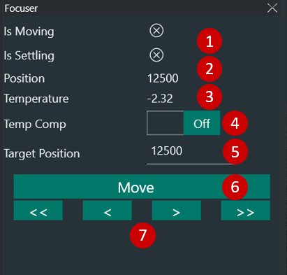

1. 调焦器当前状态（移动中或稳定中）
2. 调焦器当前位置（对于绝对步进电机调焦器）
3. 调焦器温度（如果调焦器配备环境温度传感器）
4. 开启/关闭调焦器温度补偿
5. 在此设置调焦器目标位置，点击"移动"（6）使调焦器移动到该位置
6. 将调焦器移动到（5）中定义的目标位置
   > 建议将目标位置设置为接近你设备对焦位置的值。可以使用鱼骨板对准一颗亮星来确定此位置（参见**手动对焦目标**）。确定接近对焦的位置后，将（2）"位置"中指示的步数输入到目标位置字段中。然后，你可以在每次拍摄开始时指示调焦器移动到此位置，再启动自动对焦流程。
7. 箭头将使调焦器以预定义的量前后移动，该量与选项 - [自动对焦](options/autofocus.md)中定义的自动对焦步长相关：
    * 单箭头 `<`  `>`：自动对焦步长的一半
    * 双箭头 `<<`  `>>`：自动对焦步长的五倍

### E. 旋转器 
在此控制旋转器。
> 需要连接 ASCOM 旋转器

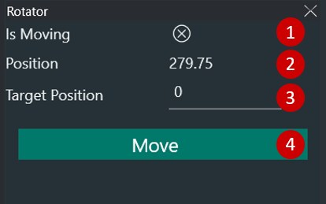

1. 旋转器当前状态
2. 旋转器当前位置
3. 输入旋转器目标位置
4. 将旋转器移动到目标位置

### F. 望远镜 
望远镜面板提供关于望远镜的所有重要信息，如跟踪状态、恒星时、到达中天时间和当前望远镜坐标。
> 需要连接 ASCOM 望远镜

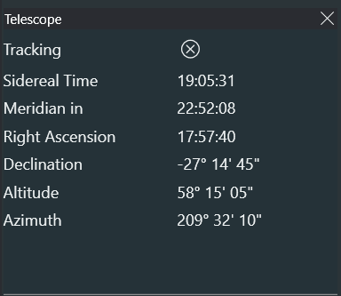

### G. 导星  
导星面板显示当前导星器状态、RMS 值，以及当已连接导星器提供导星遥测数据时的实时导星图表。

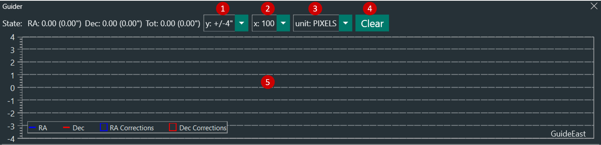

1. 选择 y 轴的刻度范围
2. 选择 x 轴的刻度范围
3. 选择 y 轴的单位：
    * 像素：导星相机像素
    * 角秒：以角秒显示的导星误差
4. 清除图表
5. 图表区域，导星图表在此处可视化

### H. 序列 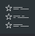
序列面板跟随当前活动序列器，让你可以从拍摄工作区快速访问运行中的序列。根据当前模式，它可以显示传统/简单序列器、高级序列器，或在没有序列器活动时显示一个导航占位符。要了解如何设置序列，请参考[序列](sequencer.md)部分。

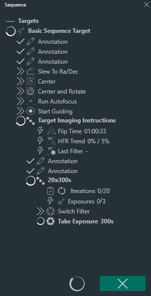

### I. 开关 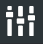
此面板让你控制活动开关。
> 需要连接开关设备

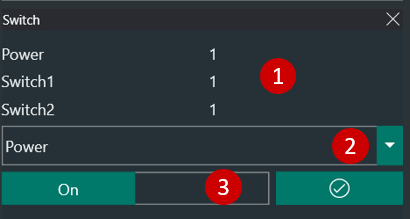

1. 可用开关和状态
2. 手动选择开关
3. 切换活动开关 ON/OFF

### J. 气象  
气象面板显示已连接气象来源报告的值。仅显示该来源提供的值。
> 某些气象来源需要在[设备 > 气象](equipment/weather.md)中进行额外设置。

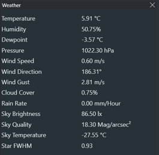

### K. 统计  
在此面板中，报告最后一张拍摄图像的所有重要信息。

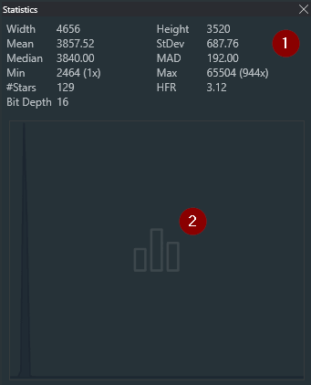

1. 最后一张拍摄图像的基本统计信息：
    * 宽度和高度（像素）
    * 均值、标准差、中位数和 MAD 值（ADU）
    * 图像中的最小和最大 ADU 值
    * 检测到的星点数和平均 HFR
        > 星点和 HFR 仅在自动 HFR 激活时显示
    * 图像头报告的位深

2. 最后一张拍摄图像的直方图

### 额外设备面板
根据连接的硬件和所选布局，拍摄选项卡还可以显示以下额外面板：

* **圆顶**：报告连接状态、归位/原点状态、转动状态、跟随模式、快门状态、方位角和高度角。
* **安全监测器**：报告所选安全监测器是否已连接以及当前是否安全。
* **平场设备**：报告灯光状态、亮度和盖板状态，并可选择暴露灯光、亮度和盖板的手动控制。

### M. HFR 历史  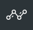
当自动 HFR（半通量半径）星点检测开启时，此面板将使用两个可配置的绘图值和自动对焦标记来显示已拍摄图像的历史记录。

默认情况下，HFR 历史记录显示当前拍摄会话中的 HFR 和星点数量。当面板设置打开时，你可以：

1. 绿色线：左侧 y 轴
2. 黄色线：右侧 y 轴
3. 三角标记：自动对焦运行
4. 选择左侧和右侧绘制的值
5. 按滤镜筛选图表
6. 包括或排除快照
7. 在像素和角秒之间切换星点测量单位
8. 清除当前历史记录
9. 将当前历史记录保存为 CSV 文件

悬停在绘制的图像点上会显示该曝光的记录图像属性。悬停在自动对焦标记上会显示该次运行的记录自动对焦详情。

## 工具

### N. 拍摄 
拍摄面板允许你拍摄单张曝光或（在相机支持的情况下）使用实时预览模式。

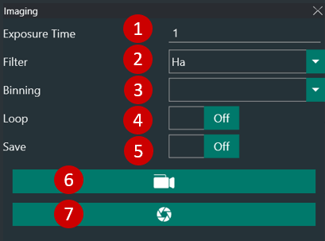

1. 拍摄曝光时间（秒）
2. 拍摄使用的滤镜（如果连接了滤镜轮）
3. 相机像素合并
4. 开启/关闭图像循环拍摄。这对使用鱼骨板进行手动对焦特别有用。
5. 开启/关闭保存当前拍摄到磁盘
6. 当相机支持时，激活实时预览模式
7. 拍摄曝光

### O. 图像历史  
图像历史面板以缩略图形式显示最近保存的图像。列表最多保留 50 条记录，可以显示基本图像详情，如 ADU 平均值、平均 HFR、滤镜、曝光时长和拍摄时间。
> 点击缩略图可在图像面板（A）中打开该图像。

悬停在缩略图上会显示评分按钮，你可以将图像标记为不良或清除不良标记。

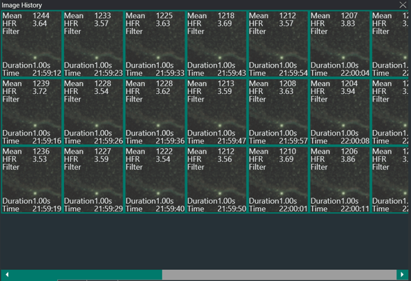

### P. 解析 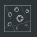
解析是拍摄过程中非常重要的一步。有关解析流程的更多信息，请参考高级主题中的[解析](../advanced/platesolving.md)。此面板允许你执行手动解析，并保留所有解析会话的历史记录。
> 解析正常工作的前提条件：
> * 在选项[解析](options/platesolving.md)中定义了外部解析器。
> * 在选项[设备](options/equipment.md)中定义了望远镜焦距。
> * 在选项[设备](options/equipment.md)中定义了相机像素尺寸。
> * 待解析的图像是使用指定的焦距和像素尺寸拍摄的。

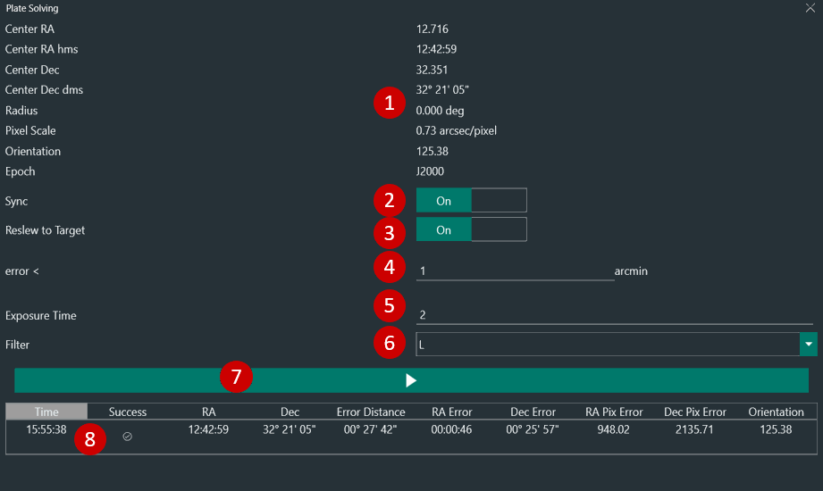

1. 解析结果
2. 开启/关闭将望远镜赤道仪与解析坐标同步。
3. 开启/关闭重新转向并重新对中赤道仪到解析坐标（如果解析位置与预期位置不匹配）。
4. （3）的误差阈值。
5. 用于拍摄解析图像的曝光时间。
6. 用于拍摄解析图像的滤镜。
7. 拍摄解析图像。
8. 解析会话历史记录。

### R. 自动对焦 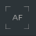
此面板允许你基于选项[自动对焦](options/autofocus.md)中设置的自动对焦参数手动触发自动对焦流程。

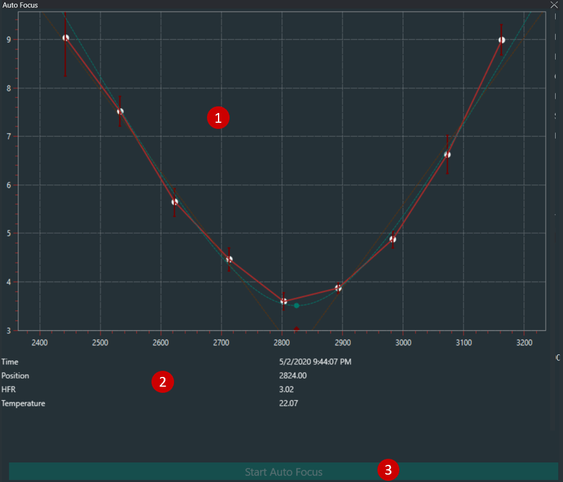

1. 自动对焦曲线
2. 上次自动对焦运行参数
3. 启动自动对焦流程

### S. 手动对焦目标 
当你需要手动对焦望远镜时，此选项卡让你可以方便地从当前可见的较亮恒星中进行选择（根据你的位置和时间）。

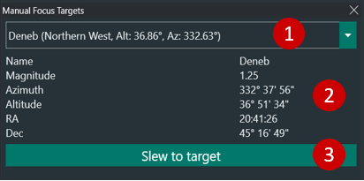

1. 可供选择的恒星列表
2. 选定恒星的属性
3. 将望远镜转向所选恒星
