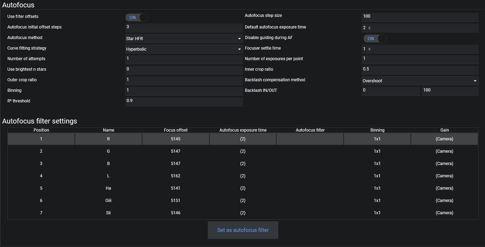

## General settings
### Use FilterWheel Offsets
Determines whether the focuser should move per the defined offset in the list at the bottom when the filter wheel changes filters. See below for more details.

### Autofocus Step Size
The number of focuser steps that the autofocus routine will move by between autofocus points. This setting is highly dependent on the telescope and focuser.
  
### Autofocus Initial Offset Steps
The number of focus points that will be used on each side of perfect focus by the autofocus routine.  
*The default value should work for most cases*

### Default Autofocus Exposure Time
The exposure time in seconds that will be used by autofocus, if filter-specific times in the list below are not set.

### AF Method
Method used to detect data points for autofocus.  

* Star HFR: This is the default method that will work reliably with images containing stars  
* Contrast Detection: An alternative method to focus on terrestrial objects or planets  

### AF disable Guiding
Activate to pause guiding during AF routines. Enable this setting when using an Off-Axis Guider. For Guidescopes it is recommended to be left off.

### AF Curve Fitting
Fitting that should be used to determine ideal focus position out of the measured data points. A traditional autofocus curve follows a hyperbolic shape, so Hyperbolic method is recommended.

### Focuser Settle Time
The amount of time, in seconds, to wait after a focuser move before starting a new exposure. Some focusers will require a small settle time to avoid losing steps and to prevent vibrations.
  
### AF Number of Attempts
The number of times the autofocus routine should be retried in case of unsuccessful focusing. Be careful when increasing this, as it can unnecessarily lengthen the AF routine when no focus can be achieved anyway, due to, for example, clouds. This is better handled with the [advanced sequencer](../../sequencer/advanced/advanced.md).

### AF Number of Frames per Point
The number of frames whose HFR or contrast will be averaged per focus point. Most of the time, only one frame per focus point is enough.
  
### Use brightest n stars
The number of brightest stars that the autofocus routine will use. 0 means there is no limit and all stars are considered.

### AF Inner Crop Ratio
Inner ratio that will determine a centered region of interest for autofocus

### AF Outer Crop Ratio
Outer ratio that will determine a centered region of interest for autofocus
  
### Backlash Compensation Method
This controls the backlash compensation method used. The method can only be changed when the focuser is not connected!

* Absolute:
  When the focuser changes directions, an absolute value will be added to the focuser movement.
  Backlash IN: when the focuser changes from moving outwards to moving inwards, the Backlash IN value will be added.
  Backlash OUT: when the focuser changes from moving inwards to moving outwards, the Backlash OUT value will be added.
* Overshoot (recommended):
  This method will compensate for backlash by overshooting the target position by a large amount and then moving the focuser back to the initially requested position.
  Due to this compensation, the last movement of the focuser will always be in the same direction (either always inwards or always outwards).
  
### Backlash IN/OUT
The focuser backlash in the IN (decreasing position) and OUT (increasing position) directions, expressed in focuser steps.
  
!!! tip
    When Overshoot is chosen, only ONE value between Backlash IN and OUT must be set! When setting IN, the amount will be applied on each inward movement, so the final movement will always be outwards. For Backlash OUT, it will be the other way around.
    The recommended direction is OUT, as then the autofocus routine will need less compensation. Use IN only when your equipment requires this direction to work properly.

### Binning
The binning to be used for Autofocus exposures, if filter-specific binning in the list below is not set.

### R² Threshold
This setting refers to the [coefficient of determination](https://en.wikipedia.org/wiki/Coefficient_of_determination) which is used to grade the [calculated fitting](./autofocus.md#af-curve-fitting) of an autofocus run to the actual data points. When an autofocus run leads to an R² value that is below this threshold, the autofocus run will be deemed as failed. This can happen due to bad parameters, clouds rolling in and other problems during an autofocus run. An ideal autofocus run will have an R² value that is easily beyond 0.95. 

## Autofocus filter settings

### Filter offsets

Most filters are not exactly parfocal, meaning that when changing filters, the ideal focus distance changes slightly. This will cause an imaging system that was in perfect focus with one filter to be slightly out of focus with another filter. This can be a big problem for precise imaging, requiring an additional autofocus run each time the filter is changed.

To avoid this, it is possible to set filter offsets, which are the amount of focuser steps that the focuser should move by when switching from one filter to another.

For example, I could run the autofocus routine on each of my filters one after the other (with hopefully very little temperature change in between), with the following results:

* L filter achieves perfect focus at focuser position 5000
* R filter achieves perfect focus at focuser position 4990 (10 steps fewer than L filter)
* G filter achieves perfect focus at focuser position 5030 (30 steps more than L filter)
* B filter achieves perfect focus at focuser position 5045 (45 steps more than L filter)
* Ha filter achieves perfect focus at focuser position 4988 (12 steps fewer than L filter)

If we take the L filter as the reference filter, we can set up all the filter offsets relative to the L filter, as below:

* L filter offset 0 (reference filter)
* R filter offset -10 (10 steps fewer than L)
* G filter offset 30 (30 steps more than L)
* B filter offset 45 (45 more steps than L)
* HA filter offset -12 (12 steps fewer than L)

This is what has been done in the above screenshot.

Note that for this to work, the *Use FilterWheel Offsets* parameter under the Focuser Options needs to be set to On.

### Autofocus Exposure Time

The ideal auto-focus time can change per filter, particularly between broadband and narrowband filters (in the above example, the narrowband filter requires an exposure time 5 times longer than the broadband filters). This can easily be set up here.

Finding a good exposure time for autofocus is further explained in the [Auto-Focus section](../../advanced/autofocus.md)

### Autofocus Filter

From the filter list, it is possible to set (or unset) an autofocus filter, which will be used by the autofocus routine (if the *Use FilterWheel Offsets* setting is enabled). This can be done by simply selecting a filter in the list, and clicking on the *Set as Default AF Filter* button. The same button can be used to unset the autofocus filter.
