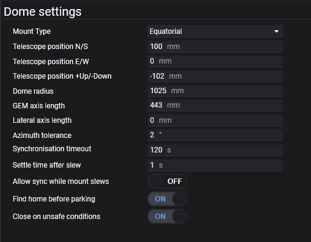

此选项卡用于设置与圆顶相关的所有参数。

## 圆顶与赤道仪几何参数

### 赤道仪类型
指定你的赤道仪是德式赤道仪还是楔架上的叉式支架。这将影响计算。

### 望远镜位置 +北/-南（毫米）
 测量赤道仪中心相对于圆顶中心的南北偏移量（毫米）。北是指真北——极轴对准的望远镜所指的同一方向。北方向使用正数，南方向使用负数。

### 望远镜位置 +东/-西（毫米）
 测量赤道仪中心相对于圆顶中心的东西偏移量（毫米）。东西方向是相对于真北而言的——与北半球极轴对准的望远镜所指方向一致。东方向使用正数，西方向使用负数。

### 望远镜位置 +上/-下（毫米）
 测量赤道仪轴线中心相对于圆顶底座的高度差（毫米）。对于经纬仪，是指高度轴的中心；对于赤道仪，是指 RA 轴和 DEC 轴的交点。正数表示轴线中心高于圆顶底座，负数表示低于圆顶底座。

### 圆顶半径（毫米）
 测量从圆顶中心到底部边缘的距离。

### 德式赤道仪轴长（毫米）
 如果是经纬仪，此项应为 0。对于赤道仪，将 RA 轴转到 +/- 90 度，测量从轴线到望远镜镜筒中心的横向距离（毫米）。

:::note
此设置的目的是确定什么应指向圆顶开口的中心。如果你有导星镜，应在 OTA 到导星镜顶部的长度上再加一半。例如，如果导星镜支架为 40mm，导星镜口径为 60mm，则应在**德式赤道仪轴长**中增加 70mm。
:::

### 横轴长度（毫米）
 如果你有双抱箍并排安装的 OTA，此设置指定 OTA 中心相对于赤道仪轴线的偏移量（毫米）。相对于 RA 和 DEC 轴向右偏移使用正数。

### 方位角容差（度）
 当目标方位角相差超过此值时，圆顶将转动。某些圆顶旋转器具有最大精度限制，因此应将此值设为等于或大于该精度值。例如，NexDome 在 2020 年中期添加高精度转动之前，转动时仅支持 1 度的分辨率。

## 圆顶设置

### 同步超时
 需要拍照的操作（如解析和自动对焦）依赖于圆顶与赤道仪的同步。如果启用了<i>圆顶跟随望远镜</i>，拍摄操作将等待望远镜停止转向**且**圆顶指向相同的方位角（在配置的容差范围内）。此设置指定等待同步完成的最长时间（秒）。

:::warning
此值不应小于圆顶旋转器精度的两倍。例如，NexDome 只能以整数粒度转动，这意味着其精度为 1 度。如果你拥有 NexDome，请勿将此值设为小于 2，否则**等待圆顶同步**会定期延迟。
:::

### 转动后稳定时间
如果你的圆顶需要几秒钟来稳定，可在此处添加稳定时间。

### 赤道仪转动时允许同步
 当外部应用程序或手控器使赤道仪转动时，圆顶同步将等待赤道仪停止后再旋转圆顶。开启此选项允许圆顶同步跟随赤道仪转动。如果旋转速度较快，你可能更倾向于开启此选项。

### 望远镜转动时同步转动圆顶
 启用后，当望远镜转动时，N.I.N.A. 会转动圆顶使其与望远镜同步。但这并不会在望远镜跟踪期间持续保持圆顶同步。

### 归位前寻找原点
 这是一项创新的可靠性功能。某些圆顶（如 NexDome）需要精确的归位位置，以便为快门电机供电的电池能够充电。如果启用此设置，圆顶将在归位并关闭快门前寻找原点位置（如果圆顶提供了原点）。这将重新同步圆顶方位角，以提高归位精度。

:::note
一些圆顶供应商也提供手册来配置许多相同的参数。如果遇到困难，可以尝试查阅一下这些手册。
:::

## 快门协调

:::warning
这些设置关系到你的设备安全。它们仅在 N.I.N.A. 运行并已连接时管理 N.I.N.A. 对圆顶或天窗的控制。圆顶或天窗的安全机制应始终具备硬件备份和电气联锁，以防止不当的快门或天窗移动。
:::

### 不安全条件下关闭
当[安全监测器](../equipment/safetymonitor.md)连接时，如果监测器报告不安全条件，圆顶将立即自动关闭。这将独立于应用程序中的任何其他操作（如序列器）发生。

### 未连接安全监测器时拒绝打开
启用后，如果未连接[安全监测器](../equipment/safetymonitor.md)设备，N.I.N.A. 将拒绝打开快门或天窗。

### 快门操作前归位赤道仪
启用后，N.I.N.A. 将在打开或关闭快门前尝试归位赤道仪。

### 快门操作前归位圆顶
启用后，N.I.N.A. 将在尝试打开或关闭快门前将圆顶发送到归位位置。

### 快门未打开时拒绝解锁赤道仪
启用后，除非快门或天窗报告已打开状态，否则 N.I.N.A. 将拒绝解锁赤道仪的尝试。

### 赤道仪已解锁时拒绝打开或关闭
启用后，如果赤道仪处于已解锁状态，N.I.N.A. 将拒绝打开或关闭快门或天窗。此项在"快门操作前归位赤道仪"设置之后进行评估。
