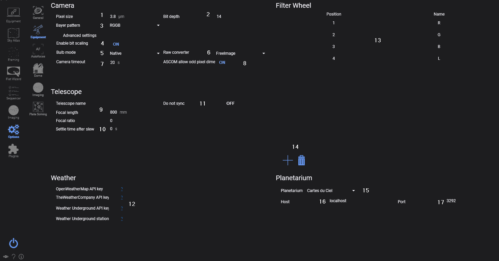
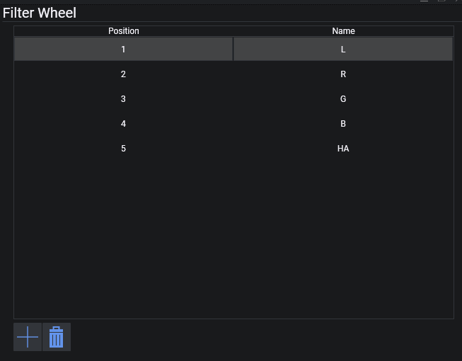

此选项卡用于设置与设备相关的所有参数。

## 相机

### 像素尺寸
* 相机传感器的像素尺寸，单位为微米。如果相机提供此信息，该字段将自动填充。
> 此字段与"望远镜"中的值一起用于解析操作。

### 位深
* 指定所用相机输出图像的位深度。

> 对于使用 DCRaw 的 DSLR，请设置为 16 位。如果使用 FreeImage，请设置为与相机位深匹配的值。

> 对于 ZWO、QHY、SBIG、FLI、PlayerOne 和 Atik 相机，请设置为 16 位，因为它们已由相机驱动重新缩放。

> ToupTek、RisingCam、Altair、MallinCam、Omegon 和 SVBony 不会进行缩放，因此请设置为与相机位深匹配的值。

> 对于其他 CCD/CMOS 相机，请咨询相机制造商。

### Bayer 阵列
* 指定 DSLR/OSC 相机的 Bayer 阵列。保留为"自动"即可从相机驱动自动选择。

### 启用电平缩放
* 指示是否应将数据移位到 16 位。*仅适用于 ToupTek、RisingCam、Altair、MallinCam、Omegon 和 SVBony 相机*

### B 门模式
* 允许更改相机的 B 门模式。在大多数情况下，原生模式即可正常工作。
> RS232 和赤道仪模式也可用，对于较旧的 Nikon 相机可能是必需的。
> 有关 RS232 和赤道仪快门的使用，请参考：[使用 RS232 或赤道仪进行 B 门快门控制](../../advanced/bulbshutter.md)

### 原始转换器
* 仅适用于 DSLR：选择 RAW 转换器，可选 DCRaw 和 FreeImage。
> DCRaw 将利用 DCRaw 将图像拉伸到 16 位，并应用相机特定的色彩偏差配置文件。
FreeImage 将直接提供相机输出的原始帧，在速度较慢的机器上，图像下载速度可能稍快。

:::note
两种原始转换器都会提供 DSLR 的原始帧，但它们在色彩上可能有所不同。使用 FreeImage 而不添加相机特定配置文件来保存原始帧，得到的原始图像可能会比平常更暗淡、色彩更少。
:::

### 相机超时
* 指定曝光时间结束后，N.I.N.A. 应等待帧下载多久才超时并继续执行。

### ASCOM 允许奇数像素尺寸
* 在 N.I.N.A. 的早期版本中，由于 OSC 相机的原因，像素尺寸总是被截断为偶数宽度和高度。此开关允许在使用 ASCOM 驱动时对单色相机使用完整的传感器尺寸。

## 望远镜

### 望远镜
* 此部分用于输入望远镜的参数，这些参数将用于[解析](../../advanced/platesolving.md)。
> 如果你更换了望远镜，请记得更新这些设置，或在[选项/常规](../../tabs/options/general.md)中切换配置文件。

### 转向后稳定时间
* 望远镜转向后，再次拍摄之前等待的秒数。

### 不同步
* 激活后，在对中过程中会阻止向赤道仪发送同步命令。而是计算一个偏移量来使赤道仪居中。
> 当你拥有固定设备且赤道仪性能良好，并已建立了可靠的指向模型时，这可能很有用，可以避免干扰该模型。

## 气象

### API 密钥
* 输入各种气象来源的个人 API 密钥。
> 点击问号可打开相应的 API 密钥获取页面。

## 滤镜轮

### 滤镜轮
* 如果在[设备](../equipment/equipment.md)中连接了滤镜轮，此窗口将列出可用的滤镜和名称。
    * 位置：滤镜位置
    * 名称：从 ASCOM 驱动导入的滤镜名称
    * 对焦偏移：如果启用了"使用滤镜轮偏移"，每次切换滤镜时使用的偏移值。
    * 自动对焦曝光时间：可以为每个滤镜指定自动对焦曝光时间。

### 滤镜加减按钮
    * 这些按钮用于在滤镜轮列表（24）中添加和移除滤镜。

### 滤镜轮配置

在滤镜轮列表中定义的滤镜会在 N.I.N.A. 的多个地方使用，尤其是：

* [序列器](../../sequencer/overview.md)：某些地方可以指定拍摄所用的滤镜。
* 解析流程：可以设置为使用特定的滤镜，以降低解析曝光时间（例如使用 L 滤镜而非 HA）。
* 自动对焦流程：与解析类似，自动对焦可以设置为使用特定滤镜，还可以按滤镜设置不同的自动对焦选项。

要使以上功能良好运行，需要正确定义可用的滤镜。

界面如下所示：

**添加滤镜**

用户在首次设置滤镜轮时，通常的第一步是连接到滤镜轮。这将从滤镜轮本身获取滤镜信息，并根据该信息自动填充 N.I.N.A. 中的列表。

如果这不起作用，用户可以使用 *+* 和 *-* 按钮手动添加或移除滤镜。请注意，此选项卡中滤镜的位置顺序应与滤镜轮中物理滤镜的顺序一致。

例如，如果一个滤镜轮具有以下滤镜：

1. 第 1 位：Luminance 滤镜
2. 第 2 位：Red 滤镜
3. 第 3 位：Green 滤镜
4. 第 4 位：Blue 滤镜
5. 第 5 位：H-Alpha 滤镜

则屏幕应按照上方截图所示配置，从 L 滤镜开始，按顺序排列到 HA 滤镜。

## 星图设置
星图部分包含 4 款受支持的星图程序的设置。
目前 N.I.N.A. 支持 Stellarium、Cartes du Ciel、TheSkyX 和 HNSKY。
该连接允许从星图软件向 N.I.N.A. 单向传输坐标。

如果配置了星图程序，则可以在程序中任何具有星图同步按钮的地方导入坐标。

### 首选星图软件
* 此下拉菜单选择要使用的星图软件。

### 主机
* 星图服务器所在地址。
> 如果你在同一台机器上运行星图软件，默认值 'localhost' 即可正常工作。

### 端口
* 每个软件的服务器运行在不同的端口上。
> 建议保持默认设置。
