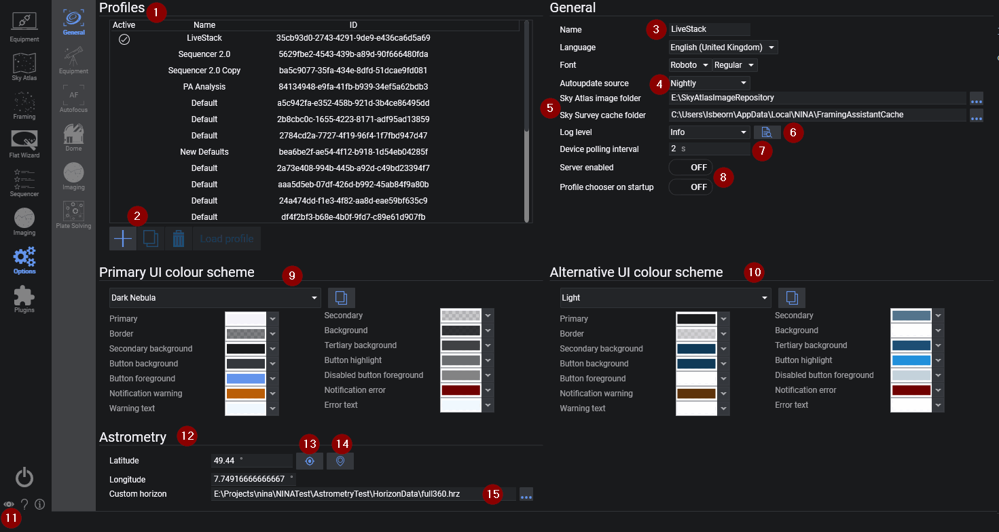
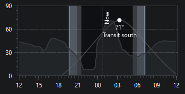

# 常规选项

常规设置选项卡包含不属于单个设备或工作流的应用程序全局设置。



## 配置文件

配置文件列表显示系统上可用的配置文件，包括其激活状态、名称、描述和 ID。

### 配置文件按钮

使用列表下方的按钮可以：

* 添加新配置文件
* 复制所选配置文件
* 删除所选配置文件
* 加载所选配置文件

:::warning
在设备保持连接的状态下，无法加载其他配置文件。
:::

## 常规

### 名称、描述、语言和字体

* 可在此处编辑当前配置文件的名称和描述。
* 语言选择器可更改应用程序中的大多数标签、工具提示和按钮文本。
* 字体选择器用于选择用户界面使用的字体族和字形。

> 如果你想参与本地化翻译，请参阅[本地化指南](../../contributing/localization.md)。

### 天图缓存目录

此目录用于存储下载的天图图像，例如在使用构图助手时获取的图像。

### 启动时显示配置文件选择器

此选项控制 N.I.N.A. 启动时是显示配置文件选择器，还是自动使用上次保存的配置文件。

### 高级设置

**高级设置**展开区域包含以下应用程序全局选项：

#### 自动更新源

选择 N.I.N.A. 检查更新的渠道。可用渠道有**每日构建（Nightly）**、**测试版（Beta）**和**正式版（Release）**。
* 目前有 3 个版本分支：每日构建版、测试版和正式版

    > 每日构建版提供最新的开发成果，包括错误修复和新增功能。这些构建版本的测试不如测试版或正式版充分，但应该足以稳定运行拍摄任务。

    > 测试版被认为是功能完整的版本，通常非常稳定。在成为正式版之前，它们将经历一系列测试和错误修复，并逐步进行增量更新。

    > 正式版为拍摄任务提供了最高的可靠性和稳定性。

#### 单一拍摄布局

如果希望拍摄选项卡的布局在配置文件之间共享，而不是每个配置文件各自保留独立的布局，请启用此选项。

#### 日志

* 设置应用程序日志级别
* 一般使用推荐日志级别为 `Info`
* 通过选择器旁边的按钮可直接打开日志文件夹

可用日志级别有 `Error`、`Warning`、`Info`、`Debug` 和 `Trace`。

#### 通知工作区域与通知角落

这些设置控制 N.I.N.A. 在屏幕上显示弹出通知的位置。

#### 设备轮询间隔

设置设备轮询间隔（秒）。

#### 保存队列大小

控制图像保存队列的大小。

#### 硬件加速

为此应用程序开启或关闭硬件加速渲染。

:::note
更改**单一拍摄布局**、**保存队列大小**或**硬件加速**后需要重启 N.I.N.A.。
:::

## 配色方案

### 当前界面配色方案

* 选择应用程序使用的主配色方案
* 可切换到内置主题之一
* 可将当前方案复制为自定义方案，然后编辑各颜色项

### 备选界面配色方案

这是第二套完整的配色方案，可以与当前方案分开配置。

### 配色方案切换

眼睛按钮可在当前配色方案和备选配色方案之间切换。

## 天文测量设置

此部分包含你的观测地点信息：

* 纬度
* 经度
* 海拔
* 观测者姓名
* 天文台名称
* 地点名称

### GNSS 按钮

从当前选择的 GNSS 源加载坐标。

> GNSS 源配置在[选项 > 设备](equipment.md)中完成。

### 星图按钮

从当前选择的星图应用程序加载坐标。

> 星图软件的选择和连接详情在[选项 > 设备](equipment.md)中配置。

### 自定义地平线

如果你希望基于高度的显示和序列逻辑能反映本地的遮挡情况，请使用自定义地平线文件。

文件格式为方位角/高度角数据对列表。方位角值之间的空白会进行插值处理。至少需要两组方位角/高度角数据。

示例：

```
# Az Alt
0 14
5 69
55 77
90 70
105 35
115 10
120 24
135 25
145 30
205 20
230 23
235 14
240 14
265 33
285 33
350 20
360 14
```

配置地平线文件后，它将在整个应用程序的高度角图表中显示。



### 世界地图

世界地图提供当前配置观测地点的快速可视化确认。

## 插件仓库

在页面底部，可以管理**可用**插件选项卡使用的插件仓库列表。

* 使用 **+** 按钮添加额外的仓库 URL。
* 使用删除按钮移除不再需要的仓库。

:::note
N.I.N.A. 主插件仓库始终保留在列表中，且无法从此视图中移除。
:::
