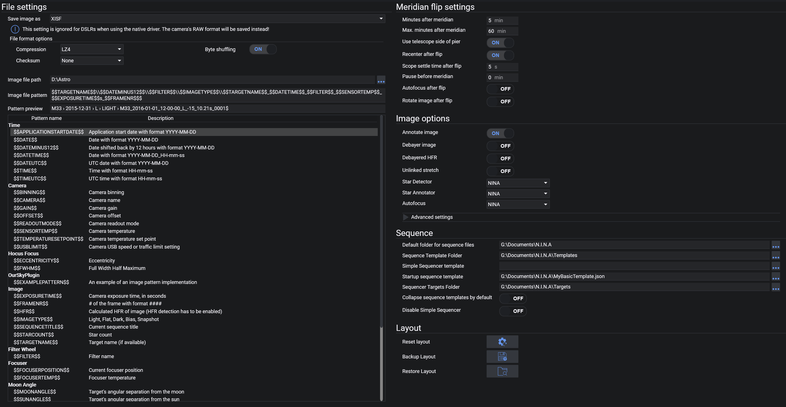

# 拍摄选项

拍摄选项选项卡包含文件格式、保存目录、自动中天翻转、序列拍摄和图像选项的设置。

## 文件设置

### 图像保存文件格式
* 每张图像保存的格式
    * 可用格式：TIFF（zip、lzw 压缩）、FITS、XISF（lz4、lz4hc、zlib 压缩）
* 有关这些文件格式的更多信息，请参见：
    * [高级主题：文件格式 TIFF](../../advanced/file_formats/tiff.md)
    * [高级主题：文件格式 FITS](../../advanced/file_formats/fits.md)
    * [高级主题：文件格式 XISF](../../advanced/file_formats/xisf.md)
* 所有格式均以 16 位保存
* 如果使用 OSC 相机，将保存原始 Bayer 数据。

### 压缩
* 选择压缩方法（如果可用）
* 压缩会增加保存图像所需的时间，但文件大小会减小。

### 字节重排
* 启用/禁用 XISF 压缩的字节重排

### 校验和
* 选择 XISF 的校验和方法（可选）
* 校验和可用于判断文件是否损坏。

### 图像文件路径
* 图像将保存到的文件路径。

### 图像文件命名模式与预览
* 可在此处调整保存图像的文件夹结构和文件名。
* 保存图像时，每个关键字都将被替换为其当前值。
* 模式下方表格中描述了所有可用关键字及其用法。
* 也可以使用静态文本，这些文本将按原样保留。
* 模式下方还会显示文件命名模式的预览效果。
* 此外，你还可以展开此部分，为 FLAT、DARK 和 BIAS 图像分别指定不同的命名模式。如果未为这些类型指定模式，则将使用默认的图像命名模式。

:::note
在 `FlatWizard`、`Legacy Sequencer`、`Advanced Sequencer` 或 `Imaging Snapshot` 中填写目标名称（Target Name）值时，应避免使用非 ASCII 字符。这些字段中的值将传递给文件命名模式 `$$TARGETNAME$$`。由于 FITS 格式和其他图像处理软件的兼容性要求，`$$TARGETNAME$$` 不允许使用非 ASCII 字符。希腊字母会使用特殊的转换表进行替换，其他非 ASCII 字符则替换为 "_"，例如：
`织女, Vega, α Lyr, BD +38°3238 -> __, Vega, alf Lyr, BD +38_3238`
:::

:::tip
通过使用反斜杠字符 `\\`，你可以将图像保存到不同的文件夹和子文件夹中。
例如，使用以下命名模式时，N.I.N.A. 将在每次新拍摄会话中创建独立的文件夹，并为亮场、暗场等创建子文件夹，然后将实际的图像文件放入这些子文件夹中：
`$$DATEMINUS12$$\\$$IMAGETYPE$$\\$$EXPOSURENUMBER$$`
这将产生：
`2020-01-01 -> FLAT -> 0001.fits`
`2020-01-01 -> LIGHT -> 0001.fits`
`2020-01-02 -> LIGHT -> 0001.fits`
:::

## 自动中天翻转
* 有关自动中天翻转的使用，请参考[高级主题：自动中天翻转](../../advanced/meridianflip.md)。

### 过中天后分钟数
* 定义过中天后可以进行翻转的最短等待时间。

### 过中天后最大分钟数
* 此设置定义过中天后翻转的最晚时间。

:::tip
通过设置"过中天后分钟数"和"过中天后最大分钟数"形成一个时间窗口，可以在不浪费等待时间的情况下立即翻转。
例如，将其设置为 5 分钟和 10 分钟最大值，当曝光在这个时间窗口内完成时，应用程序可以立即翻转望远镜，而不必等待无法容纳一张曝光的剩余时间。
:::

### 使用望远镜中天侧信息
* 几乎所有的赤道仪驱动都能告诉 N.I.N.A. 望远镜位于中天柱的哪一侧（西侧或东侧）。启用此选项将使翻转判断逻辑更加可靠和稳健，因为无需对中天状态做任何假设。
*强烈建议开启*

### 翻转后重新对中
* 启用后，N.I.N.A. 将在翻转后开始解析序列以重新对中目标。
*强烈建议开启。需要事先设置解析器。*

### 望远镜稳定时间
* 翻转望远镜后，等待指定的秒数以让望远镜稳定下来。
> 如果你在翻转后首次解析尝试中观察到星点拖尾，请增大此值。

### 中天前暂停
* 对于某些配置，设备可能在过中天前一段时间就会触碰到三脚架或立柱。此设置允许赤道仪在到达中天前的指定分钟数内停止跟踪。一旦超过该时间和设定的过中天后分钟数，翻转将正常进行。
* **只有当你的设备无法安全通过中天时，才设置暂停时间。如果你的设备可以安全跟踪直到中天翻转时间，请将此设置保持为 0！**

### 翻转后自动对焦
* 开启/关闭翻转后的自动对焦流程。
> 对于在中天翻转后可能发生镜片位移或焦点偏移的望远镜很有用。

:::note
在 N.I.N.A. 的早期版本中，启用中天翻转的开关位于此处。然而，这种方式已经改变，现在需要在序列层面启用中天翻转。传统序列器有一个目标集选项来启用它，高级序列器则需要在中天翻转触发器中添加到序列中。
:::

### 翻转后旋转图像
* 启用此选项后，拍摄选项卡中的图像将在中天翻转后自动旋转 180 度。这仅用于显示目的，不会改变任何原始图像数据。

## 图像选项

### 自动拉伸因子与黑色裁剪
* 这些是显示自动拉伸的参数。
> 这些值指的是中间调转换函数。标准值在几乎所有情况下都能正常工作。

### 标注图像
* 当此设置和拍摄中的 HFR 分析同时启用时，显示的图像将在检测到的星点上标注 HFR 值。
> 请注意，这仅用于拍摄选项卡中的显示，对保存的数据没有影响。

### Debayer 图像
* 使用 OSC 相机时，启用此选项将仅用于显示目的对图像进行 Debayer 处理。

### Debayered HFR
* 如果启用，图像将在 HFR 分析之前先进行 Debayer 处理。当你使用 OSC 相机和自动对焦时遇到星点检测问题，请启用此设置。
*此设置占用大量内存和处理资源，不应在资源受限的机器上激活*

### 非联动拉伸
* 使用 OSC 相机时，Debayer 图像会生成 3 个通道：R、G 和 B。
* 默认情况下，拍摄中的自动拉伸是联动的，可能导致色彩通道不平衡。
* 启用此选项将启用 Debayer 图像，并在拉伸时应能获得平衡的色彩通道。
*此设置占用大量内存和处理资源，不应在资源受限的机器上激活*

### 星点灵敏度
* 更改用于 HFR 分析的星点检测灵敏度。
> 仅当应用程序无法正确识别星点时更改此项。

### 降噪
* 更改在星点检测和 HFR 分析中对图像执行的降噪量。
> 仅当应用程序无法正确识别星点时更改此项。

## 序列

### 序列文件默认文件夹
* 用户可在此处设置保存/加载序列的默认文件夹。

### 序列模板文件夹
* 用户可设置存储序列模板的默认文件夹。

### 传统序列器模板
* 用户可在此处设置一个默认的自定义传统序列模板。定义模板后，向传统序列器添加新目标时将使用该模板来预填充各项值，如对中、曝光等。
> 可以在传统序列选项卡中使用"保存模板为 xml"按钮来创建模板。

### 启动序列模板（高级序列器）
* 一个完整的已保存高级序列，将在应用程序启动时预填充高级序列器。这对于你希望每次都以相同方式执行的启动和结束指令非常有用。

### 序列器目标文件夹（高级序列器）
* 用户可设置存储高级序列目标的默认文件夹。

### 默认折叠序列模板（高级序列器）
* 启用后，拖入序列器的模板将默认处于折叠状态。

### 禁用传统序列器
* 这将从界面中移除传统序列器。如果你完全不使用传统序列器，并希望消除两种序列器之间不必要的选择时，此选项很有用。

:::note
在 N.I.N.A. 的早期版本中，有一些用于运行序列结束操作的选项。这些选项已移入序列器中。
:::

## 布局
### 重置布局
* 这将重置拍摄选项卡中停靠窗口的布局。
* 如果按钮呈灰色，请至少访问一次拍摄选项卡以初始化布局。

### 备份布局
* 将当前布局备份到单独的文件中。之后可以使用"恢复布局"按钮重新加载该文件。
* 如果按钮呈灰色，请至少访问一次拍摄选项卡以初始化布局。

### 恢复布局
* 从备份文件中恢复停靠窗口的布局。
