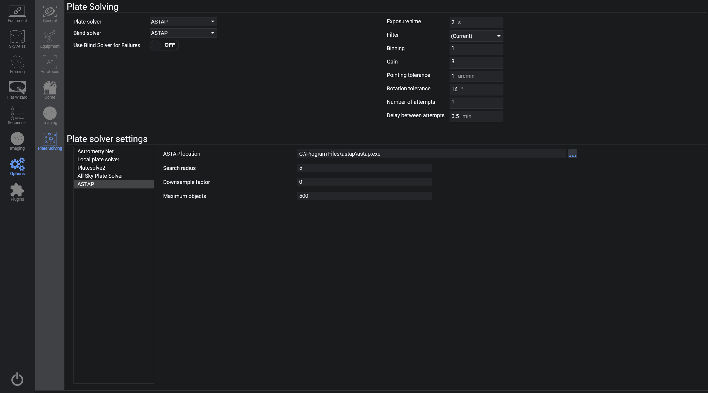

The Plate Solving tab contains configuration options for each supported plate solver.
N.I.N.A. currently supports Astrometry.Net, Local Platesolver, Platesolve2, Platesolve3, All Sky Plate Solver, ASTAP, TheSkyX Imagelink, and PinPoint as primary plate solvers. Blind solver options are Astrometry.Net, Local Platesolver, All Sky Plate Solver, ASTAP, Platesolve3, and PinPoint.

For usage of the Plate Solver, refer to [Advanced Topics: Plate Solving](../../advanced/platesolving.md).

## Plate Solving

### Plate Solver
* This drop-down menu selects the primary plate solver to use
> [ASTAP](https://www.hnsky.org/astap.htm) is recommended

### Blind Solver
* This drop-down menu selects the blind solver that is used for initial solves and/or backup solving
> The blind solver will be used in the framing assistant and normal plate solving should the primary solver fail.

### Use Blind Solver For Failures
* When a plate solve fails, a fallback to the blind solver is attempted. This behavior can be disabled so that no fallback will be used. This can be useful when it is used in combination with a number of retries.

### Exposure Time
* The default exposure time for plate solving frames

### Filter
* The default filter to be used for plate solving

### Binning
* The default binning to be used for plate solving

### Gain
* The default gain to be used for plate solving
> If empty, the current camera gain will be used

### Pointing Tolerance
* The threshold of acceptable error for re-centering in arcminutes

### Rotation Tolerance
* The threshold of acceptable error in the rotation axis in degrees

### Number of Attempts
* Defines the number of attempts for plate solving
> The value of 1 will not retry a completely failed plate solve

### Delay between attempts
* The delay between plate solving retries in minutes, when the number of attempts is greater than 1

## Plate Solver Settings

### Plate Solver Settings Selection
* This menu displays the currently supported plate solvers in N.I.N.A.
* Clicking on each entry will display the corresponding solvers' settings to the right (10)

### Plate Solver Settings
* Depending on the selected solver, this area shows install paths, host and port fields, catalog settings, or API settings.
