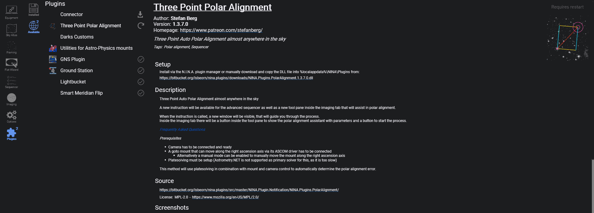
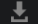
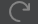
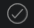

The **Available** tab queries the configured plugin repositories and shows the plugins that can be installed for your current N.I.N.A. version.

## Plugin List

The list on the left shows each available plugin with its thumbnail, name, and current state. Plugins with updates available are shown before plugins that are already up to date.

The buttons below the list let you:

* check all configured plugin repositories again
* update every plugin that currently has an update available

The repositories used here are managed under **Options > General > Plugin Repositories**.

## Selected Plugin Details

Selecting a plugin shows a detailed information page on the right. Depending on the manifest provided by the plugin author, this page can include:

* name, author, and version
* homepage and changelog links
* short description and tags
* featured image
* installation method and download URL
* long description
* source repository
* license name and license URL
* screenshots

## Install, Update and Restart

The action button on the right changes with the current plugin state:

* **Install** for plugins that are not yet installed
* **Update** for plugins with a newer version available
* **Installed** when the selected version is already in place
* **Requires Restart** after an install or update has completed and N.I.N.A. needs to be restarted

During long-running actions, the update and install buttons can be cancelled.

### State Icons

*  Update available
*  Installed or updated, restart required
*  Installed and up to date

!!! important
    Plugins are maintained by individual authors. If a plugin causes a problem, contact the plugin maintainer first. If you need to rule out plugin-related issues, restart N.I.N.A. without that plugin installed.
