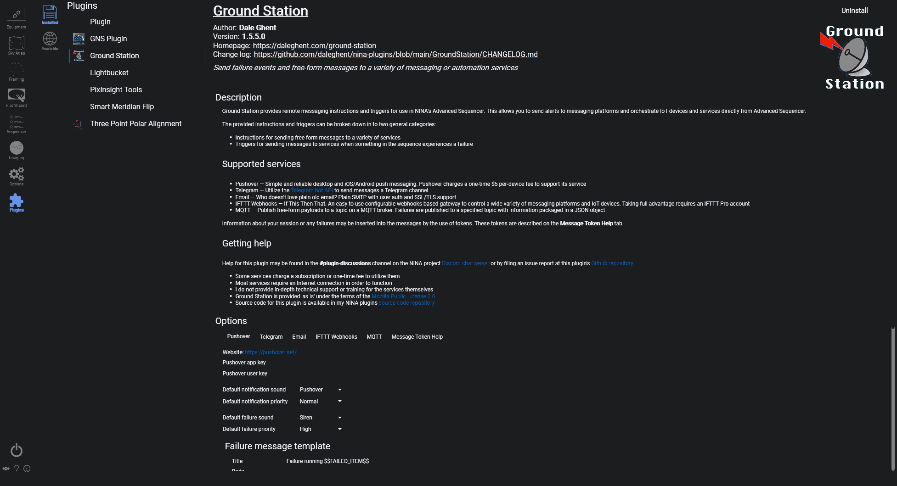

**已安装**选项卡显示你机器上已存在的插件。

## 插件列表

左侧列表显示已安装的插件及其缩略图和名称。选择一个插件即可打开其详情页面。

## 选中插件详情

所选插件的详情页面可显示：

* 名称、作者和版本
* 主页和更新日志链接
* 简短描述
* 特色图片
* 详细描述

## 插件选项

**选项**区域保留给插件特定的设置。如果插件提供了选项面板，将显示在此处。如果插件没有暴露任何用户设置，此区域将保持空白。

## 卸载

使用**卸载**按钮从机器上移除所选插件。

:::warning
插件由个人作者维护，这些作者可能与 N.I.N.A. 核心贡献者有关，也可能无关。如果插件引发问题，请首先联系插件维护者。如果你需要隔离问题，可以移除插件或不安装该插件重启 N.I.N.A.。
:::
