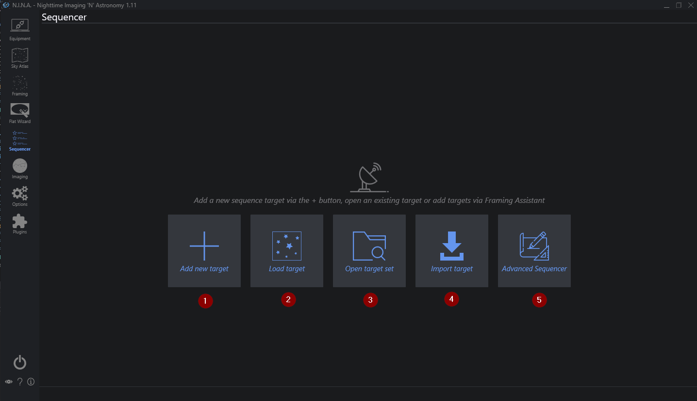

1. **Add new Target**  
    Creates a new empty target and opens the [Legacy Sequencer](../sequencer/simple/simple.md)
2. **Load Target**  
    Load a target from a saved target file and opens the [Legacy Sequencer](../sequencer/simple/simple.md)
3. **Open Target Set**  
    Load a whole target set consisting of multiple targets for the [Legacy Sequencer](../sequencer/simple/simple.md)
4. **Import Target**  
    Import a list of targets from an external source into the [Legacy Sequencer](../sequencer/simple/simple.md)
5. **Advanced Sequencer**  
    Plan a sequence step by step from scratch using the [Advanced Sequencer](../sequencer/advanced/advanced.md)

