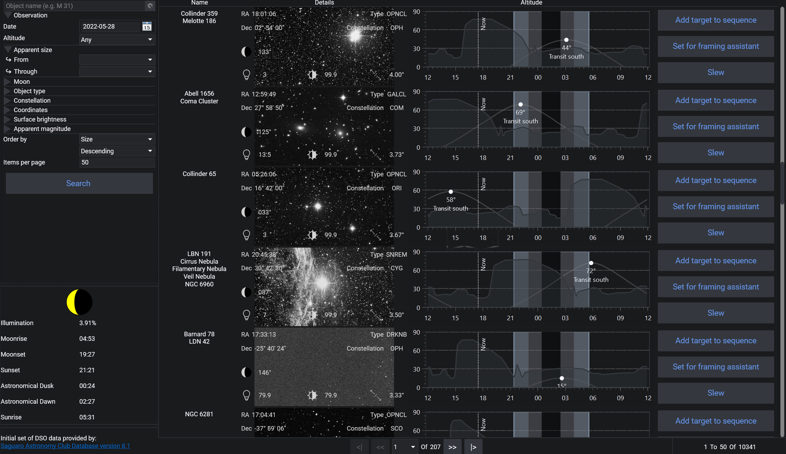
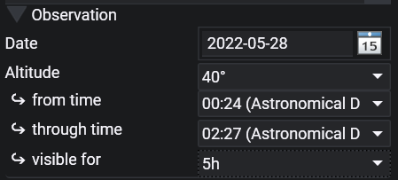
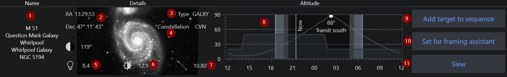

The Sky Atlas lets you search N.I.N.A.'s deep sky object database and narrow the results with planning-oriented filters. From the result list you can send an object to the sequencer, the Framing Assistant, or directly to the mount.

The Sky Atlas interface consists of the following main areas:

### Search Field

Search for an object by name or by catalog designation. Press **Enter** or use the **Search** button to start the search.

### Reset

The reset button next to the search field clears the current filters and returns the filter set to its default state.

### Filters

The filter panel on the left groups the available search filters into expandable sections. Leave a field empty if you do not want to filter by that value.

#### Observation

  

Use the observation section to filter by:

* observing date
* minimum altitude or above-horizon visibility
* the visible time range (`From` / `Through`)
* how long the target must remain visible during that time range

This is the quickest way to find targets that fit a specific night.

#### Apparent Size

Filters the object size with `From` and `Through` limits.

#### Moon

Lets you require a minimum separation from the Moon.

#### Object Type and Constellation

Lets you restrict the search to selected object types and, optionally, a single constellation.

#### Coordinates

Lets you filter by RA and Dec ranges.

#### Surface Brightness and Magnitude

Lets you filter by surface brightness and apparent magnitude ranges.

#### Transit

Lets you keep only targets whose transit falls inside a selected time range.

### Search Result Order

Search results can be ordered by:

* size
* apparent magnitude
* constellation
* RA
* Dec
* surface brightness
* object type

Display order can be either ascending or descending, and you can set the number of results shown per page.

!!! important
    Very large page sizes can affect performance.

### Search

Use the **Search** button to run the query. While a search is running, it can also be cancelled.

!!! important
    Sky Atlas calculations depend on the observing location set under **Options > General > Astrometry**. Incorrect latitude, longitude, elevation, or horizon data will lead to incorrect visibility information.

### Moon Phase and Night Information

This area shows the current moon phase and the night information for the selected observing date and location.

## Object List Display

An example of a search result:

1. Object name and available aliases
2. Coordinates in RA and Dec
3. Object type
4. Constellation
5. Apparent magnitude, if available
6. Surface brightness, if available
7. Apparent size, shown in arcminutes or degrees as appropriate
8. Altitude chart for the selected observing date. The chart also shows the current time marker, darkness markers, and a custom horizon if one is configured.
9. **Add Target to Sequence**. Depending on your sequencer setup, this can offer the legacy sequencer, advanced sequencer templates, or only advanced sequencer templates.
10. Sends the object to the [Framing Assistant](../tabs/framing.md)
11. Slews the mount to the selected target coordinates

!!! tip
    If a preview image is available for an object, it is shown in the result entry.
