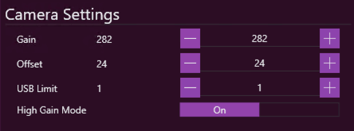

## Introduction

Dual gain cameras from Altair include the 294C and the new 269C. These cameras have two gain settings, LCG (Low Conversion Gain) and HCG (High Conversion Gain). The High Conversion Gain mode effectively gives a gain boost, by a multiplier (usually x2). Cameras using the same dual-gain sensors from most other manufacturers have these settings hidden in their driver; they automatically switch at a certain gain setting, and if you analyze the sensor you can see where it happens. Altair cameras do not make this switch automatically, which is why this tech note exists.

## Configuration

If your Altair camera has a dual-gain sensor, an option for _High Gain Mode_ will appear in the Camera Settings screen. The default is to use High Conversion Gain. To change from HCG to LCG, simply flip this switch. Like all Camera Settings, once set this will be remembered - so if you swap to LCG to "just try something out", make sure to switch back to HCG once you have finished testing!

Note that switching from HCG to LCG or vice versa does not change the gain _value_ that you have set anywhere else in N.I.N.A. - for example, if you have a sequence set up to take images at gain 430, the camera will be instructed to use gain 430 irrespective of the high/low gain toggle. The same is true for any location in N.I.N.A. where camera gain is set (including the imaging tab, plate solving, autofocus, etc).

## Comparison with Other Imaging Software

N.I.N.A. presents Camera Gain to the user in exactly the format that the camera SDK returns. For other brands of camera which automatically switch from LCG to HCG and back, the switch is inherent in the value and transparent to the user. In those cameras, it is impossible to use LCG above the switch point or HCG below the switch point. Altair cameras however allow you the flexibility to use whichever combination you desire, and this is why N.I.N.A., in common with many other suites of Imaging Software (including Altair's very own AltairCapture program), presents the raw Gain value and offers a manual switch to toggle between LCG and HCG.

There is one major piece of imaging software which does not present a manual switch: SharpCap. In order to try and be consistent with the other brands of camera that automatically switch their dual-gain sensors from LCG to HCG, SharpCap implements logic to automatically perform the switch. The way it does this is to present a single scale with the multiplier, above which point HCG is automatically enabled. This is best explained by means of an example.

## Example: The Altair 269C

Let's take as our example the Altair 269C, a camera which uses the dual gain IMX269 chip from Sony. This camera has a HCG/LCG switch with a multiplier of x2 and reports gain values of 100-2000.  Sharpcap performs the following logic:

- For gain 100-199, use LCG mode
- At gain 200 and above, switch to HCG mode
- Once in HCG mode, go up to gain 2 x max normal gain

This means that SharpCap is able to present this camera as having a single gain setting of 100-4000, even though the camera itself only presents values of 100-2000 for gain. This is roughly equivalent to what the manufacturers of other camera drivers do in their SDK.

This approach does make a lot of sense. In practise it is unlikely that anyone would want to use LCG except to access the lower gain levels and get the maximum possible dynamic range and well depth from the camera. Once gain reaches the point at which the camera gain can be divided by two and HGC enabled, using HCG gives better results with significantly lower read noise. 

So what does this mean for N.I.N.A. and other software which allows the user the full flexibility that the camera maker provides via the SDK? Well, it means that SharpCap gain values will be different to equivalent gain settings in N.I.N.A., which is important because SharpCap contains a very powerful sensor analysis routine which is often used to calculate unity gain or make decisions about what gain settings to image at based on well depth and read noise. In order to use SharpCap gain values in other software for these dual-gain altair cameras, we will need to translate the values.

Going back to our Altair 269C, SharpCap presents "Unity Gain", where one electron produced in a pixel results in 1 ADU at the ADC output, as being approximately Gain 564. To set an equivalent gain in N.I.N.A., the user would have to halve this value (as it is above 200, the point at which SharpCap automatically switches to high gain mode) and switch to High Conversion Gain.  Thus Unity Gain for the Altair 269C is 282 HCG.

## Known Altair dual-gain cameras

At time of writing, the following dual-gain Altair cameras exist:

| Camera       | Sensor      | Multiplier |
| ------------ |:-----------:| ----------:|
| 269C         | IMX269      |         x2 |
| 290(M/C)     | IMX290      |         x2 |
| 294C\*         | IMX294      |       x4.5 |
| 385C         | IMX385      |         x2 |

\*note that the 294C should not be used with HCG below a native gain of 200 as the sensor will fail to fully saturate (the histogram will look unsaturated, but it will really be saturated, which will make flats extremely problematic!)
